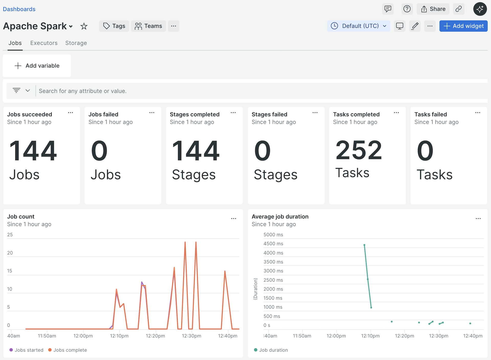
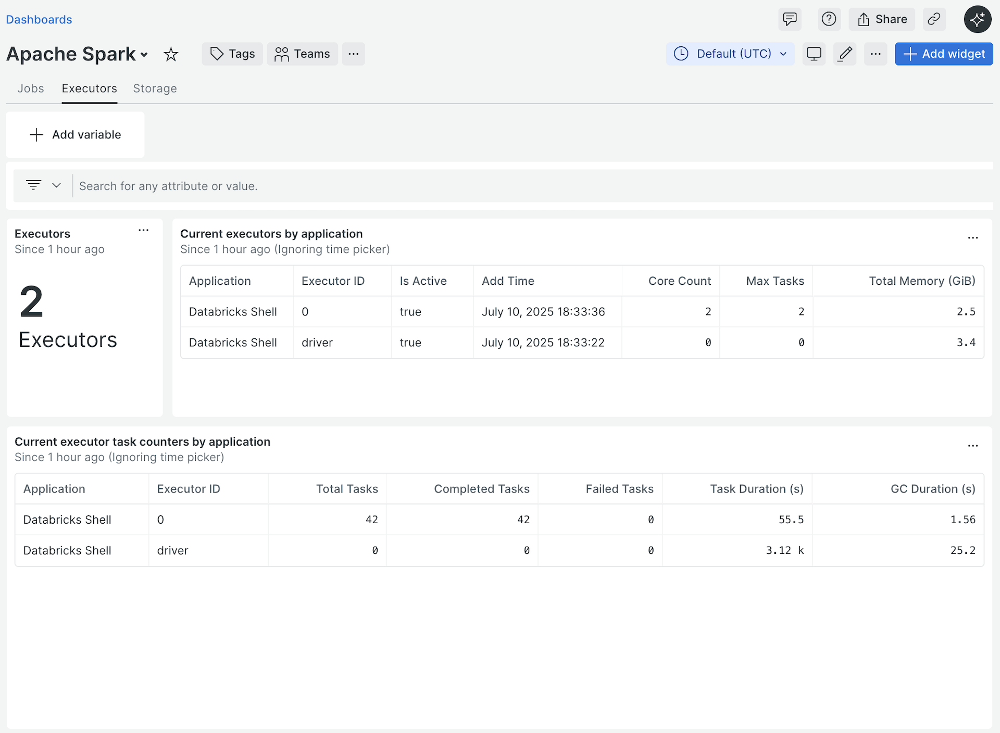
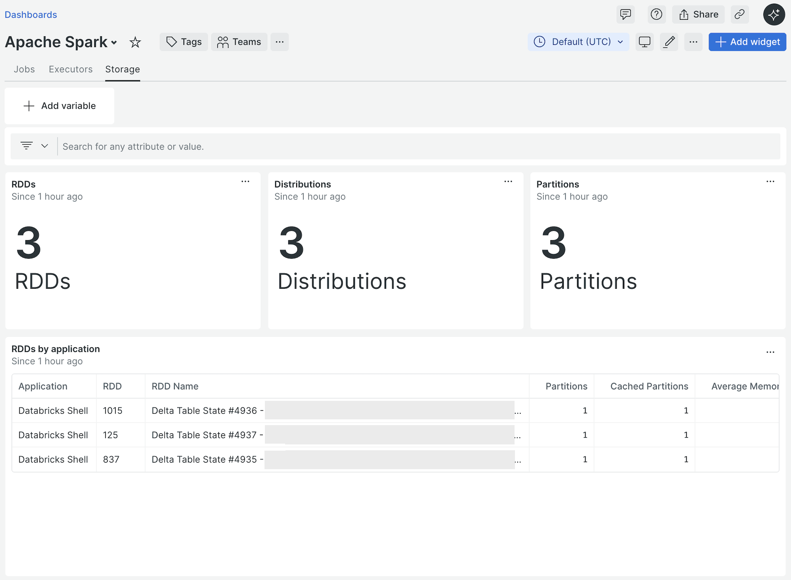
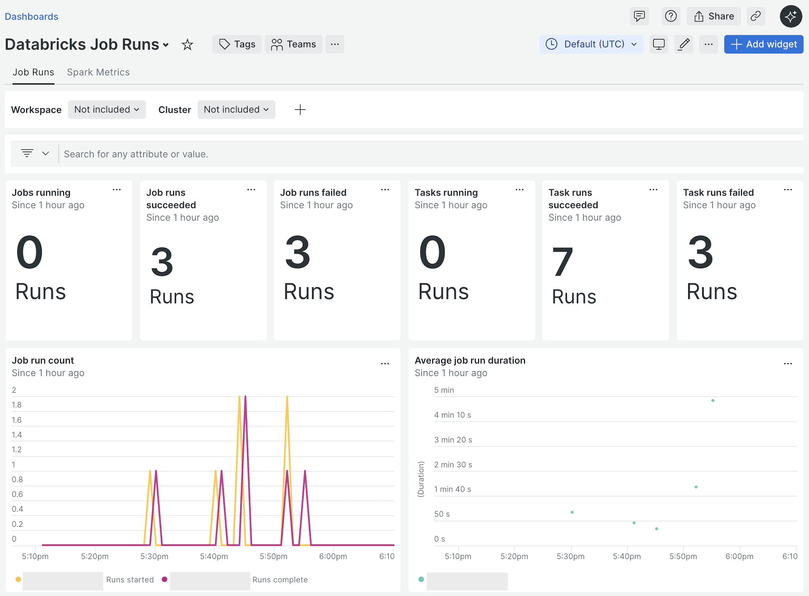
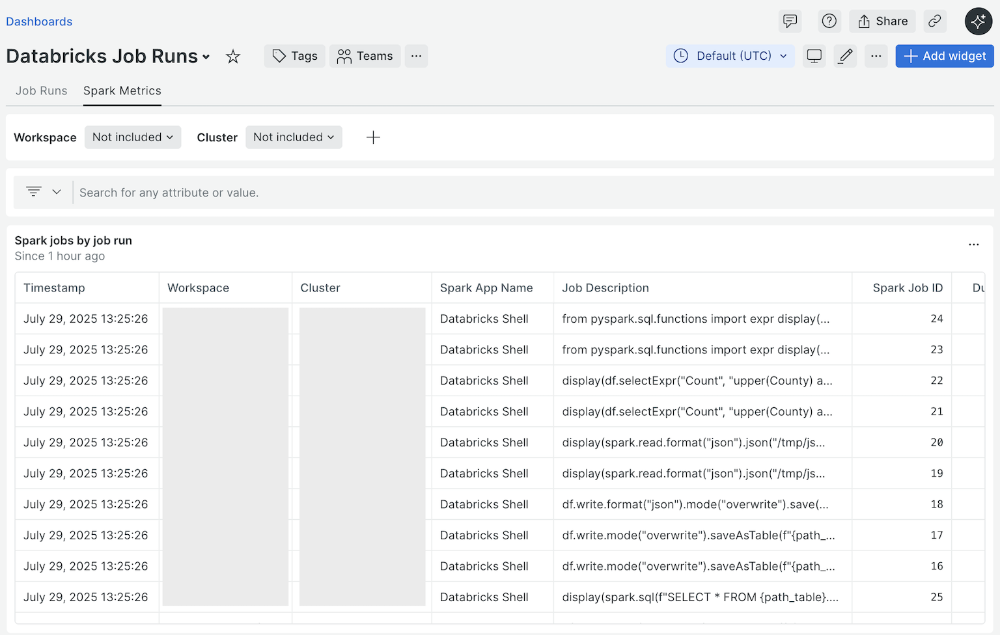
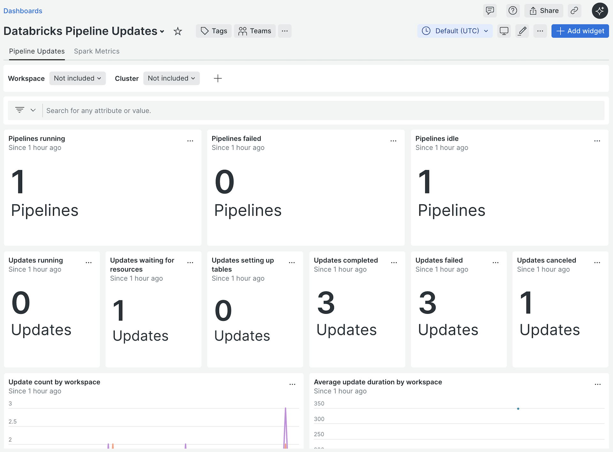
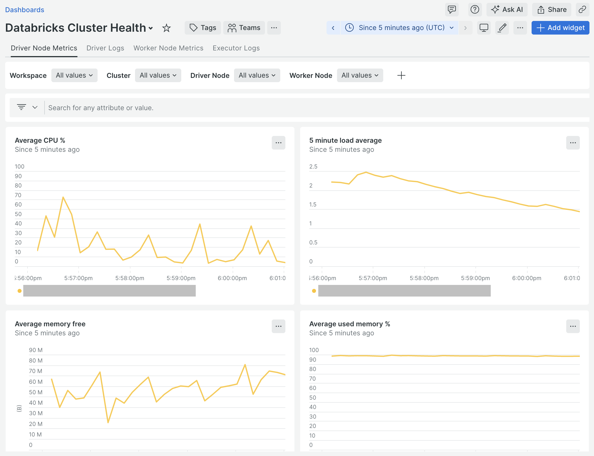
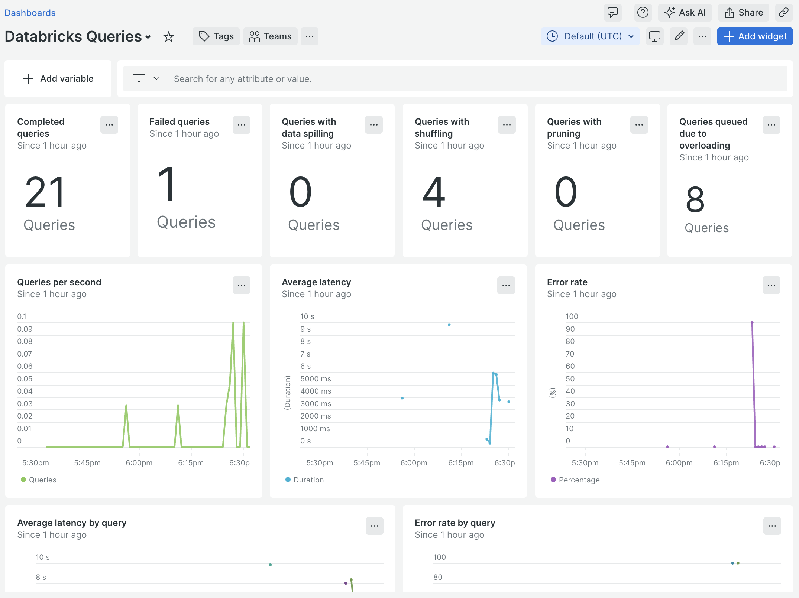

[](https://github.com/newrelic/open-source-office/blob/master/examples/categories/index.md#category-community-project)


# Databricks Integration

This integration collects telemetry from Databricks (including Spark on
Databricks) and/or Spark telemetry from any Spark deployment. See the
[Features](#features) section for supported telemetry types.



## Table of Contents

* [Important Notes](#important-notes)
* [Getting Started](#getting-started)
   * [On-host Deployment](#on-host)
* [Features](#features)
* [Usage](#usage)
   * [Command Line Options](#command-line-options)
   * [Configuration](#configuration)
      * [General configuration](#general-configuration)
      * [Pipeline configuration](#pipeline-configuration)
      * [Log configuration](#log-configuration)
      * [Databricks configuration](#databricks-configuration)
      * [Spark configuration](#spark-configuration)
   * [Authentication](#authentication)
   * [Apache Spark Data](#apache-spark-data)
   * [Consumption & Cost Data](#consumption--cost-data)
   * [Job Run Data](#job-run-data)
   * [Pipeline Update Metrics](#pipeline-update-metrics)
   * [Pipeline Event Logs](#pipeline-event-logs)
   * [Cluster Health](#cluster-health)
   * [Query Metrics](#query-metrics)
* [Building](#building)
   * [Coding Conventions](#coding-conventions)
   * [Local Development](#local-development)
   * [Releases](#releases)
   * [Github Workflows](#github-workflows)
* [Appendix](#appendix)

## Important Notes

* All references within this document to Databricks documentation reference the
  [Databricks on AWS documentation](https://docs.databricks.com/en/index.html).
  Use the cloud switcher menu located in the upper right hand corner of the
  documentation to select corresponding documentation for a different cloud
  provider.

## Getting Started

To get started with the Databricks Integration, [deploy the integration](#on-host)
using a supported deployment type, [configure](#configuration) the integration
using supported configuration mechanisms, and optionally
[import](https://docs.newrelic.com/docs/query-your-data/explore-query-data/dashboards/dashboards-charts-import-export-data/#import-json)
the sample dashboards included in the [examples](./examples/) directory.

### On-host

The Databricks Integration can be deployed inside a Databricks cluster on the
cluster's driver node (recommended) or outside a Databricks cluster on a
supported host platform.

**NOTE:**

* [Apache Spark data](#apache-spark-data) for a Databricks [cluster](https://docs.databricks.com/en/getting-started/concepts.html#cluster)
  cannot be collected remotely. In order to collect [Apache Spark data](#apache-spark-data)
  from a Databricks cluster, the Databricks Integration _must_ be deployed
  inside the cluster.
* The Databricks Integration can be used separately from Databricks to solely
  collect [Apache Spark data](#apache-spark-data) from any accessible Spark
  deployment.

#### Deploy the integration on the driver node of a Databricks cluster

The Databricks Integration can be deployed on the driver node of a Databricks
all-purpose, job, or pipeline [cluster](https://docs.databricks.com/en/getting-started/concepts.html#cluster)
using a [cluster-scoped init script](https://docs.databricks.com/en/init-scripts/cluster-scoped.html).
The [init script](./init/cluster_init_integration.sh) uses custom
[environment variables](https://docs.databricks.com/aws/en/compute/configure#environment-variables)
to specify configuration parameters necessary for the integration [configuration](#configuration).

To install the [init script](./init/cluster_init_integration.sh) on an
all-purpose cluster, perform the following steps.

1. Login to your Databricks account and navigate to the desired
   [workspace](https://docs.databricks.com/en/getting-started/concepts.html#accounts-and-workspaces).
1. Follow the [recommendations for init scripts](https://docs.databricks.com/en/init-scripts/index.html#recommendations-for-init-scripts)
   to store the [`cluster_init_integration.sh`](./init/cluster_init_integration.sh)
   script within your workspace in the recommended manner. For example, if your
   workspace is [enabled for Unity Catalog](https://docs.databricks.com/en/data-governance/unity-catalog/get-started.html#step-1-confirm-that-your-workspace-is-enabled-for-unity-catalog),
   you should store the init script in a [Unity Catalog volume](https://docs.databricks.com/en/ingestion/file-upload/upload-to-volume.html).
1. Navigate to the [`Compute`](https://docs.databricks.com/en/compute/clusters-manage.html#view-compute)
   tab and select the desired all-purpose compute to open the compute details
   UI.
1. Click the button labeled `Edit` to [edit the compute's configuration](https://docs.databricks.com/en/compute/clusters-manage.html#edit-a-compute).
1. Follow the steps to [use the UI to configure a cluster-scoped init script](https://docs.databricks.com/en/init-scripts/cluster-scoped.html#configure-a-cluster-scoped-init-script-using-the-ui)
   and point to the location where you stored the init script in step 2 above.
1. If your cluster is not running, click on the button labeled `Confirm` to
   save your changes. Then, restart the cluster. If your cluster is already
   running, click on the button labeled `Confirm and restart` to save your
   changes and restart the cluster.

Additionally, follow the steps to [set environment variables](https://docs.databricks.com/en/compute/configure.html#environment-variables)
to add the following environment variables.

* `NEW_RELIC_API_KEY` - Your [New Relic User API Key](https://docs.newrelic.com/docs/apis/intro-apis/new-relic-api-keys/#user-key)
* `NEW_RELIC_LICENSE_KEY` - Your [New Relic License Key](https://docs.newrelic.com/docs/apis/intro-apis/new-relic-api-keys/#license-key)
* `NEW_RELIC_ACCOUNT_ID` - Your [New Relic Account ID](https://docs.newrelic.com/docs/accounts/accounts-billing/account-structure/account-id/)
* `NEW_RELIC_REGION` - The [region](https://docs.newrelic.com/docs/accounts/accounts-billing/account-setup/choose-your-data-center/#regions-availability)
   of your New Relic account; one of `US` or `EU`
* `NEW_RELIC_DATABRICKS_WORKSPACE_HOST` - The [instance name](https://docs.databricks.com/en/workspace/workspace-details.html#workspace-instance-names-urls-and-ids)
   of the target Databricks instance
* `NEW_RELIC_DATABRICKS_ACCESS_TOKEN` - To [authenticate](#authentication) with
   a [personal access token](https://docs.databricks.com/en/dev-tools/auth/pat.html#databricks-personal-access-tokens-for-workspace-users),
   your personal access token
* `NEW_RELIC_DATABRICKS_OAUTH_CLIENT_ID` - To [use a service principal to authenticate with Databricks (OAuth M2M)](https://docs.databricks.com/en/dev-tools/auth/oauth-m2m.html),
   the OAuth client ID for the service principal
* `NEW_RELIC_DATABRICKS_OAUTH_CLIENT_SECRET` - To [use a service principal to authenticate with Databricks (OAuth M2M)](https://docs.databricks.com/en/dev-tools/auth/oauth-m2m.html),
   an OAuth client secret associated with the service principal
* `NEW_RELIC_DATABRICKS_USAGE_ENABLED` - Set to `true` to enable collection of
  [consumption and cost data](#consumption--cost-data) from this cluster node or
  `false` to disable collection. Defaults to `true`.
* `NEW_RELIC_DATABRICKS_SQL_WAREHOUSE` - The ID of a [SQL warehouse](https://docs.databricks.com/en/compute/sql-warehouse/index.html)
   where usage queries should be run
* `NEW_RELIC_DATABRICKS_JOB_RUNS_ENABLED` - Set to `true` to enable collection
  of [job run data](#job-run-data) from this cluster node or `false` to disable
  collection. Defaults to `true`.
* `NEW_RELIC_DATABRICKS_PIPELINE_EVENT_LOGS_ENABLED` - Set to `true` to enable
  collection of Databricks Delta Live Tables [pipeline event logs](#pipeline-event-logs)
  from this cluster node or `false` to disable collection. Defaults to `true`.
* `NEW_RELIC_DATABRICKS_QUERY_METRICS_ENABLED` - Set to `true` to enable
  collection of Databricks [query metrics](#query-metrics) for this workspace
  or `false` to disable collection. Defaults to `true`.
* `NEW_RELIC_INFRASTRUCTURE_ENABLED` - Set to `true` to install the
  [New Relic Infrastructure agent](https://docs.newrelic.com/docs/infrastructure/introduction-infra-monitoring/)
  on the driver and worker nodes of the [cluster](https://docs.databricks.com/en/getting-started/concepts.html#cluster).
  Defaults to `false`.
* `NEW_RELIC_INFRASTRUCTURE_LOGS_ENABLED` - Set to `true` to enable collection
  of the Spark driver and executor logs, the Spark driver event log, and the
  driver and worker init script logs. Logs will be [forwarded](https://docs.newrelic.com/docs/logs/forward-logs/forward-your-logs-using-infrastructure-agent/)
  to [New Relic Logs](https://docs.newrelic.com/docs/logs/get-started/get-started-log-management/)
  via the [New Relic Infrastructure agent](https://docs.newrelic.com/docs/infrastructure/introduction-infra-monitoring/)
  and therefore, setting this environment variable to `true` requires that the
  `NEW_RELIC_INFRASTRUCTURE_ENABLED` environment variable also be set to `true`.
  Defaults to `false`.

**NOTE:**
* The `NEW_RELIC_API_KEY` and `NEW_RELIC_ACCOUNT_ID` are currently unused but
  are required by the [new-relic-client-go](https://github.com/newrelic/newrelic-client-go)
  module used by the integration.
* Only the personal access token _or_ OAuth credentials need to be specified but
  not both. If both are specified, the OAuth credentials take precedence.
* Sensitive data like credentials and API keys should never be specified
  directly in custom [environment variables](https://docs.databricks.com/aws/en/compute/configure#environment-variables).
  Instead, it is recommended to create a [secret](https://docs.databricks.com/en/security/secrets/secrets.html)
  using the [Databricks CLI](https://docs.databricks.com/en/dev-tools/cli/index.html)
  and [reference the secret in the environment variable](https://docs.databricks.com/aws/en/security/secrets/secrets-spark-conf-env-var#reference-a-secret-in-an-environment-variable).
  See the [appendix](#appendix) for an [example](#example-creating-and-using-a-secret-for-your-new-relic-license-key)
  of creating a [secret](https://docs.databricks.com/en/security/secrets/secrets.html)
  and referencing it in a custom [environment variable](https://docs.databricks.com/aws/en/compute/configure#environment-variables).
* To install the [init script](./init/cluster_init_integration.sh) on a job
  cluster, see the section [configure compute for jobs](https://docs.databricks.com/aws/en/jobs/compute)
  in the Databricks documentation.
* To install the [init script](./init/cluster_init_integration.sh) on a pipeline
  cluster, see the section [configure compute for a DLT pipeline](https://docs.databricks.com/aws/en/dlt/configure-compute)
  in the Databricks documentation.
* Make sure to restart the cluster following the configuration of the
  environment variables.

#### Deploy the integration on a host outside a Databricks cluster

The Databricks Integration provides binaries for the following host platforms.

* Linux amd64
* Windows amd64

To run the Databricks integration on a host outside a Databricks cluster,
perform the following steps.

1. Download the appropriate archive for your platform from the [latest release](https://github.com/newrelic/newrelic-databricks-integration/releases/latest).
1. Extract the archive to a new or existing directory.
1. Create a directory named `configs` in the same directory.
1. Create a file named `config.yml` in the `configs` directory and copy the
   contents of the file [`configs/config.template.yml`](./configs/config.template.yml)
   in this repository into it.
1. Edit the `config.yml` file to [configure](#configuration) the integration
   appropriately for your environment.
1. From the directory where the archive was extracted, execute the integration
   binary using the command `./newrelic-databricks-integration` (or
   `.\newrelic-databricks-integration.exe` on Windows) with the appropriate
   [Command Line Options](#command-line-options).

## Features

The Databricks Integration supports the following capabilities.

* Collect Spark telemetry

  When deployed [inside a Databricks cluster](#deploy-the-integration-on-the-driver-node-of-a-databricks-cluster),
  the Databricks Integration can collect telemetry from all Spark applications
  running in the cluster.

  When deployed [outside a Databricks cluster](#deploy-the-integration-on-a-host-outside-a-databricks-cluster),
  the Databricks Integration can also collect Spark telemetry from all Spark
  applications on any accessible Spark deployment.

* Collect Databricks consumption and cost data

  The Databricks Integration can collect consumption and cost related
  data from the Databricks [system tables](https://docs.databricks.com/en/admin/system-tables/index.html).
  This data can be used to show Databricks DBU consumption metrics and estimated
  Databricks costs directly within New Relic.

* Collect Databricks job run telemetry

  The Databricks Integration can collect telemetry about
  [Databricks Job](https://docs.databricks.com/en/jobs/index.html#what-are-databricks-jobs)
  runs, such as job run durations, task run durations, the current state of job
  and task runs, if a job or a task is a retry, and the number of times a task
  was retried.

* Collect Databricks Delta Live Tables Pipeline event logs

  The Databricks Integration can collect [Databricks Delta Live Tables Pipeline event logs](https://docs.databricks.com/en/delta-live-tables/observability.html#event-log)
  for all [Databricks Delta Live Tables Pipelines](https://docs.databricks.com/en/delta-live-tables/develop-pipelines.html)
  defined in a [workspace](https://docs.databricks.com/en/getting-started/concepts.html#accounts-and-workspaces).
  [Databricks Delta Live Tables Pipeline event log](https://docs.databricks.com/en/delta-live-tables/observability.html#event-log)
  entries for every [pipeline update](https://docs.databricks.com/en/delta-live-tables/updates.html)
  are collected and sent to [New Relic Logs](https://docs.newrelic.com/docs/logs/get-started/get-started-log-management/).

## Usage

### Command Line Options

| Option | Description | Default |
| --- | --- | --- |
| --config_path | path to the (#configyml) to use | `configs/config.yml` |
| --dry_run | flag to enable "dry run" mode | `false` |
| --env_prefix | prefix to use for environment variable lookup | `''` |
| --verbose | flag to enable "verbose" mode | `false` |
| --version | display version information only | N/a |

### Configuration

The Databricks integration is configured using the [`config.yml`](#configyml)
and/or environment variables. For Databricks, authentication related configuration
parameters may also be set in a [Databricks configuration profile](https://docs.databricks.com/en/dev-tools/auth/config-profiles.html).
In all cases, where applicable, environment variables always take precedence.

#### `config.yml`

All configuration parameters for the Databricks integration can be set using a
YAML file named [`config.yml`](#configyml). The default location for this file
is `configs/config.yml` relative to the current working directory when the
integration binary is executed. The supported configuration parameters are
listed below. See [`config.template.yml`](./configs/config.template.yml)
for a full configuration example.

##### General configuration

The parameters in this section are configured at the top level of the
[`config.yml`](#configyml).

###### `licenseKey`

| Description | Valid Values | Required | Default |
| --- | --- | --- | --- |
| New Relic license key | string | Y | N/a |

This parameter specifies the New Relic License Key (INGEST) that should be used
to send generated metrics.

The license key can also be specified using the `NEW_RELIC_LICENSE_KEY`
environment variable.

###### `region`

| Description | Valid Values | Required | Default |
| --- | --- | --- | --- |
| New Relic region identifier | `US` / `EU` | N | `US` |

This parameter specifies which New Relic region that generated metrics should be
sent to.

###### `interval`

| Description | Valid Values | Required | Default |
| --- | --- | --- | --- |
| Polling interval (in _seconds_) | numeric | N | 60 |

This parameter specifies the interval (in _seconds_) at which the integration
should poll for data.

This parameter is only used when [`runAsService`](#runasservice) is set to
`true`.

###### `runAsService`

| Description | Valid Values | Required | Default |
| --- | --- | --- | --- |
| Flag to enable running the integration as a "service" | `true` / `false` | N | `false` |

The integration can run either as a "service" or as a simple command line
utility which runs once and exits when it is complete.

When set to `true`, the integration process will run continuously and poll the
for data at the recurring interval specified by the [`interval`](#interval)
parameter. The process will only exit if it is explicitly stopped or a fatal
error or panic occurs.

When set to `false`, the integration will run once and exit. This is intended for
use with an external scheduling mechanism like [cron](https://man7.org/linux/man-pages/man8/cron.8.html).

###### `pipeline`

| Description | Valid Values | Required | Default |
| --- | --- | --- | --- |
| The root node for the set of [pipeline configuration](#pipeline-configuration) parameters | YAML Mapping | N | N/a |

The integration retrieves, processes, and exports data to New Relic using
a data pipeline consisting of one or more receivers, a processing chain, and a
New Relic exporter. Various aspects of the pipeline are configurable. This
element groups together the configuration parameters related to
[pipeline configuration](#pipeline-configuration).

###### `log`

| Description | Valid Values | Required | Default |
| --- | --- | --- | --- |
| The root node for the set of [log configuration](#log-configuration) parameters | YAML Mapping | N | N/a |

The integration uses the [logrus](https://pkg.go.dev/github.com/sirupsen/logrus)
package for application logging. This element groups together the configuration
parameters related to [log configuration](#log-configuration).

###### `mode`

| Description | Valid Values | Required | Default |
| --- | --- | --- | --- |
| The integration execution mode | `databricks` | N | `databricks` |

The integration execution mode. Currently, the only supported execution mode is
`databricks`.

**Deprecated:** As of v2.3.0, this configuration parameter is no longer used.
The presence (or not) of the [`databricks`](#databricks) top-level node will be
used to enable (or disable) the Databricks collector. Likewise, the presence
(or not) of the [`spark`](#spark) top-level node will be used to enable (or
disable) the Spark collector separate from Databricks.

###### `databricks`

| Description | Valid Values | Required | Default |
| --- | --- | --- | --- |
| The root node for the set of [Databricks configuration](#databricks-configuration) parameters | YAML Mapping | N | N/a |

This element groups together the configuration parameters to [configure](#databricks-configuration)
the Databricks collector. If this element is not specified, the Databricks
collector will not be run.

Note that this node is not required. It can be used with or without the
[`spark`](#spark) top-level node.

###### `spark`

| Description | Valid Values | Required | Default |
| --- | --- | --- | --- |
| The root node for the set of [Spark configuration](#spark-configuration) parameters | YAML Mapping | N | N/a |

This element groups together the configuration parameters to [configure](#spark-configuration)
the Spark collector. If this element is not specified, the Spark collector will
not be run.

Note that this node is not required. It can be used with or without the
[`databricks`](#databricks) top-level node.

###### `tags`

| Description | Valid Values | Required | Default |
| --- | --- | --- | --- |
| The root node for a set of custom [tags](https://docs.newrelic.com/docs/new-relic-solutions/new-relic-one/core-concepts/use-tags-help-organize-find-your-data/) to add to all telemetry sent to New Relic | YAML Mapping | N | N/a |

This element specifies a group of custom [tags](https://docs.newrelic.com/docs/new-relic-solutions/new-relic-one/core-concepts/use-tags-help-organize-find-your-data/)
that will be added to all telemetry sent to New Relic. The tags are specified as
a set of key-value pairs.

##### Pipeline configuration

###### `receiveBufferSize`

| Description | Valid Values | Required | Default |
| --- | --- | --- | --- |
| Size of the buffer that holds items before processing | number | N | 500 |

This parameter specifies the size of the buffer that holds received items before
being flushed through the processing chain and on to the exporters. When this
size is reached, the items in the buffer will be flushed automatically.

###### `harvestInterval`

| Description | Valid Values | Required | Default |
| --- | --- | --- | --- |
| Harvest interval (in _seconds_) | number | N | 60 |

This parameter specifies the interval (in _seconds_) at which the pipeline
should automatically flush received items through the processing chain and on
to the exporters. Each time this interval is reached, the pipeline will flush
items even if the item buffer has not reached the size specified by the
[`receiveBufferSize`](#receiveBufferSize) parameter.

###### `instances`

| Description | Valid Values | Required | Default |
| --- | --- | --- | --- |
| Number of concurrent pipeline instances to run | number | N | 3 |

The integration retrieves, processes, and exports metrics to New Relic using
a data pipeline consisting of one or more receivers, a processing chain, and a
New Relic exporter. When [`runAsService`](#runasservice) is `true`, the
integration can launch one or more "instances" of this pipeline to receive,
process, and export data concurrently. Each "instance" will be configured with
the same processing chain and exporters and the receivers will be spread across
the available instances in a round-robin fashion.

This parameter specifies the number of pipeline instances to launch.

**NOTE:** When [`runAsService`](#runasservice) is `false`, only a single
pipeline instance is used.

##### Log configuration

###### `level`

| Description | Valid Values | Required | Default |
| --- | --- | --- | --- |
| Log level | `panic` / `fatal` / `error` / `warn` / `info` / `debug` / `trace`  | N | `warn` |

This parameter specifies the maximum severity of log messages to output with
`trace` being the least severe and `panic` being the most severe. For example,
at the default log level (`warn`), all log messages with severities `warn`,
`error`, `fatal`, and `panic` will be output but `info`, `debug`, and `trace`
will not.

###### `fileName`

| Description | Valid Values | Required | Default |
| --- | --- | --- | --- |
| Path to a file where log output will be written | string | N | `stderr` |

This parameter designates a file path where log output should be written. When
no path is specified, log output will be written to the standard error stream
(`stderr`).

##### Databricks configuration

The Databricks configuration parameters are used to configure the Databricks
collector.

###### `workspaceHost`

| Description | Valid Values | Required | Default |
| --- | --- | --- | --- |
| Databricks workspace instance name | string | conditional | N/a |

This parameter specifies the [instance name](https://docs.databricks.com/en/workspace/workspace-details.html#workspace-instance-names-urls-and-ids)
of the target Databricks instance for which data should be collected. This is
used by the integration when constructing the URLs for API calls. Note that the
value of this parameter _must not_ include the `https://` prefix, e.g.
`https://my-databricks-instance-name.cloud.databricks.com`.

The workspace host can also be specified using the `DATABRICKS_HOST`
environment variable.

###### `accessToken`

| Description | Valid Values | Required | Default |
| --- | --- | --- | --- |
| Databricks personal access token | string | N | N/a |

When set, the integration will use [Databricks personal access token authentication](https://docs.databricks.com/en/dev-tools/auth/pat.html)
to authenticate Databricks API calls with the value of this parameter as the
Databricks [personal access token](https://docs.databricks.com/en/dev-tools/auth/pat.html#databricks-personal-access-tokens-for-workspace-users).

The personal access token can also be specified using the `DATABRICKS_TOKEN`
environment variable or any other SDK-supported mechanism (e.g. the `token`
field in a Databricks [configuration profile](https://docs.databricks.com/en/dev-tools/auth/config-profiles.html)).

See the [authentication section](#authentication) for more details.

###### `oauthClientId`

| Description | Valid Values | Required | Default |
| --- | --- | --- | --- |
| Databricks OAuth M2M client ID | string | N | N/a |

When set, the integration will [use a service principal to authenticate with Databricks (OAuth M2M)](https://docs.databricks.com/en/dev-tools/auth/oauth-m2m.html)
when making Databricks API calls. The value of this parameter will be used as
the OAuth client ID.

The OAuth client ID can also be specified using the `DATABRICKS_CLIENT_ID`
environment variable or any other SDK-supported mechanism (e.g. the `client_id`
field in a Databricks [configuration profile](https://docs.databricks.com/en/dev-tools/auth/config-profiles.html)).

See the [authentication section](#authentication) for more details.

###### `oauthClientSecret`

| Description | Valid Values | Required | Default |
| --- | --- | --- | --- |
| Databricks OAuth M2M client secret | string | N | N/a |

When the [`oauthClientId`](#oauthclientid) is set, this parameter can be set to
specify the [OAuth secret](https://docs.databricks.com/en/dev-tools/auth/oauth-m2m.html#step-3-create-an-oauth-secret-for-a-service-principal)
associated with the [service principal](https://docs.databricks.com/en/admin/users-groups/service-principals.html#what-is-a-service-principal).

The OAuth client secret can also be specified using the
`DATABRICKS_CLIENT_SECRET` environment variable or any other SDK-supported
mechanism (e.g. the `client_secret` field in a Databricks
[configuration profile](https://docs.databricks.com/en/dev-tools/auth/config-profiles.html)).

See the [authentication section](#authentication) for more details.

###### `sqlStatementTimeout`

| Description | Valid Values | Required | Default |
| --- | --- | --- | --- |
| Timeout (in seconds) to use when executing SQL statements on a SQL warehouse | number | N | 30 |

Certain telemetry and data collected by the Databricks collector requires the
collector to run Databricks SQL statements on a SQL warehouse. This
configuration parameter specifies the number of seconds to wait before timing
out a pending or running SQL query.

###### `usage`

| Description | Valid Values | Required | Default |
| --- | --- | --- | --- |
| The root node for the set of [Databricks Usage configuration](#databricks-usage-configuration) parameters | YAML Mapping | N | N/a |

This element groups together the configuration parameters to [configure](#databricks-usage-configuration)
the Databricks collector settings related to the collection of
[consumption and cost data](#consumption--cost-data).

###### `jobs`

| Description | Valid Values | Required | Default |
| --- | --- | --- | --- |
| The root node for the set of [Databricks Job configuration](#databricks-job-configuration) parameters | YAML Mapping | N | N/a |

This element groups together the configuration parameters to [configure](#databricks-job-configuration)
the Databricks collector settings related to the collection of job data.

###### `pipelines`

| Description | Valid Values | Required | Default |
| --- | --- | --- | --- |
| The root node for the set of [Databricks Pipeline configuration](#databricks-pipeline-configuration) parameters | YAML Mapping | N | N/a |

This element groups together the configuration parameters to [configure](#databricks-pipeline-configuration)
the Databricks collector settings related to the collection of [Databricks Delta Live Tables Pipelines](https://docs.databricks.com/en/delta-live-tables/develop-pipelines.html)
telemetry.

###### `queries`

| Description | Valid Values | Required | Default |
| --- | --- | --- | --- |
| The root node for the set of [Databricks Query configuration](#databricks-query-configuration) parameters | YAML Mapping | N | N/a |

This element groups together the configuration parameters to [configure](#databricks-query-configuration)
the Databricks collector settings related to the collection of Databricks query
telemetry.

##### Databricks Usage Configuration

The Databricks usage configuration parameters are used to configure Databricks
collector settings related to the collection of Databricks
[consumption and cost data](#consumption--cost-data).

###### Databricks Usage `enabled`

| Description | Valid Values | Required | Default |
| --- | --- | --- | --- |
| Flag to enable automatic collection of consumption and cost data | `true` / `false` | N | `true` |

By default, when the Databricks collector is enabled, it will automatically
collect [consumption and cost data](#consumption--cost-data).

This flag can be used to disable the collection of consumption and cost data by
the Databricks collector. This may be useful when running multiple instances of
the Databricks Integration. In this scenario, Databricks consumption and cost
data collection should _only_ be enabled on a single instance. Otherwise, this
data will be recorded more than once in New Relic, affecting consumption and
cost calculations.

###### `warehouseId`

| Description | Valid Values | Required | Default |
| --- | --- | --- | --- |
| ID of a SQL warehouse on which to run usage-related SQL statements | string | Y | N/a |

The ID of a SQL warehouse on which to run the SQL statements used to collect
Databricks [consumption and cost data](#consumption--cost-data).

This parameter is required when the collection of Databricks
[consumption and cost data](#consumption--cost-data) is [enabled](#databricks-usage-enabled).

###### `includeIdentityMetadata`

| Description | Valid Values | Required | Default |
| --- | --- | --- | --- |
| Flag to enable inclusion of identity related metadata in consumption and cost data | `true` / `false` | N | `false` |

When the collection of Databricks [consumption and cost data](#consumption--cost-data)
is [enabled](#databricks-usage-enabled), the Databricks collector can include
several pieces of identifying information along with the consumption and cost
data.

By default, when the collection of Databricks [consumption and cost data](#consumption--cost-data)
is [enabled](#databricks-usage-enabled), the Databricks collector will _not_
collect such data as it may be personally identifiable. This flag can be used to
enable the inclusion of the identifying information.

When enabled, the following values are included.

* The identity of the user a serverless billing record is attributed to. This
  value is included in the [identity metadata](https://docs.databricks.com/en/admin/system-tables/billing.html#analyze-identity-metadata)
  returned from usage records in the [billable usage system table](https://docs.databricks.com/en/admin/system-tables/billing.html).
* The identity of the cluster creator for each usage record for billable usage
  attributed to all-purpose and job compute.
* The single user name for each usage record for billable usage attributed to
  all-purpose and job compute configured for [single-user access mode](https://docs.databricks.com/en/compute/configure.html#access-mode).
* The identity of the warehouse creator for each usage record for billable usage
  attributed to SQL warehouse compute.
* The identity of the user or service principal used to run jobs for each query
  result collected by [job cost data](#job-costs) queries.

###### `runTime`

| Description | Valid Values | Required | Default |
| --- | --- | --- | --- |
| Time of day (as `HH:mm:ss`) at which to run usage data collection | string with format `HH:mm:ss` | N | `02:00:00` |

This parameter specifies the time of day at which the collection of
[consumption and cost data](#consumption--cost-data) occur. The value must be of
the form `HH:mm:ss` where `HH` is the `0`-padded 24-hour clock hour
(`00` - `23`), `mm` is the `0`-padded minute (`00` - `59`) and `ss` is the
`0`-padded second (`00` - `59`). For example, `09:00:00` is the time 9:00 AM and
`23:30:00` is the time 11:30 PM.

The time will _always_ be interpreted according to the UTC time zone. The time
zone can not be configured. For example, to specify that the integration should
be run at 2:00 AM EST (-0500), the value `07:00:00` should be specified.

###### `optionalQueries`

| Description | Valid Values | Required | Default |
| --- | --- | --- | --- |
| The root node for the set of flags used to selectively enable or disable optional usage queries | YAML Mapping | N | N/a |

When the collection of Databricks [consumption and cost data](#consumption--cost-data)
is [enabled](#databricks-usage-enabled), the Databricks collector will always
collect [billable usage data](#billable-usage-data) and [list pricing data](#list-pricing-data)
on every run. In addition, by default, the Databricks collector will also run
all [job cost](#job-costs) queries on every run. However, the latter behavior
can be configured using a set of flags specified with this configuration
property to selectively enable or disable the [job cost](#job-costs) queries.
Each flag is specified using a property with the query ID as the name of the
property and `true` or `false` as the value of the property.The following flags
are supported.

* [`jobs_cost_list_cost_per_job_run`](#list-cost-per-job-run)
* [`jobs_cost_list_cost_per_job`](#list-cost-per-job)
* [`jobs_cost_frequent_failures`](#list-cost-of-failed-job-runs-for-jobs-with-frequent-failures)
* [`jobs_cost_most_retries`](#list-cost-of-repaired-job-runs-for-jobs-with-frequent-repairs)

For example, to enable the [list cost per job run](#list-cost-per-job-run) query
and the [list cost per job](#list-cost-per-job) query but disable the
[list cost of failed job runs for jobs with frequent failures](#list-cost-of-failed-job-runs-for-jobs-with-frequent-failures) query
and the [list cost of repaired job runs for jobs with frequent repairs](#list-cost-of-repaired-job-runs-for-jobs-with-frequent-repairs) query,
the following configuration would be specified.

```yaml
  optionalQueries:
    jobs_cost_list_cost_per_job_run: true
    jobs_cost_list_cost_per_job: true
    jobs_cost_frequent_failures: false
    jobs_cost_most_retries: false
```

##### Databricks Job configuration

###### `runs`

| Description | Valid Values | Required | Default |
| --- | --- | --- | --- |
| The root node for the set of [Databricks Job Run configuration](#databricks-job-run-configuration) parameters | YAML Mapping | N | N/a |

This element groups together the configuration parameters to [configure](#databricks-job-run-configuration)
the Databricks collector settings related to the collection of [job run data](#job-run-data).

##### Databricks job run configuration

The Databricks job run configuration parameters are used to configure Databricks
collector settings related to the collection of Databricks [job run data](#job-run-data).

###### Databricks job runs `enabled`

| Description | Valid Values | Required | Default |
| --- | --- | --- | --- |
| Flag to enable automatic collection of job run data | `true` / `false` | N | `true` |

By default, when the Databricks collector is enabled, it will automatically
collect [job run data](#job-run-data).

This flag can be used to disable the collection of job run data by the
Databricks collector. This may be useful when running multiple instances of the
Databricks Integration against the same Databricks [workspace](https://docs.databricks.com/en/getting-started/concepts.html#accounts-and-workspaces).
In this scenario, Databricks job run data collection should _only_ be enabled on
a single instance of the integration. Otherwise, this data will be recorded more
than once in New Relic, affecting product features that use [job run metrics](#job-run-metrics)
(e.g. [dashboards](https://docs.newrelic.com/docs/query-your-data/explore-query-data/dashboards/introduction-dashboards/)
and [alerts](https://docs.newrelic.com/docs/alerts/overview/)).

###### `startOffset`

| Description | Valid Values | Required | Default |
| --- | --- | --- | --- |
| Offset (in seconds) from the current time to use for calculating the earliest job run start time to match when listing job runs | number | N | 86400 (1 day) |

This parameter specifies an offset, in seconds that can be used to tune the
collector's performance by limiting the number of job runs to return by
constraining the start time of job runs to match to be greather than a
particular time in the past calculated as an offset from the current time.

See the section [`startOffset` Configuration](#startoffset-configuration) for
more details.

##### Databricks Pipeline configuration

###### `metrics`

| Description | Valid Values | Required | Default |
| --- | --- | --- | --- |
| The root node for the set of [Databricks Pipeline Update Metrics configuration](#databricks-pipeline-update-metrics-configuration) parameters | YAML Mapping | N | N/a |

This element groups together the configuration parameters to [configure](#databricks-pipeline-update-metrics-configuration)
the Databricks collector settings related to the collection of Databricks Delta
Live Tables [pipeline update metrics](#pipeline-update-metrics).

###### `logs`

| Description | Valid Values | Required | Default |
| --- | --- | --- | --- |
| The root node for the set of [Databricks Pipeline Event Logs configuration](#databricks-pipeline-event-logs-configuration) parameters | YAML Mapping | N | N/a |

This element groups together the configuration parameters to [configure](#databricks-pipeline-event-logs-configuration)
the Databricks collector settings related to the collection of Databricks Delta
Live Tables [pipeline event logs](#pipeline-event-logs).

##### Databricks pipeline event logs configuration

The Databricks pipeline event logs configuration parameters are used to
configure Databricks collector settings related to the collection of Databricks
Delta Live Tables [pipeline event logs](#pipeline-event-logs).

###### Databricks pipeline event logs `enabled`

| Description | Valid Values | Required | Default |
| --- | --- | --- | --- |
| Flag to enable automatic collection of Databricks Delta Live Tables [pipeline event logs](#pipeline-event-logs) | `true` / `false` | N | `true` |

By default, when the Databricks collector is enabled, it will automatically
collect Databricks Delta Live Tables [pipeline event logs](#pipeline-event-logs).

This flag can be used to disable the collection of Databricks Delta Live Tables
[pipeline event logs](#pipeline-event-logs) by the Databricks collector. This
may be useful when running multiple instances of the Databricks Integration
against the same Databricks [workspace](https://docs.databricks.com/en/getting-started/concepts.html#accounts-and-workspaces).
In this scenario, the collection of Databricks Delta Live Tables [pipeline event logs](#pipeline-event-logs)
should _only_ be enabled on a single instance of the integration. Otherwise,
duplicate New Relic log entries will be created for each Databricks Delta Live
Tables [pipeline event log](#pipeline-event-logs) entry, making troubleshooting
challenging and affecting product features that rely on signal integrity such as
[anomaly detection](https://docs.newrelic.com/docs/alerts/create-alert/set-thresholds/anomaly-detection/).

##### Databricks pipeline update metrics configuration

The Databricks pipeline update metrics configuration parameters are used to
configure Databricks collector settings related to the collection of Databricks
Delta Live Tables [pipeline update metrics](#pipeline-update-metrics).

###### Databricks pipeline update metrics `enabled`

| Description | Valid Values | Required | Default |
| --- | --- | --- | --- |
| Flag to enable automatic collection of Databricks Delta Live Tables [pipeline update metrics](#pipeline-update-metrics) | `true` / `false` | N | `true` |

By default, when the Databricks collector is enabled, it will automatically
collect Databricks Delta Live Tables [pipeline update metrics](#pipeline-update-metrics).

This flag can be used to disable the collection of Databricks Delta Live Tables
[pipeline update metrics](#pipeline-update-metrics) by the Databricks collector.
This may be useful when running multiple instances of the Databricks Integration
against the same Databricks [workspace](https://docs.databricks.com/en/getting-started/concepts.html#accounts-and-workspaces).
In this scenario, the collection of Databricks Delta Live Tables [pipeline update metrics](#pipeline-update-metrics)
should _only_ be enabled on a single instance of the integration. Otherwise,
Databricks Delta Live Tables [pipeline update metrics](#pipeline-update-metrics)
will be recorded more than once, making troubleshooting challenging and
affecting product features that use these metrics (e.g. [dashboards](https://docs.newrelic.com/docs/query-your-data/explore-query-data/dashboards/introduction-dashboards/)
and [alerts](https://docs.newrelic.com/docs/alerts/overview/)).

###### Databricks pipeline update metrics `metricPrefix`

| Description | Valid Values | Required | Default |
| --- | --- | --- | --- |
| A prefix to prepend to Databricks [pipeline update metric](#pipeline-update-metrics) names | string | N | N/a |

This parameter specifies a prefix that will be prepended to each Databricks
[pipeline update metric](#pipeline-update-metrics) name when the metric is
exported to New Relic.

For example, if this parameter is set to `databricks.`, then the full name of
the metric representing the duration of a pipeline update
(`pipeline.update.duration`) will be
`databricks.pipeline.update.duration`.

Note that it is not recommended to leave this value empty as the metric names
without a prefix may be ambiguous.

###### Databricks pipeline update metrics `includeUpdateId`

| Description | Valid Values | Required | Default |
| --- | --- | --- | --- |
| Flag to enable inclusion of the pipeline update ID in the `databricksPipelineUpdateId` attribute on all [pipeline update metrics](#pipeline-update-metrics) | `true` / `false` | N | `false` |

By default, the Databricks collector will not include pipeline update IDs on any
of the [pipeline update metrics](#pipeline-update-metrics) in order to avoid
possible violations of [metric cardinality limits](https://docs.newrelic.com/docs/data-apis/convert-to-metrics/creating-metric-rules-requirements-tips/#attributes-limit)
due to the fact that update IDs have high cardinality because they are unique
across all pipeline updates.

This flag can be used to enable the inclusion of the pipeline update ID in the
`databricksPipelineUpdateId` attribute on all [pipeline update metrics](#pipeline-update-metrics).

When enabled, use the [Limits UI](https://docs.newrelic.com/docs/data-apis/manage-data/view-system-limits/#limits-ui)
and/or create a [dashboard](https://docs.newrelic.com/docs/data-apis/manage-data/query-limits/#create-a-dashboard-to-view-your-limit-status)
in order to monitor your limit status. Additionally, [set alerts on resource metrics](https://docs.newrelic.com/docs/data-apis/manage-data/query-limits/#set-alerts-on-resource-metrics)
to provide updates on limits changes.

###### Databricks pipeline update metrics `startOffset`

| Description | Valid Values | Required | Default |
| --- | --- | --- | --- |
| Offset (in seconds) from the current time to use for calculating the earliest pipeline event timestamp to match when listing pipeline events | number | N | 86400 (1 day) |

This parameter specifies an offset, in seconds, that can be used to tune the
collector's performance by limiting the number of pipeline events to return by
constraining the timestamp of pipeline events to match to be greather than a
particular time in the past calculated as an offset from the current time.

See the section [`startOffset` Configuration](#pipeline-startoffset-configuration) for
more details.

###### Databricks pipeline update metrics `intervalOffset`

| Description | Valid Values | Required | Default |
| --- | --- | --- | --- |
| Offset (in seconds) to use for delaying the collection of pipeline events to account for lag in the [list pipeline events API](https://docs.databricks.com/api/workspace/pipelines/listpipelineevents) | number | N | 5 |

This parameter specifies an offset, in seconds, that the collector will use to
delay collection of pipeline events in order to account for potential lag in the
[list pipeline events endpoint](https://docs.databricks.com/api/workspace/pipelines/listpipelineevents)
of the [Databricks ReST API](https://docs.databricks.com/api/workspace/introduction).

See the section [`intervalOffset` Configuration](#pipeline-intervaloffset-configuration)
for more details.

##### Databricks Query configuration

###### `metrics`

| Description | Valid Values | Required | Default |
| --- | --- | --- | --- |
| The root node for the set of [Databricks Query Metrics configuration](#databricks-query-metrics-configuration) parameters | YAML Mapping | N | N/a |

This element groups together the configuration parameters to [configure](#databricks-query-metrics-configuration)
the Databricks collector settings related to the collection of Databricks
[query metrics](#query-metrics).

##### Databricks query metrics configuration

The Databricks query metrics configuration parameters are used to configure
Databricks collector settings related to the collection of Databricks
[query metrics](#query-metrics).

###### Databricks query metrics `enabled`

| Description | Valid Values | Required | Default |
| --- | --- | --- | --- |
| Flag to enable automatic collection of Databricks [query metrics](#query-metrics) | `true` / `false` | N | `true` |

By default, when the Databricks collector is enabled, it will automatically
collect Databricks [query metrics](#query-metrics).

This flag can be used to disable the collection of [query metrics](#query-metrics)
by the Databricks collector. This may be useful when running multiple instances
of the Databricks Integration against the same Databricks [workspace](https://docs.databricks.com/en/getting-started/concepts.html#accounts-and-workspaces).
In this scenario, the collection of Databricks [query metrics](#query-metrics)
should _only_ be enabled on a single instance of the integration. Otherwise,
[query metrics](#query-metrics) will be recorded more than once, making
troubleshooting challenging and affecting product features that use these
metrics (e.g. [dashboards](https://docs.newrelic.com/docs/query-your-data/explore-query-data/dashboards/introduction-dashboards/)
and [alerts](https://docs.newrelic.com/docs/alerts/overview/)).

###### Databricks query metrics `includeIdentityMetadata`

| Description | Valid Values | Required | Default |
| --- | --- | --- | --- |
| Flag to enable inclusion of identity related metadata in Databricks [query metric](#query-metrics) data | `true` / `false` | N | `false` |

When the collection of Databricks [query metrics](#query-metrics) is [enabled](#databricks-query-metrics-enabled),
the Databricks collector can include several pieces of identifying information
along with the query metric data.

By default, when the collection of Databricks [query metrics](#query-metrics)
is [enabled](#databricks-query-metrics-enabled), the Databricks collector will
_not_ collect such data as it may be personally identifiable. This flag can be
used to enable the inclusion of the identifying information.

When enabled, the following values are included.

* The ID of the user that executed the query
* The email address or username of the user that executed the query
* The ID of the user whose credentials were used to execute the query
* The email address or username whose credentials were used to execute the query
* The identity of the warehouse creator of the [SQL warehouse](https://docs.databricks.com/en/compute/sql-warehouse/index.html)
  where the query was executed

###### Databricks query metrics `startOffset`

| Description | Valid Values | Required | Default |
| --- | --- | --- | --- |
| Offset (in seconds) to use for the start of the time range used on the [list query history API](https://docs.databricks.com/api/workspace/queryhistory/list) call | number | N | 600 |

This parameter specifies an offset, in seconds, that the collector will use to
calculate the start time of the time range used to call the [list query history API](https://docs.databricks.com/api/workspace/queryhistory/list).

See the section [Query Metrics `startOffset` Configuration](#query-metrics-startoffset-configuration)
for more details.

###### Databricks query metrics `intervalOffset`

| Description | Valid Values | Required | Default |
| --- | --- | --- | --- |
| Offset (in seconds) to use for the time window used to check for terminated queries to account for any lag setting the query end time in the [list query history API](https://docs.databricks.com/api/workspace/queryhistory/list) | number | N | 5 |

This parameter specifies an offset, in seconds, that the collector will use to
offset the current time window when checking for terminated queries, allowing
the query end time additional time to be reflected in the
[list query history API](https://docs.databricks.com/api/workspace/queryhistory/list).

See the section [Query Metrics `intervalOffset` Configuration](#query-metrics-intervaloffset-configuration)
for more details.

###### Databricks query metrics `maxResults`

| Description | Valid Values | Required | Default |
| --- | --- | --- | --- |
| The maximum number of query results to return per page when calling the [list query history API](https://docs.databricks.com/api/workspace/queryhistory/list) | number | N | 100 |

This parameter specifies the maximum number of query results to return per page
when listing queries via the [list query history API](https://docs.databricks.com/api/workspace/queryhistory/list)

**NOTE:**
For performance reasons, since the integration retrieves query metrics for each
query using the [list query history API](https://docs.databricks.com/api/workspace/queryhistory/list),
it is recommended to keep the `maxResults` parameter at its default value in
most cases.

##### Spark configuration

The Spark configuration parameters are used to configure the Spark collector.

###### `webUiUrl`

| Description | Valid Values | Required | Default |
| --- | --- | --- | --- |
| The [Web UI](https://spark.apache.org/docs/3.5.2/web-ui.html) URL of an application on the Spark deployment to monitor | string | N | N/a |

This parameter can be used to monitor a Spark deployment. It specifies the URL
of the [Web UI](https://spark.apache.org/docs/3.5.2/web-ui.html) of an
application running on the Spark deployment to monitor. The value should be of
the form `http[s]://<hostname>:<port>` where `<hostname>` is the hostname of the
Spark deployment to monitor and `<port>` is the port number of the Spark
application's Web UI (typically 4040 or 4041, 4042, etc if more than one
application is running on the same host).

Note that the value must not contain a path. The path of the [Spark ReST API](https://spark.apache.org/docs/3.5.2/monitoring.html#rest-api)
endpoints (mounted at `/api/v1`) will automatically be appended.

###### `clusterManager`

| Description | Valid Values | Required | Default |
| --- | --- | --- | --- |
| The cluster manager on which the Spark engine is running. | string | N | `standalone` |

This parameter specifies an identifier that indicates the cluster manager on
which the Spark engine is running.

The valid values for this parameter are `standalone` and `databricks`. When
this parameter is set to `databricks`, metrics are decorated with additional
attributes (such as the workspace ID, name, and URL). Additional parameters that
apply to Databricks can be specified using the Spark [`databricks`](#spark-databricks)
configuration. When this parameter is not set, or is set to `standalone`, no
additional telemetry or attributes are collected. The default value for this
parameter is `standalone`.

### Authentication

The Databricks integration uses the [Databricks SDK for Go](https://docs.databricks.com/en/dev-tools/sdk-go.html)
to access the [Databricks ReST API](https://docs.databricks.com/api/workspace/introduction).
The SDK performs authentication on behalf of the integration and provides many
options for configuring the authentication type and credentials to be used. See
the [SDK documentation](https://github.com/databricks/databricks-sdk-go?tab=readme-ov-file#authentication)
and the [Databricks client unified authentication documentation](https://docs.databricks.com/en/dev-tools/auth/unified-auth.html)
for details.

For convenience purposes, the following parameters can be used in the
[Databricks configuration](#databricks-configuration) section of the
[`config.yml](#configyml) file.

- [`accessToken`](#accesstoken) - When set, the integration will instruct the
  SDK to explicitly use [Databricks personal access token authentication](https://docs.databricks.com/en/dev-tools/auth/pat.html).
  The SDK will _not_ attempt to try other authentication mechanisms and instead
  will fail immediately if personal access token authentication fails.
- [`oauthClientId`](#oauthclientid) - When set, the integration will instruct
  the SDK to explicitly [use a service principal to authenticate with Databricks (OAuth M2M)](https://docs.databricks.com/en/dev-tools/auth/oauth-m2m.html).
  The SDK will _not_ attempt to try other authentication mechanisms and instead
  will fail immediately if OAuth M2M authentication fails. The OAuth Client
  secret can be set using the [`oauthClientSecret`](#oauthclientsecret)
  configuration parameter or any of the other mechanisms supported by the SDK
  (e.g. the `client_secret` field in a Databricks [configuration profile](https://docs.databricks.com/en/dev-tools/auth/config-profiles.html)
  or the `DATABRICKS_CLIENT_SECRET` environment variable).
- [`oauthClientSecret`](#oauthclientsecret) - The OAuth client secret to use for
  [OAuth M2M authentication](https://docs.databricks.com/en/dev-tools/auth/oauth-m2m.html).
  This value is _only_ used when [`oauthClientId`](#oauthclientid) is set in the
  [`config.yml`](#configyml). The OAuth client secret can also be set using any
  of the other mechanisms supported by the SDK (e.g. the `client_secret` field
  in a Databricks [configuration profile](https://docs.databricks.com/en/dev-tools/auth/config-profiles.html)
  or the `DATABRICKS_CLIENT_SECRET` environment variable).

**NOTE:** Authentication applies only to calls made to collect Databricks
telemetry via the [Databricks SDK for Go](https://docs.databricks.com/en/dev-tools/sdk-go.html).
The Spark collector does not support authentication when accessing the
[Spark ReST API](https://spark.apache.org/docs/3.5.2/monitoring.html#rest-api).

### Apache Spark Data

The Databricks Integration can collect [Apache Spark](https://spark.apache.org/docs/latest/index.html)
[application](https://spark.apache.org/docs/latest/submitting-applications.html)
metrics for all running applications in a given [Spark cluster](https://spark.apache.org/docs/3.5.4/cluster-overview.html).
Metrics are collected by accessing the monitoring [ReST API](https://spark.apache.org/docs/latest/monitoring.html#rest-api)
through the [Web UI](https://spark.apache.org/docs/latest/web-ui.html) of a
given [`SparkContext`](https://spark.apache.org/docs/3.5.4/rdd-programming-guide.html#initializing-spark).

This feature can be used for _any_ [Spark cluster](https://spark.apache.org/docs/3.5.4/cluster-overview.html),
not just for Spark running on Databricks.

When the Spark collector is enabled (the top-level [`spark`](#spark) node is
specified), Spark application metrics are collected from the [Web UI](https://spark.apache.org/docs/latest/web-ui.html)
URL specified in the [`webUiUrl`](#webuiurl) or from the [Web UI](https://spark.apache.org/docs/latest/web-ui.html)
URL `https://localhost:4040` by default.

#### Spark Application Events

Spark application telemetry is sent to New Relic as [event data](https://docs.newrelic.com/docs/data-apis/understand-data/new-relic-data-types/#event-data).
The provided events and attributes are listed in the sections below.

**NOTE:** Many of the descriptions in the following sections are sourced from
the Apache Spark monitoring [ReST API documentation](https://spark.apache.org/docs/latest/monitoring.html#rest-api),
the [Javadoc for the Spark Java API](https://spark.apache.org/docs/latest/api/java/index.html),
and the [Apache Spark source code](https://github.com/apache/spark/tree/master).

##### Spark API metric types

The Apache Spark monitoring [ReST API](https://spark.apache.org/docs/latest/monitoring.html#rest-api)
returns two types of metrics: monotonically increasing counters (referred to
below simply as "counters") and gauges, with the majority of metrics being
counters. Both types of metrics are stored as numeric attributes on the New
Relic events generated by the integration for Apache Spark data.

Unlike gauges, counter metrics are additive. Each successive value of a counter
metric will include the previous value of the metric. The metric is _not_ reset
to zero each time it is reported. Because of this, only the [`latest()`](https://docs.newrelic.com/docs/nrql/nrql-syntax-clauses-functions/#latest)
aggregator function will provide meaningful results when visualizing or alerting
on these metrics (e.g. taking the average of a set of data points that represent
a monotonically increasing counter makes no sense). Aggregation functions such
as `average()` and `median()` can not, unfortunately, be used with these counter
metrics.

For example, the `totalTaskDuration` metric on the `SparkExecutorSample` event
is a counter which will be reported each time the integration collects Spark
executor metrics. As more tasks run on the executor, the `totalTaskDuration`
will increase by the duration of each task as depicted below.

| Collection time | Task duration delta | Reported `totalTaskDuration` |
| --- | --- | --- |
| `00s` | `500ms` | `500` |
| `30s` | `5000ms` | `5500` |
| `60s` | `00ms` | `5500` |
| `90s` | `15000ms` | `20500` |

In this case, using the `average()` aggregator function on `totalTaskDuration`
would yield `8000ms` but the actual average task duration is `5125ms`.

Counter metrics which are reported on multiple samples are indicated below with
the text `(counter)`.

##### Common Spark application event attributes

The following attributes are included on _all_ Spark application events.

| Attribute Name | Data Type | Description |
| --- | --- | --- |
| `sparkAppId` | string | Spark application ID |
| `sparkAppName` | string | Spark application name |
| `databricksWorkspaceId` | string | **Databricks only** [ID](https://docs.databricks.com/en/workspace/workspace-details.html#workspace-instance-names-urls-and-ids) of the Databricks workspace of the Databricks cluster running the application |
| `databricksWorkspaceName` | string | **Databricks only** [Instance name](https://docs.databricks.com/en/workspace/workspace-details.html#workspace-instance-names-urls-and-ids) of the Databricks workspace of the Databricks cluster running the application |
| `databricksWorkspaceUrl` | string | **Databricks only** [URL](https://docs.databricks.com/en/workspace/workspace-details.html#workspace-instance-names-urls-and-ids) of the Databricks workspace of the Databricks cluster running the application |
| `databricksClusterId` | string | **Databricks only** Databricks cluster ID |
| `databricksClusterName` | string | **Databricks only** Databricks cluster name |

##### Spark application executor data

Each time the integration collects Spark executor metrics, it reports one
`SparkExecutorSample` event for each Spark executor in each Spark application.

Each `SparkExecutorSample` event includes the following attributes.

| Attribute Name | Data Type | Description |
| --- | --- | --- |
| `executorId` | string | ID of the executor within the Spark application |
| `isActive` | boolean | `true` if the executor is currently active, otherwise `false` |
| `isExcluded` | boolean | `true` if the executor has been excluded from task scheduling, otherwise `false` |
| `isBlacklisted` | boolean | `true` if the executor has been marked as blacklisted, otherwise `false` |
| `addTime` | number | The time the executor was added, in milliseconds since the epoch |
| `rddBlockCount` | number | RDD blocks in the block manager of this executor |
| `memoryUsedBytes` | number | Storage memory used by this executor |
| `diskUsedBytes` | number | Disk space used for RDD storage by this executor |
| `coreCount` | number (counter) | Number of cores available in this executor |
| `maxTasks` | number (counter) | Maximum number of tasks that can run concurrently in this executor |
| `activeTaskCount` | number | Number of tasks currently executing |
| `failedTaskCount` | number (counter) | Number of tasks that have failed in this executor |
| `completedTaskCount` | number (counter) | Number of tasks that have completed in this executor |
| `taskCount` | number (counter) | Total number of tasks (running, failed and completed) in this executor |
| `taskDuration` | number (counter) | Elapsed time the JVM spent executing tasks in this executor. The value is expressed in milliseconds. |
| `gcDuration` | number (counter) | Elapsed time the JVM spent in garbage collection summed in this executor. The value is expressed in milliseconds. |
| `inputBytes` | number (counter) | Total input bytes summed in this executor |
| `shuffleReadBytes` | number (counter) | Total shuffle read bytes summed in this executor |
| `shuffleWriteBytes` | number (counter) | Total shuffle write bytes summed in this executor |
| `memoryTotalBytes` | gauge | Total amount of memory available for storage, in bytes |
| `onHeapMemoryUsedBytes` | gauge | Used on heap memory currently for storage, in bytes |
| `offHeapMemoryUsedBytes` | gauge | Used off heap memory currently for storage, in bytes |
| `onHeapMemoryTotalBytes` | gauge | Total available on heap memory for storage, in bytes. This amount can vary over time, on the MemoryManager implementation. |
| `offHeapMemoryTotalBytes` | gauge | Total available off heap memory for storage, in bytes. This amount can vary over time, depending on the MemoryManager implementation. |
| `peakJvmHeapMemoryUsedBytes` | number (counter) | Peak memory usage of the heap that is used for object allocation by the Java virtual machine |
| `peakJvmOffHeapMemoryUsedBytes` | number (counter) | Peak memory usage of non-heap memory that is used by the Java virtual machine |
| `peakOnHeapExecutionMemoryUsedBytes` | number (counter) | Peak on heap execution memory usage, in bytes |
| `peakOffHeapExecutionMemoryUsedBytes` | number (counter) | Peak off heap execution memory usage, in bytes |
| `peakOnHeapStorageMemoryUsedBytes` | number (counter) | Peak on heap storage memory usage, in bytes |
| `peakOffHeapStorageMemoryUsedBytes` | number (counter) | Peak off heap storage memory usage, in bytes |
| `peakOnHeapUnifiedMemoryUsedBytes` | number (counter) | Peak on heap memory usage (execution and storage) |
| `peakOffHeapUnifiedMemoryUsedBytes` | number (counter) | Peak off heap memory usage (execution and storage) |
| `peakDirectPoolMemoryUsedBytes` | number (counter) | Peak JVM memory usage for direct buffer pool (java.lang.management.BufferPoolMXBean) |
| `peakMappedPoolMemoryUsedBytes` | number (counter) | Peak JVM memory usage for mapped buffer pool (java.lang.management.BufferPoolMXBean) |
| `peakProcessTreeJvmVirtualBytes` | number (counter) | Peak virtual memory size, in bytes |
| `peakProcessTreeJvmRSS` | number (counter) | Peak Resident Set Size (number of pages the process has in real memory) |
| `peakProcessTreePythonVirtualBytes` | number (counter) | Peak virtual memory size for Python, in bytes |
| `peakProcessTreePythonRSS` | number (counter) | Peak resident Set Size for Python |
| `peakProcessTreeOtherVirtualBytes` | number (counter) | Peak virtual memory size for other kinds of processes, in bytes |
| `peakProcessTreeOtherRSS` | number (counter) | Peak resident Set Size for other kinds of processes |
| `peakMinorGCCount` | number (counter) | Total number of minor GCs that have occurred |
| `peakMinorGCDuration` | number (counter) | Total elapsed time spent doing minor GCs. The value is expressed in milliseconds. |
| `peakMajorGCCount` | number (counter) | Total number of major GCs that have occurred |
| `peakMajorGCDuration` | number (counter) | Total elapsed time spent doing major GCs. The value is expressed in milliseconds. |
| `peakTotalGCDuration` | number (counter) | Total elapsed time spent doing GC (major + minor). The value is expressed in milliseconds. |
| `peakNettyDirectMemory` | number (counter) | **Databricks only** |
| `peakJvmDirectMemory` | number (counter) | **Databricks only** |
| `peakSparkDirectMemoryOverLimit` | number (counter) | **Databricks only** |
| `peakTotalOffHeapMemory` | number (counter) | **Databricks only** |

##### Spark application job data

The integration records a start event for each job that starts while the
integration is running and a complete event for each job that completes while
the integration is running. Both events are reported using the `SparkJob` event
type. The `event` attribute on the `SparkJob` event can be used to differentiate
between the start event (the `event` attribute will be set to `start`) and the
complete event (the `event` attribute will be set to `complete`).

Each `SparkJob` start event includes the following attributes.

| Attribute Name | Data Type | Description |
| --- | --- | --- |
| `event` | string | Set to `start` for a start event and `complete` for a complete event |
| `jobId` | number | Spark job ID |
| `jobName` | string | Spark job name |
| `jobGroup` | string | Spark job group |
| `jobTags` | string | Comma-separated list of Spark [job tags](https://spark.apache.org/docs/latest/api/python/reference/api/pyspark.SparkContext.getJobTags.html) |
| `description` | string | Spark job description (value of the Spark context property `spark.job.description`) |
| `submissionTime` | number | Time the job was submitted, in milliseconds since the epoch |

Each `SparkJob` complete event includes all the attributes on the start event
plus the following additional attributes.

| Attribute Name | Data Type | Description |
| --- | --- | --- |
| `status` | string | Spark job [status](#spark-job-stage-and-task-status) |
| `completionTime` | number | Time the job completed, in milliseconds since the epoch |
| `duration` | number | Duration of the job. The value is expressed in milliseconds. |
| `completedIndexCount` | number | This metric is not documented in the Apache Spark monitoring [ReST API documentation](https://spark.apache.org/docs/latest/monitoring.html#rest-api) |
| `activeStageCount` | number | The number of stages currently running. This number should always be `0` as there should be no stages running once a job has completed. |
| `completedStageCount` | number | The number of stages that completed successfully |
| `skippedStageCount` | number | The number of stages that were skipped for this job |
| `failedStageCount` | number | The number of stages that failed for this job |
| `taskCount` | number | The number of tasks for this job |
| `activeTaskCount` | number | The number of tasks currently running for this job. This number should always be `0` as there should be no tasks running once a job has completed. |
| `completedTaskCount` | number | The number of tasks that completed successfully for this job |
| `skippedTaskCount` | number | The number of tasks that were skipped for this job |
| `failedTaskCount` | number | The number of tasks that failed for this job |
| `killedTaskCount` | number | The number of tasks that were killed for this job |

##### Spark application stage data

The integration records a start event for each stage that starts while the
integration is running and a complete event for each stage that completes while
the integration is running. Both events are reported using the `SparkStage`
event type. The `event` attribute on the `SparkStage` event can be used to
differentiate between the start event (the `event` attribute will be set to
`start`) and the complete event (the `event` attribute will be set to
`complete`).

**NOTE:** The metrics in this section are not documented in the
Apache Spark monitoring [ReST API documentation](https://spark.apache.org/docs/latest/monitoring.html#rest-api).
The descriptions provided below were deduced primarily via analysis of the
[Apache Spark source code](https://github.com/apache/spark/tree/master) and
are not necessarily determinate.

Each `SparkStage` start event includes the following attributes.

| Attribute Name | Data Type | Description |
| --- | --- | --- |
| `event` | string | Set to `start` for a start event and `complete` for a complete event |
| `stageId` | number | Spark stage ID |
| `stageName` | string | Spark stage name (call site short form) |
| `jobDescription` | string | Description (value of the Spark context property `spark.job.description`) of the job for this stage  |
| `details` | string | Spark stage details (call site long form) |
| `attemptId` | number | Spark stage attempt ID |
| `schedulingPool` | string | Name of the Spark fair scheduler pool that this stage is a part of |
| `resourceProfileId` | number | ID of the resource profile applied during this stage |
| `submissionTime` | number | Time the stage was submitted, in milliseconds since the epoch |
| `firstTaskLaunchedTime` | number | Time the first task for this stage was launched, in milliseconds since the epoch |

Each `SparkStage` complete event includes all the attributes on the start event
plus the following additional attributes.

| Attribute Name | Data Type | Description |
| --- | --- | --- |
| `status` | string | Spark stage [status](#spark-job-stage-and-task-status) |
| `completionTime` | number | Time the stage completed, in milliseconds since the epoch |
| `duration` | number | Duration of the stage. The value is the number of milliseconds between the completion time and the first task launched time. |
| `taskCount` | number | Number of tasks for this stage |
| `activeTaskCount` | number | The number of tasks currently running for this stage. This number should always be `0` as there should be no tasks running once a stage has completed. |
| `completedTaskCount` | number | The number of tasks that completed successfully for this stage |
| `failedTaskCount` | number | The number of tasks that failed for this stage |
| `killedTaskCount` | number | The number of tasks that were killed for this stage |
| `completedIndexCount` | number | This metric is not documented in the Apache Spark monitoring [ReST API documentation](https://spark.apache.org/docs/latest/monitoring.html#rest-api) |
| `executorDeserializeDuration` | number | Total elapsed time spent by executors deserializing tasks for the named stage. The value is expressed in milliseconds. |
| `executorDeserializeCpuDuration` | number | Total CPU time spent by executors to deserialize tasks for the named stage. The value is expressed in nanoseconds. |
| `executorRunDuration` | number | Total elapsed time spent running tasks on executors for the named stage. The value is expressed in milliseconds. |
| `executorCpuDuration` | number | Total CPU time spent running tasks on executors for the named stage. This includes time fetching shuffle data. The value is expressed in nanoseconds. |
| `resultSizeBytes` | number | The total number of bytes transmitted back to the driver by all tasks for the named stage |
| `gcDuration` | number | Total elapsed time the JVM spent in garbage collection while executing tasks for the named stage. The value is expressed in milliseconds. |
| `resultSerializationDuration` | number | Total elapsed time spent serializing task results for the named stage. The value is expressed in milliseconds. |
| `memorySpilledBytes` | number | Sum of the in-memory bytes spilled by all tasks for the named stage |
| `diskSpilledBytes` | number | Sum of the number of on-disk bytes spilled by all tasks for the named stage |
| `peakExecutionMemoryUsedBytes` | number | Sum of the peak memory used by internal data structures created during shuffles, aggregations and joins by all tasks for the named stage |
| `inputBytes` | number | Sum of the number of bytes read from org.apache.spark.rdd.HadoopRDD or from persisted data by all tasks for the named stage |
| `inputRecords` | number | Sum of the number of records read from org.apache.spark.rdd.HadoopRDD or from persisted data by all tasks for the named stage |
| `outputBytes` | number | Sum of the number of bytes written externally (e.g. to a distributed filesystem) by all tasks with output for the named stage |
| `outputRecords` | number | Sum of the number of records written externally (e.g. to a distributed filesystem) by all tasks with output for the named stage |
| `shuffleRemoteFetchedBlockCount` | number | Sum of the number of remote blocks fetched in shuffle operations by all tasks for the named stage  |
| `shuffleLocalFetchedBlockCount` | number | Sum of the number of local (as opposed to read from a remote executor) blocks fetched in shuffle operations by all tasks for the named stage |
| `shuffleFetchWaitDuration` | number | Total time tasks spent waiting for remote shuffle blocks for the named stage |
| `shuffleRemoteReadBytes` | number | Sum of the number of remote bytes read in shuffle operations by all task for the named stages |
| `shuffleRemoteReadToDiskBytes` | number | Sum of the number of remote bytes read to disk in shuffle operations by all tasks for the named stage |
| `shuffleLocalReadBytes` | number | Sum of the number of bytes read in shuffle operations from local disk (as opposed to read from a remote executor) by all tasks for the named stage |
| `shuffleReadBytes` | number | This metric is not documented in the Apache Spark monitoring [ReST API documentation](https://spark.apache.org/docs/latest/monitoring.html#rest-api) |
| `shuffleReadRecords` | number | Sum of the number of records read in shuffle operations by all tasks for the named stage |
| `shuffleCorruptMergedBlockChunkCount` | number | Sum of the number of corrupt merged shuffle block chunks encountered by all tasks (remote or local) for the named stage |
| `shuffleMergedFetchFallbackCount` | number | Sum of the number of times tasks had to fallback to fetch original shuffle blocks for a merged shuffle block chunk (remote or local) for the named stage |
| `shuffleRemoteMergedFetchedBlockCount` | number | Sum of the number of remote merged blocks fetched by all tasks for the named stage  |
| `shuffleLocalMergedFetchedBlockCount` | number | Sum of the number of local merged blocks fetched by all tasks for the named stage |
| `shuffleRemoteMergedFetchedChunkCount` | number | Sum of the number of remote merged chunks fetched by all tasks for the named stage |
| `shuffleLocalMergedFetchedChunkCount` | number | Sum of the number of local merged chunks fetched by all tasks for the named stage |
| `shuffleRemoteMergedReadBytes` | number | Sum of the number of remote merged bytes read by all tasks for the named stage |
| `shuffleLocalMergedReadBytes` | number | Sum of the number of local merged bytes read by all tasks for the named stage |
| `shuffleRemoteReqsDuration` | number | Total time tasks took executing remote requests for the named stage |
| `shuffleRemoteMergedReqsDuration` | number | Total time tasks took executing remote merged requests for the named stage |
| `shuffleWriteBytes` | number | Sum of the number of bytes written in shuffle operations by all tasks for the named stage |
| `shuffleWriteDuration` | number | Total time tasks spent blocking on writes to disk or buffer cache for the named stage. The value is expressed in nanoseconds. |
| `shuffleWriteRecords` | number | Sum of the number of records written in shuffle operations by all tasks for the named stage |
| `shuffleMergersCount` | number | The number of shuffle merges that occurred during this stage |
| `stage.peakNettyDirectMemory` | number | **Databricks only**  |
| `stage.peakJvmDirectMemory` | number | **Databricks only**  |
| `stage.peakSparkDirectMemoryOverLimit` | number | **Databricks only** |
| `stage.peakTotalOffHeapMemory` | number | **Databricks only** |
| `peakJvmHeapMemoryUsedBytes` | number | Peak memory usage of the heap that is used for object allocation by the Java virtual machine while executing tasks for the named stage |
| `peakJvmOffHeapMemoryUsedBytes` | number | Peak memory usage of non-heap memory by the Java virtual machine while executing tasks for the named stage |
| `peakOnHeapExecutionMemoryUsedBytes` | number | Peak on heap execution memory usage while executing tasks for the named stage, in bytes |
| `peakOffHeapExecutionMemoryUsedBytes` | number | Peak off heap execution memory usage while executing tasks for the named stage, in bytes |
| `peakOnHeapStorageMemoryUsedBytes` | number | Peak on heap storage memory usage while executing tasks for the named stage, in bytes |
| `peakOffHeapStorageMemoryUsedBytes` | number | Peak off heap storage memory usage while executing tasks for the named stage, in bytes |
| `peakOnHeapUnifiedMemoryUsedBytes` | number | Peak on heap memory usage (execution and storage) while executing tasks for the named stage, in bytes |
| `peakOffHeapUnifiedMemoryUsedBytes` | number | Peak off heap memory usage (execution and storage) while executing tasks for the named stage, in bytes |
| `peakDirectPoolMemoryUsedBytes` | number | Peak JVM memory usage for the direct buffer pool (java.lang.management.BufferPoolMXBean) while executing tasks for the named stage |
| `peakMappedPoolMemoryUsedBytes` | number | Peak JVM memory usage for the mapped buffer pool (java.lang.management.BufferPoolMXBean) while executing tasks for the named stage |
| `peakProcessTreeJvmVirtualBytes` | number | Peak virtual memory size while executing tasks for the named stage, in bytes |
| `peakProcessTreeJvmRSS` | number | Peak Resident Set Size (number of pages the process has in real memory) while executing tasks for the named stage |
| `peakProcessTreePythonVirtualBytes` | number | Peak virtual memory size for Python while executing tasks for the named stage, in bytes |
| `peakProcessTreePythonRSS` | number | Peak Resident Set Size for Python while executing tasks for the named stage |
| `peakProcessTreeOtherVirtualBytes` | number | Peak virtual memory size for other kinds of processes while executing tasks for the named stage, in bytes |
| `peakProcessTreeOtherRSS` | number | Peak resident Set Size for other kinds of processes while executing tasks for the named stage |
| `peakMinorGCCount` | number | Total number of minor GCs that occurred while executing tasks for the named stage |
| `peakMinorGCDuration` | number | Total elapsed time spent doing minor GCs while executing tasks for the named stage. The value is expressed in milliseconds. |
| `peakMajorGCCount` | number | Total number of major GCs that occurred while executing tasks for the named stage |
| `peakMajorGCDuration` | number | Total elapsed time spent doing major GCs while executing tasks for the named stage. The value is expressed in milliseconds. |
| `peakTotalGCDuration` | number | Total elapsed time spent doing GC while executing tasks for the named stage. The value is expressed in milliseconds. |
| `peakNettyDirectMemory` | number | **Databricks only**  |
| `peakJvmDirectMemory` | number | **Databricks only**  |
| `peakSparkDirectMemoryOverLimit` | counter | **Databricks only** |
| `peakTotalOffHeapMemory` | number | **Databricks only** |

**NOTE:** For skipped stages, only a `SparkStage` complete event is recorded.
No `SparkStage` start event is recorded. Furthermore, `SparkStage` complete
events for skipped stages _only_ include the following attributes listed above:

* `event`
* `stageId`
* `stageName`
* `jobDescription`
* `details`
* `attemptId`
* `schedulingPool`
* `resourceProfileId`
* `status`
* `taskCount`

##### Spark application task data

The integration records a start event for each task that starts while the
integration is running and a complete event for each task that completes while
the integration is running. Both events are reported using the
`SparkTask` event type. The `event` attribute on the `SparkTask` event can be
used to differentiate between the start event (the `event` attribute will be set
to `start`) and the complete event (the `event` attribute will be set to
`complete`).

Each `SparkTask` start event includes the following attributes.

| Attribute Name | Data Type | Description |
| --- | --- | --- |
| `event` | string | Set to `start` for a start event and `complete` for a complete event |
| `stageId` | number | Spark stage ID |
| `stageName` | string | Spark stage name |
| `stageStatus` | string | Spark stage [status](#spark-job-stage-and-task-status) |
| `stageAttemptId` | number | Spark stage attempt ID |
| `taskId` | string | Spark task ID |
| `index` | number | The index of this task within its task set |
| `attemptId` | number | Spark task attempt number |
| `executorId` | string | Spark executor ID |
| `locality` | string | [Locality](https://spark.apache.org/docs/3.5.4/tuning.html#data-locality) of the data this task operates on |
| `speculative` | boolean | `true` if this is a [speculative task execution](https://kb.databricks.com/scala/understanding-speculative-execution), otherwise `false` |
| `partitionId` | number | The ID of the RDD partition this task is reponsible for computing  |
| `launchTime` | number | Time the task was launched, in milliseconds since the epoch |

Each `SparkTask` complete event includes all the attributes on the start event
plus the following additional attributes.

| Attribute Name | Data Type | Description |
| --- | --- | --- |
| `status` | string | Spark task [status](#spark-job-stage-and-task-status) |
| `completionTime` | number | Time the task completed, in milliseconds since the epoch |
| `duration` | number | Duration of the task. The value is expressed in milliseconds. |
| `schedulerDelay` | number | The time between when the task was created by the scheduler and when the task begins executing on an executor |
| `gettingResultDuration` | number | The time when the task started remotely getting the result |
| `executorDeserializeDuration` | number | Elapsed time spent to deserialize this task. The value is expressed in milliseconds. |
| `executorDeserializeCpuDuration` | number | CPU time taken on the executor to deserialize this task. The value is expressed in nanoseconds. |
| `executorRunDuration` | number | Elapsed time the executor spent running this task. This includes time fetching shuffle data. The value is expressed in milliseconds. |
| `executorCpuDuration` | number | CPU time the executor spent running this task. This includes time fetching shuffle data. The value is expressed in nanoseconds. |
| `resultSizeBytes` | number | The number of bytes this task transmitted back to the driver as the TaskResult |
| `gcDuration` | number | Elapsed time the JVM spent in garbage collection while executing this task. The value is expressed in milliseconds. |
| `resultSerializationDuration` | number | Elapsed time spent serializing the task result. The value is expressed in milliseconds. |
| `memorySpilledBytes` | number | The number of in-memory bytes spilled by this task |
| `diskSpilledBytes` | number | The number of on-disk bytes spilled by this task |
| `peakExecutionMemoryUsedBytes` | number | Peak memory used by internal data structures created during shuffles, aggregations and joins. The value of this accumulator should be approximately the sum of the peak sizes across all such data structures created in this task. For SQL jobs, this only tracks all unsafe operators and ExternalSort. |
| `inputReadBytes` | number | Total number of bytes read from org.apache.spark.rdd.HadoopRDD or from persisted data |
| `inputReadRecords` | number | Total number of records read from org.apache.spark.rdd.HadoopRDD or from persisted data |
| `outputWriteBytes` | number | Total number of bytes written externally (e.g. to a distributed filesystem). Defined only in tasks with output. |
| `outputWriteRecords` | number | Total number of records written externally (e.g. to a distributed filesystem). Defined only in tasks with output. |
| `shuffleReadRemoteFetchedBlockCount` | number | Number of remote blocks fetched in shuffle operations |
| `shuffleReadLocalFetchedBlockCount` | number | Number of local (as opposed to read from a remote executor) blocks fetched in shuffle operations |
| `shuffleReadFetchWaitDuration` | number | Time the task spent waiting for remote shuffle blocks. This only includes the time blocking on shuffle input data. For instance if block B is being fetched while the task is still not finished processing block A, it is not considered to be blocking on block B. The value is expressed in milliseconds. |
| `shuffleReadRemoteReadBytes` | number | Number of remote bytes read in shuffle operations |
| `shuffleReadRemoteReadToDiskBytes` | number | Number of remote bytes read to disk in shuffle operations. Large blocks are fetched to disk in shuffle read operations, as opposed to being read into memory, which is the default behavior |
| `shuffleReadLocalReadBytes` | number | Number of bytes read in shuffle operations from local disk (as opposed to read from a remote executor) |
| `shuffleReadReadRecords` | number | Number of records read in shuffle operations |
| `shuffleReadRemoteReqsDuration` | number | Total time taken for remote requests to complete by this task. This doesn't include duration of remote merged requests. |
| `shufflePushReadCorruptMergedBlockChunkCount` | number | Number of corrupt merged shuffle block chunks encountered by this task (remote or local) |
| `shufflePushReadMergedFetchFallbackCount` | number | Number of times the task had to fallback to fetch original shuffle blocks for a merged shuffle block chunk (remote or local) |
| `shufflePushReadRemoteMergedFetchedBlockCount` | number | Number of remote merged blocks fetched  |
| `shufflePushReadLocalMergedFetchedBlockCount` | number | Number of local merged blocks fetched |
| `shufflePushReadRemoteMergedFetchedChunkCount` | number | Number of remote merged chunks fetched |
| `shufflePushReadLocalMergedFetchedChunkCount` | number | Number of local merged chunks fetched |
| `shufflePushReadRemoteMergedReadBytes` | number | Total number of remote merged bytes read |
| `shufflePushReadLocalMergedReadBytes` | number | Total number of local merged bytes read |
| `shufflePushReadRemoteMergedReqsDuration` | number | Total time taken for remote merged requests |
| `shuffleWriteWriteBytes` | number | Number of bytes written in shuffle operations |
| `shuffleWriteWriteDuration` | number | Time spent blocking on writes to disk or buffer cache. The value is expressed in nanoseconds. |
| `shuffleWriteWriteRecords` | number | Number of records written in shuffle operations |
| `photonOffHeapMinMemorySize` | number | **Databricks only** |
| `photonOffHeapMaxMemorySize` | number | **Databricks only** |
| `photonBufferPoolMinMemorySize` | number | **Databricks only** |
| `photonBufferPoolMaxMemorySize` | number | **Databricks only** |
| `photonizedTaskTimeNs` | number | **Databricks only** |
| `snapstartedTaskCount` | number | **Databricks only** |

##### Spark application RDD data

Each time the integration collects Spark RDD metrics, it reports one
`SparkRDDSample` event for each Spark RDD in each Spark application.
In addition, it records one `SparkRDDDistributionSample` for each RDD
distribution for each Spark RDD in each Spark application and one
`SparkRDDPartitionSample` for each RDD partition for each Spark RDD in each
Spark application.

**NOTE:** The metrics in this section are not documented in the
Apache Spark monitoring [ReST API documentation](https://spark.apache.org/docs/latest/monitoring.html#rest-api).
The descriptions provided below were deduced primarily via analysis of the
[Apache Spark source code](https://github.com/apache/spark/tree/master) and
are not necessarily determinate.

Each `SparkRDDSample` event includes the following attributes.

| Attribute Name | Data Type | Description |
| --- | --- | --- |
| `rddId` | number | Spark RDD ID |
| `rddName` | string | Spark RDD name |
| `storageLevel` | string | A string that describes the storage level options used to persist this RDD |
| `partitionCount` | number | The total number of partitions for this RDD |
| `cachedPartitionCount` | number | The total number of partitions that have been persisted (cached) in memory and/or on disk  |
| `memoryUsedBytes` | number | The total amount of memory used by this RDD across all partitions |
| `diskUsedBytes` | number | The total amount of disk space used by this RDD across all partitions |

Each `SparkRDDDistributionSample` event includes the following attributes.

| Attribute Name | Data Type | Description |
| --- | --- | --- |
| `rddId` | number | Spark RDD ID |
| `rddName` | string | Spark RDD name |
| `distributionIndex` | number | Numerical index of the RDD distribution in the list of distributions returned for this RDD by the Spark application RDD endpoint of the [ReST API](https://spark.apache.org/docs/latest/monitoring.html#rest-api) |
| `memoryUsedBytes` | number | Unknown |
| `memoryFreeBytes` | number | Unknown |
| `diskUsedBytes` | number | Unknown |
| `onHeapMemoryUsedBytes` | number | Unknown |
| `onHeapMemoryFreeBytes` | number | Unknown |
| `offHeapMemoryUsedBytes` | number | Unknown |
| `offHeapMemoryFreeBytes` | number | Unknown |

Each `SparkRDDPartitionSample` event includes the following attributes.

| Attribute Name | Data Type | Description |
| --- | --- | --- |
| `rddId` | number | Spark RDD ID |
| `rddName` | string | Spark RDD name |
| `blockName` | string | Name of the block where the RDD partition is stored |
| `storageLevel` | string | A string that describes the effective storage level options used to persist this RDD |
| `memoryUsedBytes` | number | The total amount of memory used by this RDD partition |
| `diskUsedBytes` | number | The total amount of disk space used by this RDD partition |
| `executorIds` | string | Comma-separated list of executor IDs |

##### Spark job, stage, and task status

`SparkJob`, `SparkStage`, and `SparkTask` complete events always include a
`status` attribute that indicates the completion status of the Spark job, stage,
or task recorded in the event. The possible values for the `status` field for
each event type are listed below.

* `SparkJob`

  * `succeeded` - job completed successfully
  * `failed` - job failed

* `SparkStage`

  * `complete` - stage completed successfully
  * `skipped` - stage was skipped because it did not need to be recomputed
  * `failed` - stage failed

* `SparkTask`

  * `complete` - task completed successfully
  * `skipped` - task was skipped because the stage was skipped
  * `failed` - task failed
  * `killed` - task was explicitly killed

  In addition, the `SparkTask` complete event includes a `stageStatus` attribute
  that indicates the status of the task's "parent" stage at the time that the
  task completed. In addition to the status values listed above for the
  `SparkStage` event, the `stageStatus` attribute can also have the value
  `active`, indicating that the stage was still running when the stage and task
  data were retrieved from the Spark [ReST API](https://spark.apache.org/docs/latest/monitoring.html#rest-api).

##### Mapping Spark metrics to Databricks Jobs and Pipelines

When the Databricks Integration is deployed on the [driver node of a Databricks cluster](#deploy-the-integration-on-the-driver-node-of-a-databricks-cluster),
all Spark metrics collected from Spark running on Databricks compute will have
the following attributes.

| Name                     | Data Type | Data Description                                                                                                                                |
| ------------------------ | --------- | ----------------------------------------------------------------------------------------------------------------------------------------------- |
| `databricksWorspaceId`   | string    | The Databricks workspace [ID](https://docs.databricks.com/en/workspace/workspace-details.html#workspace-instance-names-urls-and-ids)            |
| `databricksWorspaceName` | string    | The Databricks workspace [instance name](https://docs.databricks.com/en/workspace/workspace-details.html#workspace-instance-names-urls-and-ids) |
| `databricksWorspaceUrl`  | string    | The Databricks workspace [URL](https://docs.databricks.com/en/workspace/workspace-details.html#workspace-instance-names-urls-and-ids)           |

Additionally, the integration will attempt to map Spark job, stage, and task
metrics to either a Databricks Job task run or a Databricks Pipeline (and in
some cases a specific update flow). This is done by examining the `jobGroup`
field that is returned for Spark jobs on the [Spark ReST API](https://spark.apache.org/docs/latest/monitoring.html#rest-api).

By default, the value of the `jobGroup` field is a string with a specific
format that includes the Databricks job ID and task run ID for Spark job, stage,
and task metrics associated with a Databricks job run, and includes the
Databricks pipeline ID (and in some cases the pipeline update ID and pipeline
update flow ID) for Spark job, stage, and task metrics associated with a
Databricks pipeline update.

When collecting Spark job, stage, and task metrics, the Databricks integration
will examine the value of the `jobGroup` field. If the value follows one of the
recognized formats, the integration will parse the IDs out of the field and
include the IDs as attributes on each Spark job, stage, and task metric as
follows.

* For Spark job, stage, and task metrics associated with a Databricks job task
  run, the following attributes are added.

  | Name                        | Data Type | Description                                                                                                                                                    |
  | --------------------------- | --------- | -------------------------------------------------------------------------------------------------------------------------------------------------------------- |
  | `databricksJobId`           | number    | The job ID for the associated Databricks job run                                                                                                               |
  | `databricksJobRunTaskRunId` | number    | The task run ID for the associated Databricks job run (only included if [`includeJobRunTaskRunId`](#spark-databricks-includejobruntaskrunid) is set to `true`) |

* For Spark job, stage, and task metrics associated with a Databricks pipeline
  update, the following attributes are added.

  | Name                         | Data Type | Description                                                                                                                                                                                                                                                         |
  | ---------------------------- | --------- | ------------------------------------------------------------------------------------------------------------------------------------------------------------------------------------------------------------------------------------------------------------------- |
  | `databricksPipelineId`       | string    | The pipeline ID for the associated Databricks pipeline                                                                                                                                                                                                              |
  | `databricksPipelineUpdateId` | string    | The pipeline update ID for the associated Databricks pipeline update (only included if the pipeline update ID is present in the `jobGroup` field and [`includePipelineUpdateId`](#spark-databricks-includepipelineupdateid) is set to `true`)                       |
  | `databricksPipelineFlowId`   | string    | The pipeline update flow ID for the flow in the associated Databricks pipeline update (only included if the pipeline update flow ID is present in the `jobGroup` field and  [`databricksPipelindFlowId`](#spark-databricks-includepipelineflowid) is set to `true`) |

If the value of the `jobGroup` field does _not_ follow one of the recognized
formats (for example, if the `jobGroup` has been customized using the
[`setJobGroup`](https://spark.apache.org/docs/latest/api/python/reference/api/pyspark.SparkContext.setJobGroup.html)
function), the field value will not be parsed and none of the additional
attributes will be available on the associated Spark job, stage and task
metrics. Only the workspace related attributes will be available.

#### Example Queries

All examples below assume the spark [metricPrefix](#metricPrefix)
is `spark.`.

**Number of completed jobs by application name and job status**

```sql
FROM SparkJob
SELECT count(*)
WHERE event = 'complete'
FACET sparkAppName AS Application, status
```

**Number of jobs that failed by application name**

```sql
FROM SparkJob
SELECT count(*)
WHERE event = 'complete' AND status = 'failed'
FACET sparkAppName AS Application
```

**Number of running jobs by application name**

```sql
SELECT count(*)
FROM (
 FROM SparkJob
 SELECT
  uniqueCount(event) as 'total',
  latest(event) as 'state'
 FACET sparkAppName, jobId, description, submissionTime
 ORDER BY max(timestamp)
 LIMIT MAX)
WHERE total = 1 AND state = 'start'
FACET sparkAppName AS Application, jobId AS 'Job ID', description, toDatetime(submissionTime)
LIMIT MAX
```

**NOTE:** In this query, the nested query returns the unique number of values
for the `event` attribute on the `SparkJob` event and the value of the `event`
attribute of the first `SparkJob` row returned when grouping jobs by Spark
application name, job ID, description, and submission time (which uniquely
identifies a job) and ordering by latest timestamp. The value of the outer query
counts the number of results returned where the unique number of values for the
`event` attribute is 1 and the value of the `event` attribute of the first
`SparkJob` row is `start`. This effectively identifies running Spark jobs by
uniquely identifying jobs for which a `start` event has been posted but a
`complete` event has not been posted.

**Number of job stages completed, skipped, and failed by application name and job ID**

```sql
FROM SparkJob
SELECT latest(completedStageCount), latest(skippedStageCount), latest(failedStageCount)
WHERE event = 'complete'
FACET sparkAppName AS Application, jobId AS 'Job ID', toDatetime(submissionTime)
```

**NOTE:**
* Note the use of the `*Count` fields on the `SparkJob` event rather than
  using `count(*)` on the SparkStage. This is required in order to group the
  results by job ID.
* Spark job IDs are not always unique. For example, if an executor is
  removed and then a new executor is later added, the job IDs restart from 0.
  Therefore in order to ensure we are looking at unique jobs in the above query,
  we need to also group by the the submission time.

**Number of completed stages by application name and stage status**

```sql
FROM SparkStage
SELECT count(*)
WHERE event = 'complete'
FACET sparkAppName AS Application, status
```

**Number of stages that completed successfully by application name**

```sql
FROM SparkStage
SELECT count(*)
WHERE event = 'complete' AND status = 'complete'
FACET sparkAppName AS Application
```

**Number of stages that were skipped by application name**

```sql
FROM SparkStage
SELECT count(*)
WHERE event = 'complete' AND status = 'skipped'
FACET sparkAppName AS Application
```

**Number of stage tasks completed, killed, and failed by application name, stage ID, attempt ID, and submission time**

```sql
FROM SparkStage
SELECT latest(completedTaskCount), latest(killedTaskCount), latest(failedTaskCount)
WHERE event = 'complete'
FACET sparkAppName AS Application, stageId AS 'Stage ID', attemptId AS 'Attempt ID', toDateTime(submissionTime)
```

**NOTE:**
* Note the use of the `*Count` fields on the `SparkStage` event rather than
  using `count(*)` on the `SparkTask`. This is required in order to group the
  results by submission time.
* Spark stage IDs are not always unique. For example, if an executor is
  removed and then a new executor is later added, the stage IDs restart from 0.
  Therefore in order to ensure we are looking at unique stage attempts in the
  above query, we need to also group by the attempt ID and the submission time.

**Number of completed tasks by application name, stage ID, and task status**

```sql
FROM SparkTask
SELECT count(*)
WHERE event = 'complete'
FACET sparkAppName AS Application, stageId AS 'Stage ID', status
```

**Number of tasks that were killed by application name and stage ID**

```sql
FROM SparkTask
SELECT count(*)
WHERE event = 'complete' AND status = 'killed'
FACET sparkAppName AS Application, stageId AS 'Stage ID'
```

**Number of failed tasks by application name and job ID**

```sql
FROM SparkJob
SELECT latest(failedTaskCount)
WHERE event = 'complete'
FACET sparkAppName AS Application, jobId AS 'Job ID', attemptId AS 'Attempt ID', toDatetime(submissionTime)
```

* Note the use of the `*Count` fields on the `SparkJob` event rather than
  using `count(*)` on the `SparkTask`. This is required in order to group the
  results by job ID.
* Spark job IDs are not always unique. For example, if an executor is
  removed and then a new executor is later added, the job IDs restart from 0.
  Therefore in order to ensure we are looking at unique jobs in the above query,
  we need to also group by the attempt ID and the submission time.

**Average job duration by application name over time**

```sql
FROM SparkJob
SELECT average(duration / 1000) AS Duration
WHERE event = 'complete'
FACET sparkAppName AS Application
TIMESERIES
```

**Job details (job ID, job description, submission time, completion time, status, duration) for each job ordered by slowest job**

```sql
FROM SparkJob
SELECT sparkAppName AS Application, jobId AS 'Job ID', description, submissionTime, completionTime, status, duration
WHERE event = 'complete'
LIMIT MAX
ORDER BY duration DESC
```

**Average stage duration by application name and job description**

```sql
FROM SparkStage
SELECT average(duration / 1000) AS Duration
WHERE event = 'complete'
FACET sparkAppName AS Application, jobDescription
```

**Stage details (job description, stage ID, attempt ID, submission time, first task launched time, completion time, status, duration) for each stage ordered by slowest stage**

```sql
FROM SparkStage
SELECT sparkAppName AS Application, jobDescription, stageId AS 'Stage ID', attemptId AS 'Attempt ID', submissionTime, firstTaskLaunchedTime, completionTime, status, duration
WHERE event = 'complete'
LIMIT MAX
ORDER BY duration DESC
```

**Average task duration by application name and job description**

```sql
FROM SparkTask
SELECT average(duration / 1000) AS Duration
WHERE event = 'complete'
FACET sparkAppName AS Application, jobDescription
```

**Task details (job description, stage ID, stage attempt ID, task ID, task attempt ID, launch time, completion time, status, duration) for each task ordered by slowest task**

```sql
FROM SparkTask
SELECT sparkAppName AS Application, jobDescription, stageId AS 'Stage ID', stageAttemptId AS 'Stage Attempt ID', taskId AS 'Task ID', attemptId AS 'Attempt ID', launchTime, completionTime, status, duration
WHERE event = 'complete'
LIMIT MAX
ORDER BY duration DESC
```

**Average elapsed stage executor run time (in seconds) by application name and job description**

```sql
FROM SparkStage
SELECT average(executorRunDuration) / 1000 AS Duration
WHERE event = 'complete'
FACET sparkAppName AS Application, jobDescription
```

**Average elapsed stage JVM GC time (in seconds) by application name and job description**

```sql
FROM SparkStage
SELECT average(gcDuration) / 1000 AS Duration
WHERE event = 'complete'
FACET sparkAppName AS Application, jobDescription
```

**Average memory used by application name and executor ID over time**

```sql
FROM SparkExecutorSample
SELECT average(memoryUsedBytes)
FACET sparkAppName, executorId
TIMESERIES
```

**Number of active executors by application name**

```sql
FROM SparkExecutorSample
SELECT uniqueCount(executorId)
WHERE isActive = true
FACET sparkAppName AS Application
```

**Number of unique partitions by application name**

```sql
FROM SparkRDDPartitionSample
SELECT uniqueCount(concat(rddId, rddName, blockName))
FACET sparkAppName AS Application
```

**Average RDD memory used by application name and RDD over time**

```sql
FROM SparkRDDSample
SELECT average(memoryUsedBytes)
FACET sparkAppName AS Application, rddId AS 'RDD ID', rddName
TIMESERIES
```

**Average RDD partition memory used by application name, RDD, and block name over time**

```sql
FROM SparkRDDPartitionSample
SELECT average(memoryUsedBytes)
FACET sparkAppName AS Application, rddId AS 'RDD ID', rddName, blockName
TIMESERIES
```

#### Example Apache Spark Dashboard

A [sample dashboard](./examples/spark-daskboard.json) is included that shows
examples of the types of Apache Spark information that can be displayed and the
NRQL statements to use to visualize the data.





### Consumption & Cost Data

The Databricks Integration can collect Databricks consumption and cost related
data from the Databricks [system tables](https://docs.databricks.com/en/admin/system-tables/index.html).
This data can be used to show Databricks DBU consumption metrics and estimated
Databricks costs directly within New Relic.

This feature is enabled by setting the [Databricks usage `enabled`](#databricks-usage-enabled)
flag to `true` in the [integration configuration](#configuration). When enabled,
the Databricks collector will collect consumption and cost related data once a
day at the time specified in the [`runTime`](#runtime) configuration parameter.
The following information is collected on each run.

* Billable usage records from the [`system.billing.usage` table](https://docs.databricks.com/en/admin/system-tables/billing.html)
* List pricing records from the [`system.billing.list_prices` table](https://docs.databricks.com/en/admin/system-tables/pricing.html)
* List cost per job run of jobs run on jobs compute and serverless compute
* List cost per job of jobs run on jobs compute and serverless compute
* List cost of failed job runs for jobs with frequent failures run on jobs
  compute and serverless compute
* List cost of repair job runs for jobs with frequent repairs run on jobs
  compute and serverless compute

**NOTE:** Job cost data from jobs run on workspaces outside the region of the
workspace containing the SQL Warehouse used to collect the consumption data
(specified in the [`workspaceHost`](#workspacehost) configuration parameter)
will not be returned by the queries used by the Databricks integration to
collect Job cost data.

#### Consumption and Cost Collection Requirements

In order for the Databricks Integration to collect consumption and cost related
data from Databricks, there are several requirements.

1. The SQL [warehouse ID](#warehouseid) of a [SQL warehouse](https://docs.databricks.com/en/compute/sql-warehouse/index.html)
   within the workspace associated with the configured [workspace host](#workspacehost)
   must be specified. The Databricks SQL queries used to collect consumption and
   cost related data from the Databricks [system tables](https://docs.databricks.com/en/admin/system-tables/index.html).
   will be run against the specified SQL warehouse.
1. As of v2.6.0, the Databricks integration leverages data that is stored in the
   `system.lakeflow.jobs` table. As of 10/24/2024, this table is in public
   preview. To access this table, the `lakeflow` schema must be enabled in your
   `system` catalog. To enable the `lakeflow` schema, follow the instructions in
   the Databricks documentation to [enable a system schema](https://docs.databricks.com/en/admin/system-tables/index.html#enable-a-system-schema)
   using the metastore ID of the [Unity Catalog metastore](https://docs.databricks.com/en/data-governance/unity-catalog/index.html#metastores)
   attached to the workspace associated with the configured [workspace host](#workspacehost)
   and the schema name `lakeflow`.

#### Billable Usage Data

On each run, billable usage data is collected from the [`system.billing.usage` table](https://docs.databricks.com/en/admin/system-tables/billing.html)
_for the previous day_. For each billable usage record, a corresponding record
is created within New Relic as a [New Relic event](https://docs.newrelic.com/docs/data-apis/understand-data/new-relic-data-types/#event-data)
with the event type `DatabricksUsage` and the following attributes.

**NOTE:** Not every attribute is included in every event. For example, the
`cluster_*` attributes are only included in events for usage records relevant to
all-purpose or job related compute. Similarly, the `warehouse_*` attributes are
only included in events for usage records relevant to SQL warehouse related
compute.

**NOTE:** Descriptions below are sourced from the
[billable usage system table reference](https://docs.databricks.com/en/admin/system-tables/billing.html).

| Name | Description |
|---|---|
| `account_id` | ID of the account this usage record was generated for |
| `workspace_id` | ID of the Workspace this usage record was associated with |
| `workspace_url` | URL of the Workspace this usage record was associated with |
| `workspace_instance_name` | [Instance name](https://docs.databricks.com/en/workspace/workspace-details.html#workspace-instance-names-urls-and-ids) of the Workspace this usage record was associated with |
| `record_id` | Unique ID for this usage record |
| `sku_name` | Name of the SKU associated with this usage record |
| `cloud` | Name of the Cloud this usage record is relevant for |
| `usage_start_time` | The start time relevant to this usage record |
| `usage_end_time` | The end time relevant to this usage record |
| `usage_date` | Date of this usage record |
| `usage_unit` | Unit this usage record is measured in |
| `usage_quantity` | Number of units consumed for this usage record |
| `record_type` | Whether the usage record is original, a retraction, or a restatement. See the section ["Analyze Correction Records"](https://docs.databricks.com/en/admin/system-tables/billing.html#analyze-correction-records) in the Databricks documentation for more details. |
| `ingestion_date` | Date the usage record was ingested into the usage table |
| `billing_origin_product` | The product that originated this usage reocrd |
| `usage_type` | The type of usage attributed to the product or workload for billing purposes |
| `cluster_id` | ID of the cluster associated with this usage record |
| `cluster_creator` | Creator of the cluster associated with this usage record (only included if [`includeIdentityMetadata`](#includeidentitymetadata) is `true`) |
| `cluster_single_user_name` | Single user name of the cluster associated with this usage record if the access mode of the cluster is [single-user access mode](https://docs.databricks.com/en/compute/configure.html#access-mode) (only included if [`includeIdentityMetadata`](#includeidentitymetadata) is `true`) |
| `cluster_source` | Cluster source of the cluster associated with this usage record |
| `cluster_instance_pool_id` | Instance pool ID of the cluster associated with this usage record |
| `warehouse_id` | ID of the SQL warehouse associated with this usage record |
| `warehouse_name` | Name of the SQL warehouse associated with this usage record |
| `warehouse_creator` | Creator of the SQL warehouse associated with this usage record (only included if [`includeIdentityMetadata`](#includeidentitymetadata) is `true`) |
| `instance_pool_id` | ID of the instance pool associated with this usage record |
| `node_type` | The instance type of the compute resource associated with this usage record |
| `job_id` | ID of the job associated with this usage record for serverless compute or jobs compute usage |
| `job_run_id` | ID of the job run associated with this usage record for serverless compute or jobs compute usage |
| `job_name` | Name of the job associated with this usage record for serverless compute or jobs compute usage. **NOTE:** This field will only contain a value for jobs run within a workspace in the same cloud region as the workspace containing the SQL warehouse used to collect the consumption and cost data (specified in [`workspaceHost`](#workspacehost)). |
| `serverless_job_name` | User-given name of the job associated with this usage record for jobs run on serverless compute _only_ |
| `notebook_id` | ID of the notebook associated with this usage record for serverless compute for notebook usage  |
| `notebook_path` | Workspace storage path of the notebook associated with this usage for serverless compute for notebook usage |
| `dlt_pipeline_id` | ID of the Delta Live Tables pipeline associated with this usage record |
| `dlt_update_id` | ID of the Delta Live Tables pipeline update associated with this usage record |
| `dlt_maintenance_id` | ID of the Delta Live Tables pipeline maintenance tasks associated with this usage record |
| `run_name` | Unique user-facing identifier of the Mosaic AI Model Training fine-tuning run associated with this usage record  |
| `endpoint_name` | Name of the model serving endpoint or vector search endpoint associated with this usage record |
| `endpoint_id` | ID of the model serving endpoint or vector search endpoint associated with this usage record |
| `central_clean_room_id` | ID of the central clean room associated with this usage record |
| `run_as` | See the section ["Analyze Identity Metadata"](https://docs.databricks.com/en/admin/system-tables/billing.html#analyze-identity-metadata) in the Databricks documentation for more details (only included if [`includeIdentityMetadata`](#includeidentitymetadata) is `true`) |
| `jobs_tier` | Jobs tier product features for this usage record: values include `LIGHT`, `CLASSIC`, or `null` |
| `sql_tier` | SQL tier product features for this usage record: values include `CLASSIC`, `PRO`, or `null` |
| `dlt_tier` | DLT tier product features for this usage record: values include `CORE`, `PRO`, `ADVANCED`, or `null` |
| `is_serverless` | Flag indicating if this usage record is associated with serverless usage: values include `true` or `false`, or `null`  |
| `is_photon` | Flag indicating if this usage record is associated with Photon usage: values include `true` or `false`, or `null` |
| `serving_type` | Serving type associated with this usage record: values include `MODEL`, `GPU_MODEL`, `FOUNDATION_MODEL`, `FEATURE`, or `null` |

In addition, all compute resource tags, jobs tags, and budget policy tags
applied to this usage are added as event attributes. For jobs referenced in the
`job_id` attribute of `JOBS` usage records, custom job tags are also included if
the job was run within a workspace in the same cloud region as the workspace
containing the SQL warehouse used to collect the consumption data (specified in
the [`workspaceHost`](#workspacehost) configuration parameter).

#### List Pricing Data

On each run, list pricing data is collected from the [`system.billing.list_prices` table](https://docs.databricks.com/en/admin/system-tables/pricing.html)
and used to populate a [New Relic lookup table](https://docs.newrelic.com/docs/logs/ui-data/lookup-tables-ui/)
named `DatabricksListPrices`. The entire lookup table is updated on each run.
For each pricing record, this table will contain a corresponding row with the
following columns.

**NOTE:** Descriptions below are sourced from the
[pricing system table reference](https://docs.databricks.com/en/admin/system-tables/pricing.html).

| Name | Description |
|---|---|
| `account_id` | ID of the account this pricing record was generated for |
| `price_start_time` | The time the price in this pricing record became effective in UTC |
| `price_end_time` | The time the price in this pricing record stopped being effective in UTC |
| `sku_name` | Name of the SKU associated with this pricing record |
| `cloud` | Name of the Cloud this pricing record is relevant for |
| `currency_code` | The currency the price in this pricing record is expressed in |
| `usage_unit` | The unit of measurement that is monetized in this pricing record |
| `list_price` | A single price that can be used for simple long-term estimates |

Note that the `list_price` field contains a single price suitable for simple
long-term estimates. It does not reflect any promotional pricing or custom price
plans.

#### Job Costs

On each run, the Databricks collector runs a set of queries that leverage data
in the [`system.billing.usage` table](https://docs.databricks.com/en/admin/system-tables/billing.html),
the [`system.billing.list_prices` table](https://docs.databricks.com/en/admin/system-tables/pricing.html),
and the [`system.lakeflow.jobs` table](https://docs.databricks.com/en/admin/system-tables/jobs.html)
to collect job cost related data _for the previous day_. The set of queries that
are run collect the following data.

* [List cost per job run](#list-cost-per-job-run) of jobs run on jobs compute
  and serverless compute
* [List cost per job](#list-cost-per-job) of jobs run on jobs compute and
  serverless compute
* [List cost of failed job runs for jobs with frequent failures](#list-cost-of-failed-job-runs-for-jobs-with-frequent-failures)
  run on jobs compute and serverless compute
* [List cost of repaired job runs for jobs with frequent repairs](#list-cost-of-repaired-job-runs-for-jobs-with-frequent-repairs)
  run on jobs compute and serverless compute

By default, the Databricks integration runs each query on every run. This
behavior can be configured using the [`optionalQueries`](#optionalqueries)
configuration parameter to selectively enable or disable queries by query ID.

For each query that is run, a [New Relic event](https://docs.newrelic.com/docs/data-apis/understand-data/new-relic-data-types/#event-data)
with the event type `DatabricksJobCost` is created for each result row with one
attribute for each column of data. In addition, each event includes a `query_id`
attribute that contains the unique ID of the query that produced the data stored
in the event. This ID can be used in [NRQL](https://docs.newrelic.com/docs/nrql/get-started/introduction-nrql-new-relics-query-language/)
queries to scope the query to the appropriate data set.

See the following sub-sections for more details on the data sets collected by
each query.

**NOTE:** Please see the note at the end of the [Consumption & Cost Data](#consumption--cost-data)
section regarding job cost data and the last requirement in the
[Consumption and Cost Requirements](#consumption-and-cost-collection-requirements)
section for important considerations for collecting job cost data.

##### List cost per job run

Job cost data on the list cost per job run is collected using the query with the
query id `jobs_cost_list_cost_per_job_run`. This query produces
`DatabricksJobCost` events with the following attributes.

| Name | Description |
|---|---|
| `workspace_id` | ID of the Workspace where the job run referenced in the `run_id` attribute occurred |
| `workspace_name` | Name of the Workspace where the job run referenced in the `run_id` attribute occurred |
| `job_id` | The unique job ID of the job associated with this job run |
| `job_name` | The user-given name of the job referenced in the `job_id` attribute |
| `run_id` | The unique run ID of this job run |
| `run_as` | The ID of the user or service principal used for the job run (only included if [`includeIdentityMetadata`](#includeidentitymetadata) is `true`) |
| `list_cost` | The estimated list cost of this job run |
| `last_seen_date` | The last time a billable usage record was seen referencing the job ID referenced in the `job_id` attribute and the run ID referenced in the `run_id` attribute, in UTC |

##### List cost per job

Job cost data on the list cost per job is collected using the query with the
query id `jobs_cost_list_cost_per_job`. This query produces `DatabricksJobCost`
events with the following attributes.

| Name | Description |
|---|---|
| `workspace_id` | ID of the Workspace containing the job referenced in the `job_id` attribute |
| `workspace_name` | Name of the Workspace containing the job referenced in the `job_id` attribute |
| `job_id` | The unique job ID of the job |
| `job_name` | The user-given name of the job referenced in the `job_id` attribute |
| `runs` | The number of job runs seen for the day this result was collected for the job referenced in the `job_id` attribute |
| `run_as` | The ID of the user or service principal used to run the job (only included if [`includeIdentityMetadata`](#includeidentitymetadata) is `true`) |
| `list_cost` | The estimated list cost of all runs for the job referenced in the `job_id` attribute for the day this result was collected |
| `last_seen_date` | The last time a billable usage record was seen referencing the job ID referenced in the `job_id` attribute, in UTC |

##### List cost of failed job runs for jobs with frequent failures

Job cost data on the list cost of failed job runs for jobs with frequent
failures is collected using the query with the query id
`jobs_cost_frequent_failures`. This query produces `DatabricksJobCost` events
with the following attributes.

| Name | Description |
|---|---|
| `workspace_id` | ID of the Workspace containing the job referenced in the `job_id` attribute |
| `workspace_name` | Name of the Workspace containing the job referenced in the `job_id` attribute |
| `job_id` | The unique job ID of the job |
| `job_name` | The user-given name of the job referenced in the `job_id` attribute |
| `runs` | The number of job runs seen for the day this result was collected for the job referenced in the `job_id` attribute |
| `run_as` | The ID of the user or service principal used to run the job (only included if [`includeIdentityMetadata`](#includeidentitymetadata) is `true`) |
| `failures` | The number of job runs seen with the result state `ERROR`, `FAILED`, or `TIMED_OUT` for the day this result was collected for the job referenced in the `job_id` attribute |
| `list_cost` | The estimated list cost of all failed job runs seen for the day this result was collected for the job referenced in the `job_id` attribute |
| `last_seen_date` | The last time a billable usage record was seen referencing the job ID referenced in the `job_id` attribute, in UTC |

##### List cost of repaired job runs for jobs with frequent repairs

Job cost data on the list cost of repaired job runs for jobs with frequent
repairs is collected using the query with the query id `jobs_cost_most_retries`.
This query produces `DatabricksJobCost` events with the following attributes.

| Name | Description |
|---|---|
| `workspace_id` | ID of the Workspace where the job run referenced in the `run_id` attribute occurred |
| `workspace_name` | Name of the Workspace where the job run referenced in the `run_id` attribute occurred |
| `job_id` | The unique job ID of the job associated with this job run |
| `job_name` | The user-given name of the job referenced in the `job_id` attribute |
| `run_id` | The unique run ID of this job run |
| `run_as` | The ID of the user or service principal used to run the job (only included if [`includeIdentityMetadata`](#includeidentitymetadata) is `true`) |
| `repairs` | The number of repair runs seen for the day this result was collected for the job run referenced in the `run_id` attribute where the result of the final repair run was `SUCCEEDED` |
| `list_cost` | The estimated list cost of the repair runs seen for the day this result was collected for the job run referenced in the `run_id` attribute |
| `repair_time_seconds` | The cumulative duration of the repair runs seen for the day this result was collected for the job run referenced in the `run_id` attribute |

### Job Run Data

The Databricks Integration can collect telemetry about [Databricks Job](https://docs.databricks.com/en/jobs/index.html#what-are-databricks-jobs)
runs, such as job and task run durations and job and task termination codes and
types. This feature is enabled by default and can be enabled or disabled using
the [Databricks jobs `enabled`](#databricks-job-runs-enabled) flag in the
[integration configuration](#configuration).

#### `startOffset` Configuration

On each run, the integration uses the [Databricks ReST API](https://docs.databricks.com/api/workspace/introduction)
to retrieve job run data. By default, the [Databricks ReST API](https://docs.databricks.com/api/workspace/introduction)
endpoint for [listing job runs](https://docs.databricks.com/api/workspace/jobs/listruns)
returns a paginated list of _all_ historical job runs sorted in descending order
by start time. On systems with many jobs, there may be a large number of job
runs to retrieve and process, impacting the performance of the collector. To
account for this, the integration provides the [`startOffset`](#startoffset)
configuration parameter. This parameter is used to tune the performance of the
integration by constraining the start time of job runs to match to be greater
than a particular time in the past calculated as an offset from the current time
and thus, limiting the number of job runs to return.

The effect of this behavior is that only job runs which have a start time _at_
or _after_ the calculated start time will be returned on the API call. For
example, using the default [`startOffset`](#startoffset) (86400 seconds or 24
hours), only job runs which started within the last 24 hours will be returned.
This means that jobs that started more than 24 hours ago will not be returned
_even if_ some of those jobs are not yet in a `TERMINATED` [state](#job-and-task-run-states).
Therefore, it is important to carefully select a value for the [`startOffset`](#startoffset)
parameter that will account for long-running job runs without degrading the
performance of the integration.

#### Job Run Events

Job run data is sent to New Relic as [event data](https://docs.newrelic.com/docs/data-apis/understand-data/new-relic-data-types/#event-data).
The provided events and attributes are listed in the sections below.

**NOTE:** Some of the descriptions in the following sections are sourced from
the [Databricks SDK Go module documentation](https://pkg.go.dev/github.com/databricks/databricks-sdk-go).

##### Common Job run event attributes

The following attributes are included on _all_ job run events.

| Attribute Name | Data Type | Description |
| --- | --- | --- |
| `databricksWorkspaceId` | string | [ID](https://docs.databricks.com/en/workspace/workspace-details.html#workspace-instance-names-urls-and-ids) of the Databricks workspace of the Databricks cluster where the job ran |
| `databricksWorkspaceName` | string | [Instance name](https://docs.databricks.com/en/workspace/workspace-details.html#workspace-instance-names-urls-and-ids) of the Databricks workspace of the Databricks cluster where the job ran |
| `databricksWorkspaceUrl` | string | [URL](https://docs.databricks.com/en/workspace/workspace-details.html#workspace-instance-names-urls-and-ids) of the Databricks workspace of the Databricks cluster where the job ran |

The following attributes are included on all `DatabricksJobRun` and
`DatabricksTaskRun` events when cluster instance information is returned by the
[list runs](https://docs.databricks.com/api/workspace/jobs/listruns) API.

| `databricksClusterId` | string | Databricks [cluster](https://docs.databricks.com/en/getting-started/concepts.html#cluster) ID |
| `databricksClusterName` | string | Databricks [cluster](https://docs.databricks.com/en/getting-started/concepts.html#cluster) name |
| `databricksClusterSource` | string | Databricks [cluster](https://docs.databricks.com/en/getting-started/concepts.html#cluster) source (one of `API`, `JOB`, `MODELS`, `PIPELINE`, `PIPELINE_MAINTENANCE`, `SQL`, or `UI`) |
| `databricksClusterInstancePoolId` | string | Databricks cluster [instance pool](https://docs.databricks.com/aws/en/compute/pool-index) ID |
| `databricksClusterSparkContextId` | string | The canonical identifier for the Spark context used by a run |

**NOTE:** During testing on a constantly running all-purpose cluster, cluster
instance information was only returned at the [task](https://docs.databricks.com/api/workspace/jobs/listruns#runs-tasks-cluster_instance)
level. It was not returned at the [job](https://docs.databricks.com/api/workspace/jobs/listruns#runs-cluster_instance)
level. Further, according to the [Databricks ReST API](https://docs.databricks.com/api/workspace/introduction)
documentation, if the job run is specified to use a new cluster, cluster
instance information is set only once the Jobs service has requested a cluster
for the run. For these reasons, the availability of cluster information on
`DatabricksJobRun` and `DatabricksTaskRun` events is not guaranteed.

##### `DatabricksJobRun` events

The integration records a start event for each job run that starts while the
integration is running and a complete event for each job run that completes
while the integration is running. Both events are reported using the
`DatabricksJobRun` event type. The `event` attribute on the `DatabricksJobRun`
event can be used to differentiate between the start event (the `event`
attribute will be set to `start`) and the complete event (the `event` attribute
will be set to `complete`).

Each `DatabricksJobRun` start event includes the following attributes.

| Attribute Name | Data Type | Description |
| --- | --- | --- |
| `event` | string | Set to `start` for a start event and `complete` for a complete event |
| `jobId` | number | The canonical identifier of the Databricks job that contains the run |
| `jobRunId` | number | The canonical identifier of the run. This ID is unique across all runs of all jobs. |
| `jobRunType` | string | The type of the run; one of `JOB_RUN`, `WORKFLOW_RUN`, or `SUBMIT_RUN` |
| `jobRunName` | string | An optional name for the run |
| `jobRunStartTime` | number | The time at which the run started, in milliseconds since the epoch |
| `jobRunTrigger` | string | The type of trigger that fired the run; one of `PERIODIC`, `ONE_TIME`, `RETRY`, `RUN_JOB_TASK`, `FILE_ARRIVAL`, `TABLE`, `CONTINUOUS_RESTART`, or `MODEL` |
| `description` | string | Description of the run |
| `attempt` | number | The sequence number of the run attempt for a triggered job run. The initial attempt of a run has an attempt number of 0. |
| `isRetry` | boolean | `true` if the run attempt is a retry of a prior run attempt, otherwise `false` |
| `originalAttemptRunId` | number | If the run is a retry of a prior run attempt, the run ID of the original attempt; otherwise, the same as the `jobRunId` |

Each `DatabricksJobRun` complete event includes all the attributes on the start
event plus the following additional attributes.

| Attribute Name | Data Type | Description |
| --- | --- | --- |
| `state` | string | The state of the job run. This field will always be set to `TERMINATED`. |
| `terminationCode` | string | A code indicating why the run was terminated (see [the Databricks Go SDK documentation](https://pkg.go.dev/github.com/databricks/databricks-sdk-go/service/jobs#TerminationCodeCode) for valid codes) |
| `terminationType` | string | The termination type; one of `SUCCESS`, `INTERNAL_ERROR`, `CLIENT_ERROR`, or `CLOUD_FAILURE` |
| `jobRunEndTime` | number | The time at which the run ended, in milliseconds since the epoch |
| `duration` | number | The duration of the run, in milliseconds |
| `queueDuration` | number | The duration the run spent in the queue, in milliseconds |
| `setupDuration` | number | The duration it took to setup the cluster, in milliseconds; not set for multi-task job runs |
| `executionDuration` | number | The duration it took to execute the commands in the JAR or notebook, in milliseconds; not set for multi-task job runs |
| `cleanupDuration` | number | The duration it took to terminate the cluster and cleanup any associated artifacts, in milliseconds; not set for multi-task job runs |

##### `DatabricksTaskRun` events

The integration records a start event for each task run that starts while the
integration is running and a complete event for each task run that completes
while the integration is running. Both events are reported using the
`DatabricksTaskRun` event type. The `event` attribute on the `DatabricksTaskRun`
event can be used to differentiate between the start event (the `event`
attribute will be set to `start`) and the complete event (the `event` attribute
will be set to `complete`).

Each `DatabricksTaskRun` start event includes the following attributes.

| Attribute Name | Data Type | Description |
| --- | --- | --- |
| `event` | string | Set to `start` for a start event and `complete` for a complete event |
| `jobId` | number | The canonical identifier of the Databricks job that contains the job run for this task run |
| `jobRunId` | number | The canonical identifier of the job run for this task run. This ID is unique across all runs of all jobs. |
| `jobRunType` | string | The type of the job run for this task run; one of `JOB_RUN`, `WORKFLOW_RUN`, or `SUBMIT_RUN` |
| `jobRunName` | string | An optional name for the job run for this task run |
| `jobRunStartTime` | number | The time at which the job run for this task run started, in milliseconds since the epoch |
| `jobRunTrigger` | string | The type of trigger that fired the job run for this task run; one of `PERIODIC`, `ONE_TIME`, `RETRY`, `RUN_JOB_TASK`, `FILE_ARRIVAL`, `TABLE`, `CONTINUOUS_RESTART`, or `MODEL` |
| `taskRunId` | number | The ID of the task run |
| `taskRunStartTime` | number | The time at which the task run started, in milliseconds since the epoch |
| `taskName` | string | A unique name for the task |
| `description` | An optional description for the task |
| `attempt` | number | The sequence number of the task run attempt for a triggered job run. The initial attempt of a task run has an attempt number of 0. |
| `isRetry` | boolean | `true` if the task run attempt is a retry of a prior attempt, otherwise `false` |

Each `DatabricksTaskRun` complete event includes all the attributes on the start
event plus the following additional attributes.

| Attribute Name | Data Type | Description |
| --- | --- | --- |
| `state` | string | The state of the task run. This field will always be set to `TERMINATED`. |
| `terminationCode` | string | A code indicating why the task run was terminated (see the [Databricks Go SDK documentation](https://pkg.go.dev/github.com/databricks/databricks-sdk-go/service/jobs#TerminationCodeCode) for valid codes) |
| `terminationType` | string | The termination type; one of `SUCCESS`, `INTERNAL_ERROR`, `CLIENT_ERROR`, or `CLOUD_FAILURE` |
| `taskRunEndTime` | number | The time at which the task run ended, in milliseconds since the epoch |
| `duration` | number | The duration of the run, in milliseconds |
| `queueDuration` | number | The duration the run spent in the queue, in milliseconds |
| `setupDuration` | number | The duration it took to setup the cluster, in milliseconds |
| `executionDuration` | number | The duration it took to execute the commands in the JAR or notebook, in milliseconds |
| `cleanupDuration` | number | The duration it took to terminate the cluster and cleanup any associated artifacts, in milliseconds |

##### `DatabricksJobRunSummary`

On each run, the integration records a `DatabricksJobRunSummary` event with the
following attributes.

| Attribute Name | Data Type | Description |
| --- | --- | --- |
| `blockedJobRunCount` | number | The number of blocked job runs, measured at the time of collection |
| `waitingJobRunCount` | number | The number of waiting job runs, measured at the time of collection |
| `pendingJobRunCount` | number | The number of pending job runs, measured at the time of collection |
| `queuedJobRunCount` | number | The number of queued job runs, measured at the time of collection |
| `runningJobRunCount` | number | The number of running job runs, measured at the time of collection |
| `terminatingJobRunCount` | number | The number of terminating job runs, measured at the time of collection |
| `blockedTaskRunCount` | number | The number of blocked task runs, measured at the time of collection |
| `waitingTaskRunCount` | number | The number of waiting task runs, measured at the time of collection |
| `pendingTaskRunCount` | number | The number of pending task runs, measured at the time of collection |
| `queuedTaskRunCount` | number | The number of queued task runs, measured at the time of collection |
| `runningTaskRunCount` | number | The number of running task runs, measured at the time of collection |
| `terminatingTaskRunCount` | number | The number of terminating task runs, measured at the time of collection |

**NOTE:**
* The count values in the `DatabricksJobRunSummary` event represent the
  the sum total of jobs and tasks in each state measured at the the time of
  collection. The measurement of jobs and tasks in a given state between two
  different runs of the integration may or may not include the same jobs and
  tasks. For example, if the same job is blocked when the integration runs at
  time `T` and when the integration runs at time `T + 1`, it will be counted in
  the `blockedJobRunCount` attribute for the `DatabricksJobRunSummary` events
  generated for each of those runs. For this reason, some aggregation functions
  do not produce meaningful values with these counts. For instance, in the
  previous example, [`sum()`](https://docs.newrelic.com/docs/nrql/nrql-syntax-clauses-functions/#func-sum)
  function would count the blocked job twice when aggregated across times `T`
  and `T + 1`, making it seem as though there are a total of two blocked jobs in
  the aggregated time interval.
* The [`latest()`](https://docs.newrelic.com/docs/nrql/nrql-syntax-clauses-functions/#latest)
  aggregator function can be used with the count values in the
  `DatabricksJobRunSummary` event to display the "current" number of jobs and
  tasks in a given state. In general, the [`TIMESERIES`](https://docs.newrelic.com/docs/nrql/nrql-syntax-clauses-functions/#sel-timeseries)
  clause should not be used with the [`latest()`](https://docs.newrelic.com/docs/nrql/nrql-syntax-clauses-functions/#latest)
  aggregator function as it can obscure values when the selected time interval
  includes two or more events. For example, if one job is blocked at time `T`
  and zero jobs are blocked at time `T + 1`, the [`latest()`](https://docs.newrelic.com/docs/nrql/nrql-syntax-clauses-functions/#latest)
  aggregator function would show that zero jobs were blocked when aggregated
  across times `T` and `T + 1`.
* Count values for terminated jobs and tasks are not included in the
  `DatabricksJobRunSummary` event because terminated jobs and tasks can be
  counted simply by using the `count(*)` aggregator function on
  `DatabricksJobRun` and `DatabricksTaskRun` events with the `event` attribute
  set to `complete`.

##### Job and task run durations

The Databricks integration stores the following job and task run durations on
each `DatabricksJobRun` and `DatabricksTaskRun` _complete_ event, respectively.

**NOTE:** Duration attributes are not set on `DatabricksJobRun` and
`DatabricksTaskRun` _start_ events.

* `DatabricksJobRun`

  * `duration`

    The `duration` field represents the total duration of a job run, in
    milliseconds.

  * `queueDuration`

    The `queueDuration` field represents the time that the job run has spent in
    the queue, in milliseconds.

  * `setupDuration`

    The `setupDuration` field represents the time it took to setup the cluster,
    in milliseconds.

    **NOTE:** For multi-task job runs, this field is always set to `0`.

  * `executionDuration`

    The `executionDuration` field represents the time, in milliseconds, it took
    to execute the commands in the JAR or notebook until they completed, failed,
    timed out, were cancelled, or encountered an unexpected error.

    **NOTE:** For multi-task job runs, this field is always set to `0`.

  * `cleanupDuration`

    The `cleanupDuration` field represents the time it took to terminate the
    cluster and cleanup any associated artifacts, in milliseconds.

    **NOTE:** For multi-task job runs, this field is always set to `0`.

* `DatabricksTaskRun`

  * `duration`

    The `duration` field represents the total duration of a task run, in
    milliseconds.

  * `queueDuration`

    The `queueDuration` field represents the time that the task run has spent in
    the queue, in milliseconds.

  * `setupDuration`

    The `setupDuration` field represents the time it took to setup the cluster,
    in milliseconds.

  * `executionDuration`

    The `executionDuration` field represents the time, in milliseconds, it took
    to execute the commands in the JAR or notebook until they completed, failed,
    timed out, were cancelled, or encountered an unexpected error.

  * `cleanupDuration`

    The `cleanupDuration` field represents the time it took to terminate the
    cluster and cleanup any associated artifacts, in milliseconds.

#### Example Queries

All examples below assume the job run [metricPrefix](#databricks-job-run-metricprefix)
is `databricks.`.

**Current count of running job runs by workspace**

```sql
FROM DatabricksJobRunSummary
SELECT latest(runningJobRunCount)
FACET substring(databricksWorkspaceName, 0, position(databricksWorkspaceName, '.'))
```

**Current count of blocked task runs by workspace**

```sql
FROM DatabricksJobRunSummary
SELECT latest(blockedTaskRunCount)
FACET substring(databricksWorkspaceName, 0, position(databricksWorkspaceName, '.'))
```

**Running job runs by workspace, job run ID, job run name, and job run start time**

This query displays job runs which are currently running by looking for job runs
which have produced a job run start event but no job run complete event. The
nested query returns the number of unique values for the `event` attribute and
the latest value of the `event` attribute for each job run. The outer query
looks for results where the unique number of values for the `event` attribute
is equal to 1 and the value of that attribute is equal to `start`.

This query also shows an example of constructing a URL that links directly to
the job run details page within the Databricks workspace UI.

```sql
WITH
 substring(databricksWorkspaceName, 0, position(databricksWorkspaceName, '.')) AS workspace,
 concat(databricksWorkspaceUrl, '/jobs/', jobId, '/runs/', jobRunId) AS databricksJobRunURL
SELECT count(*)
FROM (
 FROM DatabricksJobRun
 SELECT
  uniqueCount(event) as 'total',
  latest(event) as 'state'
 FACET databricksWorkspaceName, databricksWorkspaceUrl, jobId, jobRunId, jobRunName, toDatetime(jobRunStartTime, 'MMMM dd, YYYY HH:mm:ss') AS startTime
 ORDER BY max(timestamp)
 LIMIT 100)
WHERE total = 1 AND state = 'start'
FACET workspace AS Workspace, jobRunId AS 'Job Run ID', jobRunName AS 'Job Run Name', startTime AS 'Job Run Start Time', databricksJobRunURL AS 'Databricks Link'
LIMIT 100
```

**Average duration of completed job runs by job name over time**

```sql
FROM DatabricksJobRun
SELECT average(duration)
WHERE event = 'complete'
FACET jobRunName
TIMESERIES
```

**NOTE:** Make sure to use the condition `event = 'complete'` to target only
job run complete events.

**Average duration of completed task runs by job run name and task name over time**

```sql
FROM DatabricksTaskRun
SELECT average(duration)
WHERE event = 'complete'
FACET jobRunName, taskName
TIMESERIES
```

**NOTE:** Make sure to use the condition `event = 'complete'` to target only
task run complete events.

**Average task run queued duration by task name over time**

```sql
FROM DatabricksTaskRun
SELECT average(queueDuration)
WHERE event = 'complete'
FACET taskName
TIMESERIES
```

**NOTE:** Make sure to use the condition `event = 'complete'` to target only
task run complete events.

**Job run details for completed job runs ordered by slowest job run**

```sql
WITH
 substring(databricksWorkspaceName, 0, position(databricksWorkspaceName, '.')) AS workspace,
 concat(databricksWorkspaceUrl, '/jobs/', jobId, '/runs/', jobRunId) AS databricksJobRunURL
FROM DatabricksJobRun
SELECT workspace AS Workspace,
 jobId AS 'Job ID',
 jobRunId AS 'Job Run ID',
 jobRunName,
 attempt,
 jobRunStartTime,
 jobRunEndTime,
 jobRunType,
 jobRunTrigger,
 terminationCode,
 terminationType,
 duration,
 databricksJobRunURL AS 'Databricks Link'
WHERE event = 'complete'
ORDER BY duration DESC
LIMIT 100
```

**Spark job details by job run**

When the integration is able to map Spark metrics to Databricks job runs using
data in the `jobGroup` field returned for Spark jobs on the [Spark ReST API](https://spark.apache.org/docs/latest/monitoring.html#rest-api),
Spark job metrics can be shown along with the Databricks task run information
for the Databricks task run that initiated the Spark job. The following query
shows an example of how to do so.

```sql
WITH
 concat(databricksWorkspaceUrl, '/jobs/', databricksJobId, '/runs/', databricksJobRunTaskRunId) AS databricksJobRunURL
FROM SparkJob
SELECT
 substring(databricksWorkspaceName, 0, position(databricksWorkspaceName, '.')) AS Workspace,
 databricksclustername AS Cluster,
 sparkAppName AS 'Spark App Name',
 description AS 'Job Description',
 jobId AS 'Spark Job ID',
 duration / 1000 AS Duration,
 databricksJobId AS 'Databricks Job ID',
 databricksJobRunTaskRunId as 'Databricks Task Run ID',
 databricksJobRunURL AS 'Databricks Link'
WHERE event = 'complete' AND
 databricksJobId IS NOT NULL AND
 databricksJobRunTaskRunId IS NOT NULL
LIMIT MAX
```

#### Example Job Runs Dashboard

A [sample dashboard](./examples/job-runs-dashboard.json) is included that shows
examples of the types of job run information that can be displayed and the NRQL
statements to use to visualize the data.




### Pipeline Update Metrics

The Databricks Integration can collect telemetry about
[Databricks Delta Live Tables Pipeline](https://docs.databricks.com/en/delta-live-tables/develop-pipelines.html)
[updates](https://docs.databricks.com/en/delta-live-tables/updates.html), such
as [flow](https://docs.databricks.com/aws/en/delta-live-tables/flows) durations,
[flow](https://docs.databricks.com/aws/en/delta-live-tables/flows) data quality
metrics, and [update](https://docs.databricks.com/en/delta-live-tables/updates.html)
durations. This feature is enabled by default and can be enabled or disabled
using the [Databricks pipeline update metrics `enabled`](#databricks-pipeline-update-metrics-enabled)
flag in the [integration configuration](#configuration).

**NOTE:** Some of the text below is sourced from the
[Databricks Delta Live Tables pipeline event log schema documentation](https://docs.databricks.com/en/delta-live-tables/observability.html#event-log-schema)
and the [Databricks SDK Go module documentation](https://pkg.go.dev/github.com/databricks/databricks-sdk-go).

#### Pipeline `startOffset` Configuration

On each run, the integration uses the [Databricks ReST API](https://docs.databricks.com/api/workspace/introduction)
to retrieve pipeline events for all [Delta Live Tables Pipelines](https://docs.databricks.com/en/delta-live-tables/develop.html).
By default, the [Databricks ReST API](https://docs.databricks.com/api/workspace/introduction)
endpoint for [listing pipeline events](https://docs.databricks.com/api/workspace/pipelines/listpipelineevents)
returns a paginated list of _all_ historical pipeline events sorted in
descending order by timestamp. On systems with many pipelines or complex
pipelines with many flows, there may be a large number of pipeline events to
retrieve and process, impacting the performance of the collector. To account for
this, the integration provides the [`startOffset`](#databricks-pipeline-update-metrics-startoffset)
configuration parameter. This parameter is used to tune the performance of the
integration by constraining the timestamp of pipeline events to match to be
greater than a particular time in the past calculated as an offset from the
current time and thus, limiting the number of pipeline events to return.

The effect of this behavior is that only pipeline events which have a timestamp
_at_ or _after_ the calculated start time will be returned on the API call. For
example, using the default [`startOffset`](#databricks-pipeline-update-metrics-startoffset)
(86400 seconds or 24 hours), only pipeline events which occurred within the last
24 hours will be returned. This means that pipeline events that occurred more
than 24 hours ago will not be returned _even if_ the associated pipeline update
is not yet complete. This can lead to missing flow or update metrics. Therefore,
it is important to carefully select a value for the [`startOffset`](#databricks-pipeline-update-metrics-startoffset)
parameter that will account for long-running pipeline updates without degrading
the performance of the integration.

#### Pipeline `intervalOffset` Configuration

The integration uses the [list pipeline events endpoint](https://docs.databricks.com/api/workspace/pipelines/listpipelineevents)
of the [Databricks ReST API](https://docs.databricks.com/api/workspace/introduction)
to retrieve pipeline log events. There can be a slight lag time between when a
pipeline log event is emitted and when it is available in the [API](https://docs.databricks.com/api/workspace/introduction).
The [`intervalOffset`](#databricks-pipeline-update-metrics-intervaloffset)
configuration parameter can be used to delay the processing of pipeline log
events in order to account for this lag. The default value for the
[`intervalOffset`](#databricks-pipeline-update-metrics-intervaloffset)
configuration parameter is 5 seconds.

To help illustrate, here is the processing behavior for the default settings
(60 second [collection interval](#interval) and 5 second [interval offset](#databricks-pipeline-update-metrics-intervaloffset)):

* on the first minute, the integration will process all pipeline log events from 60 seconds ago until 55 seconds ago
* on the second interval, the integration will process all pipeline log events from 55 seconds ago until 1:55
* on the third interval, the integration will process all pipeline log events from 1:55 until 2:55
* and so on

#### Pipeline Update Metric Data

Pipeline update metric data is sent to New Relic as [dimensional metrics](https://docs.newrelic.com/docs/data-apis/understand-data/new-relic-data-types/#dimensional-metrics).
The following metrics and attributes (dimensions) are provided.

##### Pipeline update metrics

| Metric Name | Metric Type | Description |
| --- | --- | --- |
| `pipeline.pipelines` | gauge | Pipeline [counts](#pipeline-update-and-flow-counts) per state |
| `pipeline.updates` | gauge | Pipeline update [counts](#pipeline-update-and-flow-counts) per status |
| `pipeline.flows` | gauge | Pipeline flow [counts](#pipeline-update-and-flow-counts) per status |
| `pipeline.update.duration` | gauge | Total [duration](#pipeline-update-and-flow-durations) (in milliseconds) of the pipeline update identified by the id in the `databricksPipelineUpdateId` attribute |
| `pipeline.update.duration.wait` | gauge | [Duration](#pipeline-update-and-flow-durations) (in milliseconds) the pipeline update identified by the id in the `databricksPipelineUpdateId` attribute spent in the `WAITING_FOR_RESOURCES` [state](#pipeline-update-status) |
| `pipeline.update.duration.runTime` | gauge | [Duration](#pipeline-update-and-flow-durations) (in milliseconds) the pipeline update identified by the id in the `databricksPipelineUpdateId` attribute spent actually running |
| `pipeline.flow.duration` | gauge | Total [duration](#pipeline-update-and-flow-durations) (in milliseconds) of the pipeline flow named in the `databricksPipelineFlowName` attribute |
| `pipeline.flow.duration.queue` | gauge | [Duration](#pipeline-update-and-flow-durations) (in milliseconds) the pipeline flow named in the `databricksPipelineFlowName` attribute spent in the `QUEUED` [state](#pipeline-flow-status) |
| `pipeline.flow.duration.plan` | gauge | [Duration](#pipeline-update-and-flow-durations) (in milliseconds) the pipeline flow named in the `databricksPipelineFlowName` attribute spent in the `PLANNING` [state](#pipeline-flow-status) |
| `pipeline.flow.backlogBytes` | gauge | Number of bytes present in the backlog of the flow named in the `databricksPipelineFlowName` attribute |
| `pipeline.flow.backlogFiles` | gauge | Number of files that exist in the backlog of the flow named in the `databricksPipelineFlowName` attribute |
| `pipeline.flow.rowsWritten` | gauge | Number of rows output by the flow named in the `databricksPipelineFlowName` attribute |
| `pipeline.flow.recordsDropped` | gauge | Number of records dropped by the flow named in the `databricksPipelineFlowName` attribute |
| `pipeline.flow.expectation.recordsPassed` | gauge | Number of records that passed the expectation named in the `databricksPipelineFlowExpectationName` attribute for the dataset named in the `databricksPipelineDatasetName` attribute |
| `pipeline.flow.expectation.recordsFailed` | gauge | Number of records that failed the expectation named in the `databricksPipelineFlowExpectationName` attribute for the dataset named in the `databricksPipelineDatasetName` attribute |

##### Pipeline update attributes

| Attribute Name | Data Type | Description |
| --- | --- | --- |
| `databricksPipelineId` | string | The unique UUID of the pipeline associated with the update. Included on all pipeline update metrics. |
| `databricksPipelineName` | string | The name of the pipeline associated with the update. Included on all pipeline update metrics. |
| `databricksPipelineState` | string | The [state](#pipeline-states) of the pipeline associated with the update. Only included on the `pipeline.pipelines` metric. |
| `databricksClusterId` | string | The ID of the cluster where the event associated with the metric originated. Included on all pipeline update metrics, when available. |
| `databricksPipelineUpdateId` | string | The unique UUID of the pipeline update. Included on all pipeline update metrics if [`includeUpdateId`](#databricks-pipeline-update-metrics-includeupdateid) is set to `true` |
| `databricksPipelineUpdateStatus` | string | The [status](#pipeline-update-status) of the pipeline update. Included on the `pipeline.updates` and `pipeline.update.duration` metrics. |
| `databricksPipelineFlowId` | string | The unique UUID of the pipeline flow associated with the metric. Included on all pipeline flow metrics, when available. |
| `databricksPipelineFlowName` | string | The unique name of the pipeline flow associated with the metric. Included on all pipeline flow metrics. |
| `databricksPipelineFlowStatus` | string | The [status](#pipeline-flow-status) of the pipeline flow. Included on all pipeline flow metrics. |
| `databricksPipelineFlowExpectationName` | string | The name of the data quality expectation associated with the metric. Included on all pipeline flow expectation metrics. |
| `databricksPipelineDatasetName` | string | The name of the dataset associated with the metric. Included on all pipeline flow expectation metrics. |

##### Pipeline states

Databricks pipelines can be in one of nine states.

* `DELETED`
* `DEPLOYING`
* `FAILED`
* `IDLE`
* `RECOVERING`
* `RESETTING`
* `RUNNING`
* `STARTING`
* `STOPPING`

The pipeline state is recorded in the `databricksPipelineState` attribute on the
`pipeline.pipelines` metric only.

##### Pipeline update status

Databricks pipeline updates can have one of eleven statuses.

* `CANCELED`
* `COMPLETED`
* `CREATED`
* `FAILED`
* `INITIALIZING`
* `QUEUED`
* `RESETTING`
* `RUNNING`
* `SETTING_UP_TABLES`
* `STOPPING`
* `WAITING_FOR_RESOURCES`

The pipeline update status is recorded in the `databricksPipelineUpdateStatus`
attribute on the `pipeline.updates` metric and the `pipeline.update.*` metrics.

The statuses `CANCELED`, `COMPLETED`, and `FAILED` are considered update
termination statuses.

##### Pipeline flow status

Databricks pipeline flows can have one of ten statuses.

* `COMPLETED`
* `EXCLUDED`
* `FAILED`
* `IDLE`
* `PLANNING`
* `QUEUED`
* `RUNNING`
* `SKIPPED`
* `STARTING`
* `STOPPED`

The pipeline flow status is recorded in the `databricksPipelineFlowStatus`
attribute on the `pipeline.flows` metric and the `pipeline.flow.*`
metrics.

The statuses `COMPLETED`, `EXCLUDED`, `FAILED`, `SKIPPED`, and `STOPPED` are
considered flow termination statuses.

##### Pipeline, update, and flow counts

On each run, the integration records the following counts.

* The count of all pipelines by [pipeline state](#pipeline-states) is recorded
  in the metric `pipeline.pipelines` using the attribute
  `databricksPipelineState` to indicate the [pipeline state](#pipeline-states).
* The count of all pipeline updates by [update status](#pipeline-update-status)
  is recorded in the metric `pipeline.updates` using the attribute
  `databricksPipelineUpdateStatus` to indicate the [update status](#pipeline-update-status).

  Pipeline updates with a termination [update status](#pipeline-update-status)
  (`CANCELED`, `COMPLETED`, `FAILED`) are only counted if the corresponding
  event occurred since the last run of the integration. Otherwise, these updates
  are ignored. This is done to avoid counting terminated updates more than once.

  Pipeline updates with a non-termination [update status](#pipeline-update-status)
  are always counted.
* The count of all pipeline flows by [flow status](#pipeline-flow-status) is
  recorded in the metric `pipeline.flows` using the attribute
  `databricksPipelineFlowStatus` to indicate the [flow status](#pipeline-flow-status).

  Pipeline flows with a termination [flow status](#pipeline-flow-status)
  (`COMPLETED`, `EXCLUDED`, `FAILED`, `SKIPPED`, `STOPPED`) are only counted if
  the corresponding event occurred since the last run of the integration.
  Otherwise, these flows are ignored. This is done to avoid counting terminated
  flows more than once.

  Pipeline flows with a non-termination [flow status](#pipeline-flow-status)
  are always counted.

##### Pipeline update and flow durations

The Databricks integration records several update and flow durations. The
different durations and the ways in which they are calculated are as follows.

* `pipeline.update.duration`

  The `pipeline.update.duration` metric represents the total duration of the
  update from the time it is created until the time it terminates. After the
  update is created but before it terminates, the duration recorded in this
  metric is the "wall clock" time, calculated as the current time when the
  metric is recorded by the integration minus the timestamp of the pipeline log
  event where the update was created. Once the update terminates, the duration
  recorded in this metric is calculated by subtracting the timestamp of the
  pipeline log event where the update was created from the timestamp of the
  pipeline log event where the update reached the termination [status](#pipeline-update-status).

* `pipeline.update.duration.wait`

  The `pipeline.update.duration.wait` metric represents the amount of time the
  update spent waiting for resources (that is, while it has the
  `WAITING_FOR_RESOURCES` [update status](#pipeline-update-status)). While the
  update is waiting for resources, the duration recorded in this metric is the
  "wall clock" time, calculated as the current time when the metric is recorded
  by the integration minus the timestamp of the pipeline log event where the
  update reached the `WAITING_FOR_RESOURCES` [status](#pipeline-update-status).
  Once the update reaches the `INITIALIZING` [status](#pipeline-update-status)
  or terminates, the duration recorded in this metric is calculated by
  subtracting the timestamp of the pipeline log event where the update reached
  the `WAITING_FOR_RESOURCES` [status](#pipeline-update-status) from the
  timestamp of the pipeline log event where the update reached the
  `INITIALIZING` [status](#pipeline-update-status) or terminated.

* `pipeline.update.duration.runTime`

  The `pipeline.update.duration.runTime` metric represents the amount of time
  the update spent actually running, defined as the time the update reached the
  `INITIALIZING` [update status](#pipeline-update-status) until the time the
  update terminates. After the update has reached the `INITIALIZING` [status](#pipeline-update-status)
  but before it terminates, the duration recorded in this metric is the
  "wall clock" time, calculated as the current time when the metric is recorded
  by the integration minus the timestamp of the pipeline log event where the
  update reached the `INITIALIZING` [status](#pipeline-update-status).
  Once the update terminates, the duration recorded in this metric is calculated
  by subtracting the timestamp of the pipeline log event where the update
  reached the `INITIALIZING` [status](#pipeline-update-status) from the
  timestamp of the pipeline log event where the update terminated.

* `pipeline.flow.duration`

  The `pipeline.flow.duration` metric represents the total duration of the flow
  from the time it starts until the time it terminates. After the flow starts
  but before it terminates, the duration recorded in this metric is the
  "wall clock" time, calculated as the current time when the metric is recorded
  by the integration minus the timestamp of the pipeline log event where the
  flow terminated. Once the flow terminates, the duration recorded in this
  metric is calculated by subtracting the timestamp of the pipeline log event
  where the flow started from the timestamp of the pipeline log event where the
  flow terminated.

* `pipeline.flow.duration.queue`

  The `pipeline.flow.duration.queue` metric represents the time the flow spent
  in the queue (that is, while it has the `QUEUED` [flow status](#pipeline-flow-status)).
  While the update in the queue and before it terminates or reaches the
  `PLANNING` or `STARTING` [status](#pipeline-flow-status), the duration
  recorded in this metric is the "wall clock" time, calculated as the current
  time when the metric is recorded by the integration minus the timestamp of the
  pipeline log event where the flow reached the `QUEUED` [status](#pipeline-flow-status).
  Once the flow terminates or reaches either the `PLANNING` [status](#pipeline-flow-status)
  or the `STARTING` [status](#pipeline-flow-status), the duration recorded in
  this metric is calculated by subtracting the timestamp of the pipeline log
  event where the flow reached the `QUEUED` [status](#pipeline-flow-status) from
  the timestamp of the log event where the flow terminated or reached either the
  `PLANNING` [status](#pipeline-flow-status) or the `STARTING` [status](#pipeline-flow-status).

* `pipeline.flow.duration.plan`

  The `pipeline.flow.duration.plan` metric represents the time spent to plan the
  flow (that is, while it has the `PLANNING` [flow status](#pipeline-flow-status)).
  While the update has the `PLANNING` [status](#pipeline-flow-status) and before
  it terminates or reaches the `STARTING` [status](#pipeline-flow-status), the
  duration recorded in this metric is the "wall clock" time, calculated as the
  current time when the metric is recorded by the integration minus the
  timestamp of the pipeline log event where the flow terminated or reached the
  `PLANNING` [status](#pipeline-flow-status). Once the terminates or reaches the
  `STARTING` [status](#pipeline-flow-status), the duration recorded in this
  metric is calculated by subtracting the timestamp of the pipeline log event
  where the flow reached the `PLANNING` [status](#pipeline-flow-status) from the
  timestamp of the log event where the flow terminated or reached the
  `STARTING` [status](#pipeline-flow-status).

**NOTE:** Wall clock durations are _cumulative_, meaning that until the update
or flow reaches the status at which the true duration is calculated, the value
of each successive metric increases monotonically. It is essentially a
[`cumulativeCount` metric](https://docs.newrelic.com/docs/data-apis/understand-data/metric-data/cumulative-metrics/)
but stored as a `gauge`. Within [NRQL](https://docs.newrelic.com/docs/nrql/get-started/introduction-nrql-new-relics-query-language/)
statements, the [latest()](https://docs.newrelic.com/docs/nrql/nrql-syntax-clauses-functions/#latest)
function can be used to get the most recent duration. For example, to show the
most recent duration of flows that are running grouped by flow name, use the
following NRQL (assuming the pipeline update [metricPrefix](#databricks-pipeline-update-metrics-metricprefix)
is `databricks.`).

```sql
FROM Metric
SELECT latest(databricks.pipeline.flow.duration)
WHERE databricksPipelineFlowStatus = `RUNNING`
FACET databricksPipelineFlowName
```

#### Example Pipeline Update Queries

All examples below assume the pipeline update [metricPrefix](#databricks-pipeline-update-metrics-metricprefix)
is `databricks.`.

**Current update counts by state**

```sql
FROM Metric
SELECT latest(databricks.pipeline.pipelines) AS 'Pipelines'
FACET databricksPipelineState
```

**Current update counts by status**

```sql
FROM Metric
SELECT latest(databricks.pipeline.updates) AS 'Updates'
FACET databricksPipelineUpdateStatus
```

**Update durations by pipeline name and update ID over time**

```sql
FROM Metric
SELECT latest(databricks.pipeline.update.duration)
FACET databricksPipelineName, substring(databricksPipelineUpdateId, 0, 6)
TIMESERIES
```

**Recent updates**

```sql
FROM Metric
SELECT databricksPipelineName AS Pipeline, substring(databricksPipelineUpdateId, 0, 6) AS Update, databricksPipelineUpdateStatus as Status, getField(databricks.pipeline.update.duration, latest) / 1000 AS Duration
WHERE databricks.pipeline.update.duration IS NOT NULL
 AND databricksPipelineUpdateStatus IN ('COMPLETED', 'CANCELED', 'FAILED')
LIMIT MAX
```
**Average update duration by pipeline name and update status**

```sql
FROM Metric
SELECT average(databricks.pipeline.update.duration) / 1000 AS 'seconds'
WHERE databricksPipelineUpdateStatus IN ('COMPLETED', 'CANCELED', 'FAILED')
FACET databricksPipelineName, databricksPipelineUpdateStatus
TIMESERIES
```

**NOTE:** Make sure to use the condition
`databricksPipelineUpdateStatus IN ('COMPLETED', 'CANCELED', 'FAILED')` when
visualizing or alerting on update duration using [aggregator functions](https://docs.newrelic.com/docs/nrql/nrql-syntax-clauses-functions/#aggregator-functions)
other than [latest](https://docs.newrelic.com/docs/nrql/nrql-syntax-clauses-functions/#latest).

**Recent flows**

```sql
FROM Metric
SELECT databricksPipelineName AS Pipeline, substring(databricksPipelineUpdateId, 0, 6) AS Update, databricksPipelineFlowName AS Flow, databricksPipelineFlowStatus AS Status, getField(databricks.pipeline.flow.duration, latest) / 1000 AS Duration
WHERE databricks.pipeline.flow.duration IS NOT NULL
 AND databricksPipelineFlowStatus IN ('COMPLETED', 'STOPPED', 'SKIPPED', 'FAILED', 'EXCLUDED')
LIMIT MAX
```

**Average flow backlog bytes**

```sql
FROM Metric
SELECT average(databricks.pipeline.flow.backlogBytes)
FACET databricksPipelineName, databricksPipelineFlowName
```

**Flow expectation records passed**

```sql
FROM Metric
SELECT databricksPipelineName AS Pipeline, substring(databricksPipelineUpdateId, 0, 6) AS Update, databricksPipelineFlowName AS Flow, databricksPipelineFlowExpectationName AS Expectation, getField(databricks.pipeline.flow.expectation.recordsPassed, latest) AS Records
WHERE databricks.pipeline.flow.expectation.recordsPassed IS NOT NULL
LIMIT MAX
```

#### Example Pipeline Updates Dashboard

A [sample dashboard](./examples/pipeline-updates-dashboard.json) is included
that shows examples of the types of pipeline update information that can be
displayed and the NRQL statements to use to visualize the data.



### Pipeline Event Logs

The Databricks Integration can collect [Databricks Delta Live Tables Pipeline event logs](https://docs.databricks.com/en/delta-live-tables/observability.html#event-log)
for all [Databricks Delta Live Tables Pipelines](https://docs.databricks.com/en/delta-live-tables/develop-pipelines.html)
defined in a [workspace](https://docs.databricks.com/en/getting-started/concepts.html#accounts-and-workspaces).
[Databricks Delta Live Tables Pipeline event log](https://docs.databricks.com/en/delta-live-tables/observability.html#event-log)
entries for every [pipeline update](https://docs.databricks.com/en/delta-live-tables/updates.html)
are collected and sent to [New Relic Logs](https://docs.newrelic.com/docs/logs/get-started/get-started-log-management/).

**NOTE:** Some of the text below is sourced from the
[Databricks Delta Live Tables pipeline event log schema documentation](https://docs.databricks.com/en/delta-live-tables/observability.html#event-log-schema)
and the [Databricks SDK Go module documentation](https://pkg.go.dev/github.com/databricks/databricks-sdk-go).

#### Pipeline Event Log Data

[Databricks Delta Live Tables Pipeline event logs](https://docs.databricks.com/en/delta-live-tables/observability.html#event-log)
are sent to New Relic as [New Relic Log data](https://docs.newrelic.com/docs/data-apis/understand-data/new-relic-data-types/#log-data).
For each [Databricks Delta Live Tables Pipeline event log](https://docs.databricks.com/en/delta-live-tables/observability.html#event-log)
entry, the [fields from the event log entry](https://docs.databricks.com/en/delta-live-tables/observability.html#event-log-schema)
are mapped to attributes on the corresponding New Relic log entry as follows.

**NOTE:** Due to the way in which the [Databricks ReST API](https://docs.databricks.com/api/workspace/introduction)
returns [Databricks Delta Live Tables Pipeline event log](https://docs.databricks.com/en/delta-live-tables/observability.html#event-log)
entries (in descending order by timestamp), later event log entries may
sometimes be visible in the [New Relic Logs UI](https://docs.newrelic.com/docs/logs/ui-data/use-logs-ui/)
before older event log entries are visible. This does not affect the temporal
ordering of the log entries. Once older log entries become visible (usually
30-60s longer than the value of the [`interval` configuration parameter](#interval)),
they are properly ordered by timestamp in the [New Relic Logs UI](https://docs.newrelic.com/docs/logs/ui-data/use-logs-ui/).

##### Pipeline event log attributes

| Pipeline Event Log Field Name | New Relic Log Entry Attribute Name | Data Type in New Relic Log Entry | Description |
| --- | --- | --- | --- |
| `message` | `message` | string | A human-readable message describing the event |
| `timestamp` | `timestamp` | integer | The time (in milliseconds since the epoch) the event was recorded |
| `id` | `databricksPipelineEventId` | string | A unique identifier for the event log record |
| `event_type` | `databricksPipelineEventType` | string | The event type |
| `level` | `level`, `databricksPipelineEventLevel` | string | The severity level of the event, for example, `INFO`, `WARN`, `ERROR`, or `METRICS` |
| `maturity_level` | `databricksPipelineEventMaturityLevel` | string | The stability of the event schema, one of `STABLE`, `NULL`, `EVOLVING`, or `DEPRECATED` |
| n/a | `databricksPipelineEventError` | boolean | `true` if an error was captured by the event (see below for additional details), otherwise `false` |
| `origin.batch_id` | `databricksPipelineFlowBatchId` | integer | The id of a batch. Unique within a flow. |
| `origin.cloud` | `databricksCloud` | string | The cloud provider, e.g., AWS or Azure |
| `origin.cluster_id` | `databricksClusterId` | string | The id of the cluster where an execution happens. Unique within a region. |
| `origin.dataset_name` | `databricksPipelineDatasetName` | string | The name of a dataset. Unique within a pipeline. |
| `origin.flow_id` | `databricksPipelineFlowId` | string | The id of the flow. Globally unique. |
| `origin.flow_name` | `databricksPipelineFlowName` | string | The name of the flow. Not unique. |
| `origin.host` | `databricksPipelineEventHost` | string | The optional host name where the event was triggered |
| `origin.maintenance_id` | `databricksPipelineMaintenanceId` | string | The id of a maintenance run. Globally unique. |
| `origin.materialization_name` | `databricksPipelineMaterializationName` | string | Materialization name |
| `origin.org_id` | `databricksOrgId` | integer | The org id of the user. Unique within a cloud. |
| `origin.pipeline_id` | `databricksPipelineId` | string | The id of the pipeline. Globally unique. |
| `origin.pipeline_name` | `databricksPipelineName` | string | The name of the pipeline. Not unique. |
| `origin.region` | `databricksCloudRegion` | string | The cloud region |
| `origin.request_id` | `databricksPipelineRequestId` | string | The id of the request that caused an update |
| `origin.table_id` | `databricksDeltaTableId` | string | The id of a (delta) table. Globally unique. |
| `origin.uc_resource_id` | `databricksUcResourceId` | string | The Unity Catalog id of the MV or ST being updated |
| `origin.update_id` | `databricksPipelineUpdateId` | string | The id of an execution. Globally unique. |

Additionally, if the `error` field is set on the pipeline event log entry,
indicating an error was captured by the event, the following attributes are
added to the New Relic log entry.

| Pipeline Event Log Field Name | New Relic Log Entry Attribute Name | Data Type in New Relic Log Entry | Description |
| --- | --- | --- | --- |
| `error.fatal` | `databricksPipelineEventErrorFatal` | boolean | Whether the error is considered fatal, that is, unrecoverable |
| `error.exceptions[N].class_name` | `databricksPipelineEventErrorExceptionNClassName` | string | Runtime class of the `N`th exception |
| `error.exceptions[N].message` | `databricksPipelineEventErrorExceptionNMessage` | string | Exception message of the `N`th exception |

### Cluster Health

The [New Relic Infrastructure agent](https://docs.newrelic.com/docs/infrastructure/introduction-infra-monitoring/)
can be used to collect [infrastructure data](https://docs.newrelic.com/docs/infrastructure/infrastructure-data/default-infra-data/)
like CPU and memory usage from the nodes in a Databricks [cluster](https://docs.databricks.com/en/getting-started/concepts.html#cluster)
as well as the Spark driver and executor logs, the Spark driver event log, and
the logs from all init scripts on the driver and worker nodes.

#### Installing the New Relic Infrastructure Agent

The [New Relic Infrastructure agent](https://docs.newrelic.com/docs/infrastructure/introduction-infra-monitoring/)
will be automatically installed on the driver and worker nodes of the cluster
as part of the process of [deploying the integration on the driver node of a cluster](#deploy-the-integration-on-the-driver-node-of-a-databricks-cluster)
if the value of the `NEW_RELIC_INFRASTRUCTURE_ENABLED` environment variable is
set to `true`. In addition, if the value of the environment variable
`NEW_RELIC_INFRASTRUCTURE_LOGS_ENABLED` is set to `true`, the Spark driver and
executor logs, the Spark driver event log, and the logs from all init scripts
on the driver and worker nodes will be collected and [forwarded](https://docs.newrelic.com/docs/logs/forward-logs/forward-your-logs-using-infrastructure-agent/)
to [New Relic Logs](https://docs.newrelic.com/docs/logs/get-started/get-started-log-management/).

#### Cluster Health Data

##### Cluster health infrastructure data

When installed, the [New Relic infrastructure agent](https://docs.newrelic.com/docs/infrastructure/introduction-infra-monitoring/)
collects [all default infrastructure monitoring data](https://docs.newrelic.com/docs/infrastructure/infrastructure-data/default-infra-data/)
for the driver and worker nodes. Additionally, a host entity will show up for
each node in the cluster.

##### Cluster health logs

When [log forwarding](https://docs.newrelic.com/docs/logs/forward-logs/forward-your-logs-using-infrastructure-agent/)
is configured, the following logs are collected.

* Spark driver standard out and standard error logs
* Spark driver [log4j](https://logging.apache.org/log4j/2.x/index.html) log
* Spark event log
* Standard out and standard error logs for all [init scripts](https://docs.databricks.com/aws/en/init-scripts/)
  on the driver node
* Spark application executor standard out and standard error logs
* Standard out and standard error logs for all [init scripts](https://docs.databricks.com/aws/en/init-scripts/)
  on the worker nodes

##### Cluster health attributes

The following attributes are included on all [infrastructure data](https://docs.newrelic.com/docs/infrastructure/infrastructure-data/default-infra-data/),
all `Log` events collected by the [infrastructure agent](https://docs.newrelic.com/docs/infrastructure/introduction-infra-monitoring/),
and on the host entities for all nodes in the cluster.

| Attribute Name | Data Type | Description |
| --- | --- | --- |
| `databricksWorkspaceHost` | string | The [instance name](https://docs.databricks.com/en/workspace/workspace-details.html#workspace-instance-names-urls-and-ids) of the target Databricks instance |
| `databricksClusterId` | string | The ID of the Databricks cluster where the metric, event, or `Log` originated from. On a host entity, the ID of the cluster the host is a part of. |
| `databricksClusterName` | string | The name of the Databricks cluster where the metric, event, or `Log` originated from. On a host entity, the name of the cluster the host is a part of. |
| `databricksIsDriverNode` | string | `true` if the metric, event, or `Log` originated from the driver node. `false` if the metric, event, or `Log` originated from a worker node. On a host entity, `true` if the host is the driver node or `false` if it is a worker node. |
| `databricksIsJobCluster` | string | `true` if the Databricks cluster where the metric, event or `Log` originated from is a job cluster, otherwise `false`. On a host entity, `true` if the cluster the host is a part of is a job cluster, otherwise `false`. |
| `databricksLogType` | string | The [type](#cluster-health-log-types) of log that generated the `Log` event. Only included on [cluster health `Log` events](#cluster-health-logs). |

##### Cluster health log types

The `databricksLogType` attribute can have one of the following values. These
values can be used to determine the log which generated the `Log` event.

* `driver-stdout`

  Indicates the `Log` event originated from the driver standard out log.

* `driver-stderr`

  Indicates the `Log` event originated from the driver standard error log.

* `driver-log4j`

  Indicates the `Log` event originated from the driver [log4j](https://logging.apache.org/log4j/2.x/index.html)
  log.

* `spark-eventlog`

  Indicates the `Log` event originated from the Spark event log.

* `driver-init-script-stdout`

  Indicates the `Log` event originated from the standard out log of an [init script](https://docs.databricks.com/aws/en/init-scripts/)
  on the driver node. The specific [init script](https://docs.databricks.com/aws/en/init-scripts/)
  can be determined by examining the `filePath` attribute.

* `driver-init-script-stderr`

  Indicates the `Log` event originated from the standard error log of an [init script](https://docs.databricks.com/aws/en/init-scripts/)
  on the driver node. The specific [init script](https://docs.databricks.com/aws/en/init-scripts/)
  can be determined by examining the `filePath` attribute.

* `executor-stdout`

  Indicates the `Log` event originated from the standard out log of a Spark
  application executor. The specific Spark application can be determined by
  examining the `filePath` attribute.

* `executor-stderr`

  Indicates the `Log` event originated from the standard error log of a Spark
  application executor. The specific Spark application can be determined by
  examining the `filePath` attribute.

* `worker-init-script-stdout`

  Indicates the `Log` event originated from the standard out log of an [init script](https://docs.databricks.com/aws/en/init-scripts/)
  on a worker node. The specific [init script](https://docs.databricks.com/aws/en/init-scripts/)
  can be determined by examining the `filePath` attribute. The specific worker
  node can be determined by examining the `hostname` or `fullHostname`
  attributes.

* `worker-init-script-stderr`

  Indicates the `Log` event originated from the standard error log of an [init script](https://docs.databricks.com/aws/en/init-scripts/)
  on a worker node. The specific [init script](https://docs.databricks.com/aws/en/init-scripts/)
  can be determined by examining the `filePath` attribute. The specific worker
  node can be determined by examining the `hostname` or `fullHostname`
  attributes.

#### Example Cluster Health Queries

**Driver node average CPU by cluster and entity name**

```sql
FROM SystemSample
SELECT average(cpuPercent)
WHERE databricksIsDriverNode = 'true'
FACET databricksClusterName, entityName
TIMESERIES
```

**Worker node average CPU by cluster and entity name**

```sql
FROM SystemSample
SELECT average(cpuPercent)
WHERE databricksIsDriverNode = 'false'
FACET databricksClusterName, entityName
TIMESERIES
```

**Spark driver [log4j](https://logging.apache.org/log4j/2.x/index.html) logs**

```sql
WITH position(databricksWorkspaceHost, '.') AS firstDot
FROM Log
SELECT substring(databricksWorkspaceHost, 0, firstDot) AS 'Workspace', databricksClusterName AS 'Cluster', hostname AS Hostname, level AS Level, message AS Message
WHERE databricksClusterId IS NOT NULL
 AND databricksLogType = 'driver-log4j'
LIMIT 1000
```

**Spark event logs**

```sql
WITH position(databricksWorkspaceHost, '.') AS firstDot,
 capture(filePath, r'/databricks/driver/eventlogs/(?P<sparkContextId>[^/]+)/.*') AS sparkContextId
FROM Log
SELECT substring(databricksWorkspaceHost, 0, firstDot) AS 'Workspace', databricksClusterName AS 'Cluster', sparkContextId AS 'Spark Context ID', Event, `App Name`, `Job ID`, `Stage Info.Stage ID` AS 'Stage ID', `Task Info.Task ID` AS 'Task ID'
WHERE databricksClusterId IS NOT NULL
 AND databricksLogType = 'spark-eventlog'
LIMIT 1000
```

**Spark application executor standard out logs**

```sql
WITH position(databricksWorkspaceHost, '.') AS firstDot,
 capture(filePath, r'/databricks/spark/work/(?P<appName>[^/]+)/.*') AS appName
FROM Log
SELECT substring(databricksWorkspaceHost, 0, firstDot) AS 'Workspace', databricksClusterName AS 'Cluster', hostname AS Hostname, appName AS Application, message AS Message
WHERE databricksClusterId IS NOT NULL
 AND databricksLogType = 'executor-stdout'
LIMIT 1000
```

#### Example Cluster Health Dashboard

A [sample dashboard](./examples/cluster-health-dashboard.json) is included
that shows examples of visualizing cluster health metrics and logs and the NRQL
statements to use to visualize the data.



### Query Metrics

The Databricks Integration can collect telemetry about queries executed in
Databricks SQL warehouses and serverless compute, including execution times,
query statuses, and query I/O metrics such as the number of bytes and rows read
and the number of bytes spilled to disk and sent over the network. This feature
is enabled by default and can be enabled or disabled using the [Databricks query metrics `enabled`](#databricks-query-metrics-enabled)
flag in the [integration configuration](#configuration).

**NOTE:**
* Unlike other metrics collected by the integration, query metrics are only
  recorded once a query has completed execution.
* When [serverless compute](https://docs.databricks.com/aws/en/compute/serverless/)
  is enabled, metrics for all SQL and Python queries executed on serverless
  compute for notebooks and jobs are returned by the [list query history API](https://docs.databricks.com/api/workspace/queryhistory/list)
  used to collect query metrics.
* Some of the text below is sourced from the documentation on
  [Databricks queries](https://docs.databricks.com/aws/en/sql/user/queries/) and
  the [Databricks SDK Go module documentation](https://pkg.go.dev/github.com/databricks/databricks-sdk-go).

#### Query Metrics `startOffset` Configuration

Query metrics are only collected once when the query terminates, that is, when
it completes successfully, when it fails, or when it is canceled. Furthermore,
query metrics are only collected for queries that terminated since the last
execution of the integration. This way, query metrics are only collected once.

Query metrics are collected using the [query history endpoint](https://docs.databricks.com/aws/en/sql/user/queries/query-history).
of the [Databricks ReST API](https://docs.databricks.com/api/workspace/introduction)
By default, this endpoint returns queries sorted in descending order by
_start time_. This means that unless the time range used on the [list query history API](https://docs.databricks.com/api/workspace/queryhistory/list)
call includes the time when a query started, it will not be returned. Were the
integration to only request the query history since the last execution of the
integration, telemetry for queries that started prior to the last execution of
the integration but completed since the last execution of the integration would
not be recorded because they would not be returned.

To account for this, the integration provides the [`startOffset`](#databricks-query-metrics-startoffset)
configuration parameter. This parameter is used to offset the start time of the
time range used on the [list query history API](https://docs.databricks.com/api/workspace/queryhistory/list)
call. The effect of this behavior is that metrics for queries that completed
since the last execution of the integration but started prior to the last
execution of the integration (up to [`startOffset`](#databricks-query-metrics-startoffset)
seconds ago) will be recorded.

For example, consider a query that started 3 minutes prior to the current
execution of the integration but completed 10 seconds prior to the current
execution of the integration. Using the default value of the [`interval`](#interval)
configuration parameter, without a mechanism to effect the start time used to
query the query history, the time range used on [list query history API](https://docs.databricks.com/api/workspace/queryhistory/list)
would be 60 seconds ago until 0 seconds ago. Because the [list query history API](https://docs.databricks.com/api/workspace/queryhistory/list)
returns queries according to the _start time_ of the query, the example query
would not be returned even though it completed since the last execution of the
integration. Since the query is not returned, the query end time can not be
checked against the time window and the query metrics will never be recorded.

In contrast, with the default [`startOffset`](#databricks-query-metrics-startoffset)
(600 seconds or 10 minutes), the example query would be returned even though it
started before the last execution of the integration. Since the query is
returned, the integration will see that the query completed since the last
execution of the integration, and will record the query metrics for the query.

**NOTE:**
It is important to carefully select a value for the [`startOffset`](#databricks-query-metrics-startoffset)
configuration parameter. Collecting query metrics with the [list query history API](https://docs.databricks.com/api/workspace/queryhistory/list)
is an expensive operation. A value should be chosen that accounts for as many
long running queries as possible without negatively affecting the performance
of the integration or the cost of executing the [list query history API](https://docs.databricks.com/api/workspace/queryhistory/list)
call.

#### Query Metrics `intervalOffset` Configuration

Since query metrics are only collected if the query terminated since the last
execution of the integration, if there is any lag setting the query end time,
it is possible for some queries to be missed. For example, consider a query that
ends one second prior to the current run time of the integration. If the end
time of the query takes one second or more to be reflected in the API, the query
end time will not be set during the current run of the integration and can not
be checked. On the subsequent run of the integration, the query will be returned
and it's end time will be set but the end time will fall just outside the last
run time of the integration. As such, the metrics for the query will never be
recorded.

To account for this, the integration provides the [`intervalOffset`](#databricks-query-metrics-intervaloffset)
configuration parameter. This parameter is used to slide the time window that
the query end time is checked against by some number of seconds, allowing the
query end time additional time to be reflected in the API. The default value for
the [`intervalOffset`](#databricks-query-metrics-intervaloffset) configuration
parameter is 5 seconds.

#### Query Metric Data

Query metric data is sent to New Relic as [events](https://docs.newrelic.com/docs/data-apis/understand-data/new-relic-data-types/#event-data).
The following event attributes are provided.

##### Query Event Attributes

**NOTE:**
Much of the text below is sourced from the file [`model.go`](https://github.com/databricks/databricks-sdk-go/blob/main/service/sql/model.go).

| Attribute Name                | Data Type   | Description                                                                 |
|-------------------------------|-------------|-----------------------------------------------------------------------------|
| `id`                          | string      | The unique ID of the query                                                 |
| `type`                        | string      | The query statement type (e.g., `SELECT`, `INSERT`)                        |
| `status`                      | string      | The status of the query (e.g., `FINISHED`, `FAILED`, `CANCELED`)           |
| `warehouseId`                 | string      | The ID of the SQL warehouse where the query was executed                   |
| `warehouseName`               | string      | The name of the SQL warehouse where the query was executed                 |
| `warehouseCreator`            | string      | The creator of the SQL warehouse where the query was executed (only included  if [`includeIdentityMetadata`](#databricks-query-metrics-includeidentitymetadata) is `true`) |
| `workspaceId`                 | int         | The ID of the workspace containing the SQL warehouse where the query was executed |
| `workspaceName`               | string      | The name of the workspace containing the SQL warehouse where the query was executed |
| `workspaceUrl`                | string      | The URL of the workspace containing the SQL warehouse where the query was executed |
| `duration`                    | int         | Total execution time of the statement in milliseconds (excluding result fetch time) |
| `query`                       | string      | The query text, truncated to 4096 characters                               |
| `plansState`                  | string      | Whether plans exist for the execution, or the reason why they are missing  |
| `error`                       | bool        | Indicates whether the query failed                                         |
| `errorMessage`                | string      | The error message if the query failed                                      |
| `userId`                      | int         | The ID of the user who executed the query (only included  if [`includeIdentityMetadata`](#databricks-query-metrics-includeidentitymetadata) is `true`) |
| `userName`                    | string      | The email address or username of the user who executed the query (only included  if [`includeIdentityMetadata`](#databricks-query-metrics-includeidentitymetadata) is `true`) |
| `runAsUserId`                 | int         | The ID of the user whose credentials were used to run the query (only included  if [`includeIdentityMetadata`](#databricks-query-metrics-includeidentitymetadata) is `true`) |
| `runAsUserName`               | string      | The email address or username of the user whose credentials were used to run the query (only included  if [`includeIdentityMetadata`](#databricks-query-metrics-includeidentitymetadata) is `true`) |
| `executionEndTime`            | int         | The timestamp when the execution of the query ended, in milliseconds       |
| `startTime`                   | int         | The timestamp when the query started, in milliseconds                      |
| `endTime`                     | int         | The timestamp when the query ended, in milliseconds                        |
| `final`                       | bool        | Indicates whether more updates for the query are expected                  |
| `compilationTime`             | int         | The time spent loading metadata and optimizing the query, in milliseconds  |
| `executionTime`               | int         | The time spent executing the query, in milliseconds                        |
| `fetchTime`                   | int         | The time spent fetching the query results after the execution finished, in milliseconds |
| `totalTime`                   | int         | The total execution time of the query from the client’s point of view, in milliseconds |
| `totalTaskTime`               | int         | The sum of the execution time for all of the query’s tasks, in milliseconds |
| `totalPhotonTime`             | int         | The total execution time for all individual Photon query engine tasks in the query, in milliseconds |
| `overloadingQueueStartTime`   | int         | The timestamp when the query was enqueued waiting while the warehouse was at max load, in milliseconds. This field will be `0` if the query skipped the overloading queue. |
| `provisioningQueueStartTime`  | int         | The timestamp when the query was enqueued waiting for a cluster to be provisioned for the warehouse, in milliseconds. This field will be `0` if the query skipped the provisioning queue. |
| `compilationStartTime`        | int         | The timestamp when the underlying compute started compilation of the query, in milliseconds |
| `fromCache`                   | bool        | Indicates whether the query result was fetched from the cache              |
| `bytesRead`                   | int         | The total size of data read by the query, in bytes                         |
| `cacheBytesRead`              | int         | The total size of persistent data read from the cache, in bytes            |
| `filesRead`                   | int         | The total number of files read after pruning                               |
| `partitionsRead`              | int         | The total number of partitions read after pruning                          |
| `remoteBytesRead`             | int         | The size of persistent data read from cloud object storage on your cloud tenant, in bytes |
| `rowsRead`                    | int         | The total number of rows read by the query                                 |
| `rowsReturned`                | int         | The total number of rows returned by the query                             |
| `bytesPruned`                 | int         | The total number of bytes in all tables not read due to pruning            |
| `filesPruned`                 | int         | The total number of files from all tables not read due to pruning          |
| `remoteBytesWritten`          | int         | The size of persistent data written to cloud object storage in your cloud tenant, in bytes |
| `diskBytesSpilled`            | int         | The size of data temporarily written to disk while executing the query, in bytes |
| `networkBytesSent`            | int         | The total amount of data sent over the network between executor nodes during shuffle, in bytes |

#### Example Query Metric Queries

**Total completed queries**

```sql
FROM DatabricksQuery
SELECT count(*) AS Queries
WHERE status = 'FINISHED'
```

**Total failed queries**

```sql
FROM DatabricksQuery
SELECT count(*) AS Queries
WHERE status = 'FAILED'
```

**Rate of successful queries per second**

```sql
FROM DatabricksQuery
SELECT rate(count(*), 1 second) AS Queries
WHERE status = 'FINISHED'
TIMESERIES
```

**Number of failed queries by query text**

```sql
FROM DatabricksQuery
SELECT count(*)
WHERE status = 'FAILED'
FACET query
```

**Average bytes spilled to disk by query text**

```sql
FROM DatabricksQuery
SELECT average(diskBytesSpilled)
WHERE diskBytesSpilled > 0
ORDER BY diskBytesSpilled DESC
FACET query
```

**Total duration of all queries run by warehouse**

```sql
FROM DatabricksQuery
SELECT sum(duration) / 1000 AS Duration
FACET warehouseName
TIMESERIES
```

**Query history**

```sql
WITH
 concat(workspaceUrl, '/sql/warehouses/', warehouseId, '/monitoring?queryId=', id) AS queryLink
FROM DatabricksQuery
SELECT
 status as Status,
 substring(query, 0, 100) as Query,
 startTime as Started,
 duration as Duration,
 userName as User,
 queryLink
```

**Queries with data spilling**

```sql
WITH
 concat(workspaceUrl, '/sql/warehouses/', warehouseId, '/monitoring?queryId=', id) AS queryLink
FROM DatabricksQuery
SELECT
 diskBytesSpilled,
 query,
 queryLink
WHERE diskBytesSpilled > 0
ORDER BY diskBytesSpilled DESC
LIMIT 100
```

#### Example Query Metrics Dashboard

A sample dashboard is included that shows examples of the types of query metric
information that can be displayed and the NRQL statements to use to visualize
the data.



## Building

### Coding Conventions

#### Style Guidelines

While not strictly enforced, the basic preferred editor settings are set in the
[.editorconfig](./.editorconfig). Other than this, no style guidelines are
currently imposed.

#### Static Analysis

This project uses both [`go vet`](https://pkg.go.dev/cmd/vet) and
[`staticcheck`](https://staticcheck.io/) to perform static code analysis. These
checks are run via [`precommit`](https://pre-commit.com) on all commits. Though
this can be bypassed on local commit, both tasks are also run during
[the `validate` workflow](./.github/workflows/validate.yml) and must have no
errors in order to be merged.

#### Commit Messages

Commit messages must follow [the conventional commit format](https://www.conventionalcommits.org/en/v1.0.0/).
Again, while this can be bypassed on local commit, it is strictly enforced in
[the `validate` workflow](./.github/workflows/validate.yml).

The basic commit message structure is as follows.

```
<type>[optional scope][!]: <description>

[optional body]

[optional footer(s)]
```

In addition to providing consistency, the commit message is used by
[svu](https://github.com/caarlos0/svu) during
[the release workflow](./.github/workflows/release.yml). The presence and values
of certain elements within the commit message affect auto-versioning. For
example, the `feat` type will bump the minor version. Therefore, it is important
to use the guidelines below and carefully consider the content of the commit
message.

Please use one of the types below.

- `feat` (bumps minor version)
- `fix` (bumps patch version)
- `chore`
- `build`
- `docs`
- `test`

Any type can be followed by the `!` character to indicate a breaking change.
Additionally, any commit that has the text `BREAKING CHANGE:` in the footer will
indicate a breaking change.

### Local Development

For local development, simply use `go build` and `go run`. For example,

```bash
go build cmd/databricks/databricks.go
```

Or

```bash
go run cmd/databricks/databricks.go
```

If you prefer, you can also use [`goreleaser`](https://goreleaser.com/) with
the `--single-target` option to build the binary for the local `GOOS` and
`GOARCH` only.

```bash
goreleaser build --single-target
```

### Releases

Releases are built and packaged using [`goreleaser`](https://goreleaser.com/).
By default, a new release will be built automatically on any push to the `main`
branch. For more details, review the [`.goreleaser.yaml`](./.goreleaser.yaml)
and [the `goreleaser` documentation](https://goreleaser.com/intro/).

The [svu](https://github.com/caarlos0/svu) utility is used to generate the next
tag value [based on commit messages](https://github.com/caarlos0/svu#commit-messages-vs-what-they-do).

### GitHub Workflows

This project utilizes GitHub workflows to perform actions in response to
certain GitHub events.

| Workflow | Events | Description
| --- | --- | --- |
| [validate](./.github/workflows/validate.yml) | `push`, `pull_request` to `main` branch | Runs [precommit](https://pre-commit.com) to perform static analysis and runs [commitlint](https://commitlint.js.org/#/) to validate the last commit message |
| [build](./.github/workflows/build.yml) | `push`, `pull_request` | Builds and tests code |
| [release](./.github/workflows/release.yml) | `push` to `main` branch | Generates a new tag using [svu](https://github.com/caarlos0/svu) and runs [`goreleaser`](https://goreleaser.com/) |
| [repolinter](./.github/workflows/repolinter.yml) | `pull_request` | Enforces repository content guidelines |

## Appendix

### Example: Creating and Using a Secret for your New Relic License Key

Sensitive data like credentials and API keys should never be specified directly
in custom [environment variables](https://docs.databricks.com/aws/en/compute/configure#environment-variables).
Instead, it is recommended to create a [secret](https://docs.databricks.com/en/security/secrets/secrets.html)
using the [Databricks CLI](https://docs.databricks.com/en/dev-tools/cli/index.html)
and [reference the secret in the environment variable](https://docs.databricks.com/aws/en/security/secrets/secrets-spark-conf-env-var#reference-a-secret-in-an-environment-variable).

For example, the [init script](./init/cluster_init_integration.sh) used to
install the Databricks Integration when [deploying the integration on the driver node of a cluster](#deploy-the-integration-on-the-driver-node-of-a-databricks-cluster)
requires the New Relic license key to be specified in the environment variable
named `NEW_RELIC_LICENSE_KEY`. The steps below show an example of how to create
a secret for the New Relic license key and [reference it in a custom environment variable](https://docs.databricks.com/aws/en/security/secrets/secrets-spark-conf-env-var#reference-a-secret-in-an-environment-variable).

1. Follow the steps to [install or update the Databricks CLI](https://docs.databricks.com/en/dev-tools/cli/install.html).
1. Use the Databricks CLI to create a [Databricks-backed secret scope](https://docs.databricks.com/en/security/secrets/secret-scopes.html#create-a-databricks-backed-secret-scope)
   with the name `newrelic`. For example,

   ```bash
   databricks secrets create-scope newrelic
   ```

   **NOTE:** Be sure to take note of the information in the referenced URL about
   the `MANAGE` scope permission and use the correct version of the command.
1. Use the Databricks CLI to create a secret for the license key in the new
   scope with the name `licenseKey`. For example,

   ```bash
   databricks secrets put-secret --json '{
      "scope": "newrelic",
      "key": "licenseKey",
      "string_value": "[YOUR_LICENSE_KEY]"
   }'
   ```

To set the custom environment variable named `NEW_RELIC_LICENSE_KEY` and
reference the value from the secret, follow the steps to
[configure custom environment variables](https://docs.databricks.com/en/compute/configure.html#environment-variables)
and add the following line after the last entry in the `Environment variables`
field.

`NEW_RELIC_LICENSE_KEY={{secrets/newrelic/licenseKey}}`

## Support

New Relic has open-sourced this project. This project is provided AS-IS WITHOUT
WARRANTY OR DEDICATED SUPPORT. Issues and contributions should be reported to
the project here on GitHub.

We encourage you to bring your experiences and questions to the
[Explorers Hub](https://discuss.newrelic.com/) where our community members
collaborate on solutions and new ideas.

### Privacy

At New Relic we take your privacy and the security of your information
seriously, and are committed to protecting your information. We must emphasize
the importance of not sharing personal data in public forums, and ask all users
to scrub logs and diagnostic information for sensitive information, whether
personal, proprietary, or otherwise.

We define “Personal Data” as any information relating to an identified or
identifiable individual, including, for example, your name, phone number, post
code or zip code, Device ID, IP address, and email address.

For more information, review [New Relic’s General Data Privacy Notice](https://newrelic.com/termsandconditions/privacy).

### Contribute

We encourage your contributions to improve this project! Keep in mind that
when you submit your pull request, you'll need to sign the CLA via the
click-through using CLA-Assistant. You only have to sign the CLA one time per
project.

If you have any questions, or to execute our corporate CLA (which is required
if your contribution is on behalf of a company), drop us an email at
opensource@newrelic.com.

**A note about vulnerabilities**

As noted in our [security policy](../../security/policy), New Relic is committed
to the privacy and security of our customers and their data. We believe that
providing coordinated disclosure by security researchers and engaging with the
security community are important means to achieve our security goals.

If you believe you have found a security vulnerability in this project or any of
New Relic's products or websites, we welcome and greatly appreciate you
reporting it to New Relic through [HackerOne](https://hackerone.com/newrelic).

If you would like to contribute to this project, review [these guidelines](./CONTRIBUTING.md).

To all contributors, we thank you!  Without your contribution, this project
would not be what it is today.

### License

The Databricks Integration project is licensed under the
[Apache 2.0](http://apache.org/licenses/LICENSE-2.0.txt) License.
