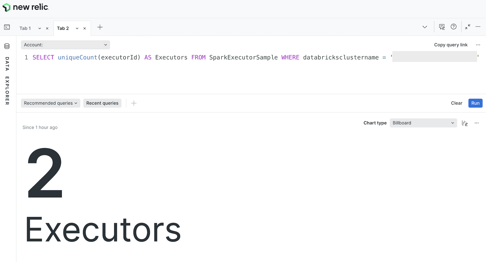

[](https://github.com/newrelic/open-source-office/blob/master/examples/categories/index.md#category-community-project)


# Databricks Integration

The Databricks Integration collects telemetry from the Databricks Data
Intelligence Platform that can be used to troubleshoot and optimize Databricks
workloads.

## Introduction

The Databricks Integration is a standalone application that collects the
following types of Databricks telemetry:

* Apache Spark application metrics

  When [deployed to a Databricks cluster](./docs/installation.md#deploy-the-integration-to-a-databricks-cluster),
  the Databricks Integration can collect telemetry from all Spark applications
  running in the cluster.

  **NOTE:** The Databricks Integration can _not_ collect Spark telemetry from
  Databricks clusters when deployed [remotely (outside of Databricks)](./docs/installation.md#deploy-the-integration-remotely).
  However, the Databricks Integration can also be used to collect Spark
  telemetry from non-Databricks Spark deployments in some cases.

  See the [Apache Spark application metrics documentation](./docs/spark.md) for
  more information.

* Databricks Lakeflow job run metrics

  The Databricks Integration can collect telemetry about
  [Databricks Lakeflow Job](https://docs.databricks.com/en/jobs/index.html#what-are-databricks-jobs)
  runs, such as durations, start and end times, and termination codes and
  types for job and task runs.

  See the [Databricks job run metrics documentation](./docs/jobs.md) for more
  information.

* Databricks Lakeflow Declarative Pipeline update metrics

  The Databricks Integration can collect telemetry about
  [Databricks Lakeflow Declarative Pipeline updates](https://docs.databricks.com/aws/en/dlt/updates),
  such as durations, start and end times, and completion status for updates and
  flows.

  See the [Databricks pipeline update metrics documentation](./docs/pipelines.md#pipeline-update-metrics)
  for more information.

* Databricks Lakeflow Declarative Pipeline event logs

  The Databricks Integration can collect [Databricks Lakeflow Declarative Pipeline event logs](https://docs.databricks.com/aws/en/dlt/monitor-event-logs)
  for all [Databricks Lakeflow Declarative Pipelines](https://docs.databricks.com/aws/en/ldp)
  defined in a [workspace](https://docs.databricks.com/en/getting-started/concepts.html#accounts-and-workspaces).
  [Databricks Lakeflow Declarative Pipeline event log](https://docs.databricks.com/aws/en/dlt/monitor-event-logs)
  entries for every [pipeline update](https://docs.databricks.com/aws/en/dlt/updates)
  are collected and sent to [New Relic Logs](https://docs.newrelic.com/docs/logs/get-started/get-started-log-management/).

  See the [Databricks pipeline event log documentation](./docs/pipelines.md#pipeline-event-logs)
  for more information.

* Databricks query metrics

  The Databricks Integration can collect telemetry about [queries](https://docs.databricks.com/aws/en/sql/user/queries/)
  executed in Databricks [SQL warehouses](https://docs.databricks.com/en/compute/sql-warehouse/index.html)
  and serverless compute, including execution times, query statuses, and query
  I/O metrics.

  See the [Databricks query metrics documentation](./docs/queries.md) for
  more information.

* Databricks cluster health metrics and logs

  When [deployed to a Databricks cluster](./docs/installation.md#deploy-the-integration-to-a-databricks-cluster),
  the [cluster-scoped init script](./init/cluster_init_integration.sh) provided
  with the Databricks Integration can automatically install the
  [New Relic Infrastructure agent](https://docs.newrelic.com/docs/infrastructure/introduction-infra-monitoring/)
  on the driver and worker nodes of the cluster in order to collect performance
  and health data from the host infrastructure. In addition, the [init script](./init/cluster_init_integration.sh)
  can automatically configure the [infrastructure agent](https://docs.newrelic.com/docs/infrastructure/introduction-infra-monitoring/)
  to collect the Spark driver and executor logs, the Spark driver event log, and
  the logs from all init scripts on the driver and worker nodes and [forward](https://docs.newrelic.com/docs/logs/forward-logs/forward-your-logs-using-infrastructure-agent/)
  them to [New Relic Logs](https://docs.newrelic.com/docs/logs/get-started/get-started-log-management/).

  See the [Databricks cluster health documentation](./docs/cluster-health.md)
  for more information.

* Databricks consumption and cost data

  The Databricks Integration can collect consumption and cost data from the
  Databricks [system tables](https://docs.databricks.com/aws/en/admin/system-tables).
  This data can be used to show Databricks DBU consumption metrics and estimated
  Databricks costs directly within New Relic.

  See the [Databricks consumption and cost data documentation](./docs/consumption-cost.md)
  for more information.

## Getting Started

Follow the steps below to get started with the Databricks Integration quickly.

**Install the integration**

1. Follow the steps to [deploy the integration to a Databricks cluster](./docs/installation.md#deploy-the-integration-to-a-databricks-cluster).

**Verify the installation**

Allow the Databricks Integration a few minutes to begin sending data. Then,
perform the following steps within New Relic:

1. Open the [query builder](https://one.newrelic.com/data-exploration/query-builder).
1. Click the button with the `+` symbol in the query builder tab bar to create a
   new tab.
1. In the query text field paste the following query:

   `SELECT uniqueCount(executorId) AS Executors FROM SparkExecutorSample WHERE databricksclustername = '[YOUR_CLUSTER_NAME]'`

   Replace the text `[YOUR_CLUSTER_NAME]` with the _name_ of the Databricks
   [cluster](https://docs.databricks.com/en/getting-started/concepts.html#cluster)
   where the integration was installed.

   **NOTE:** If your cluster name has a `'` character, make sure to prefix the
   `'` character with the `\` character. For example, if your cluster is named
   "My Company's Cluster", replace `[YOUR_CLUSTER_NAME]` with
   `My Company\'s Cluster`.

1. Click on the button labeled "Run".

When the Databricks Integration is installed and functioning properly, the
result of the query will be a number greater than zero as in the screenshot
below.



**Next steps: Install the example dashboards**

The following example dashboard JSON files are included in the [`./examples`](./examples/)
directory that can be imported to create dashboards that showcase each of the
main features of the Databricks Integration.

* [Apache Spark](./examples/spark-daskboard.json)
* [Databricks Job Runs](./examples/job-runs-dashboard.json)
* [Databricks Pipeline Updates](./examples/pipeline-updates-dashboard.json)
* [Databricks Queries](./examples/query-metrics-dashboard.json)
* [Databricks Cluster Health](./examples/cluster-health-dashboard.json)
* [Databricks Consumption & Cost](./examples/consumption-cost-dashboard.json)

**NOTE:** Collection of data for some dashboards requires additional
configuration. See the appropriate feature documentation for more details.

To import these dashboards, perform the following steps within New Relic for
each dashboard.

1. Open the JSON file for the dashboard to import.
1. Locate each instance of the following text and change the account ID `0` to
   the account ID of the account where the dashboard will be installed.

   ```json
   "accountIds": [
     0
   ],
   ```

   For example, to install the dashboard to account 12345, all instances of
   the above text would be changed to the following:

   ```json
   "accountIds": [
     12345
   ],
   ```

1. Click on "Dashboards" from the left navigation in New Relic.
1. Click on the button labeled "Import dashboard" in the upper-right hand corner
   and copy and paste the contents of the modified dashboard JSON file into the
   text field labeled "Dashboard JSON".
1. Choose the permission setting and the destination account for the dashboard.
1. Click on the button labeled "Import dashboard".
1. In the "Dashboard created" notification that appears, click on the button
   labeled "See it" to view the dashboard, or refresh the screen and click on
   the name of the imported dashboard in the table.

## Using the Integration

* [Installation](./docs/installation.md)
* [Configuration](./docs/configuration.md)
* [Authentication](./docs/authentication.md)
* [Apache Spark Application Metrics](./docs/spark.md)
* [Job Run Metrics](./docs/jobs.md)
* [Pipeline Update Metrics](./docs/pipelines.md#pipeline-update-metrics)
* [Pipeline Event Logs](./docs/pipelines.md#pipeline-event-logs)
* [Query Metrics](./docs/queries.md)
* [Cluster Health](./docs/cluster-health.md)
* [Consumption & Cost Data](./docs/consumption-cost.md)
* [Using the CLI](./docs/cli.md)
* [Additional Information](./docs/additional-information.md)

## Building the Integration

### Coding Conventions

#### Style Guidelines

While not strictly enforced, the basic preferred editor settings are set in the
[.editorconfig](./.editorconfig). Other than this, no style guidelines are
currently imposed.

#### Static Analysis

This project uses both [`go vet`](https://pkg.go.dev/cmd/vet) and
[`staticcheck`](https://staticcheck.io/) to perform static code analysis. These
checks are run via [`precommit`](https://pre-commit.com) on all commits. Though
this can be bypassed on local commit, both tasks are also run during
[the `validate` workflow](./.github/workflows/validate.yml) and must have no
errors in order to be merged.

#### Commit Messages

Commit messages must follow [the conventional commit format](https://www.conventionalcommits.org/en/v1.0.0/).
Again, while this can be bypassed on local commit, it is strictly enforced in
[the `validate` workflow](./.github/workflows/validate.yml).

The basic commit message structure is as follows.

```
<type>[optional scope][!]: <description>

[optional body]

[optional footer(s)]
```

In addition to providing consistency, the commit message is used by
[svu](https://github.com/caarlos0/svu) during
[the release workflow](./.github/workflows/release.yml). The presence and values
of certain elements within the commit message affect auto-versioning. For
example, the `feat` type will bump the minor version. Therefore, it is important
to use the guidelines below and carefully consider the content of the commit
message.

Please use one of the types below.

- `feat` (bumps minor version)
- `fix` (bumps patch version)
- `chore`
- `build`
- `docs`
- `test`

Any type can be followed by the `!` character to indicate a breaking change.
Additionally, any commit that has the text `BREAKING CHANGE:` in the footer will
indicate a breaking change.

### Local Development

For local development, simply use `go build` and `go run`. For example,

```bash
go build cmd/databricks/databricks.go
```

Or

```bash
go run cmd/databricks/databricks.go
```

If you prefer, you can also use [`goreleaser`](https://goreleaser.com/) with
the `--single-target` option to build the binary for the local `GOOS` and
`GOARCH` only.

```bash
goreleaser build --single-target
```

### Releases

Releases are built and packaged using [`goreleaser`](https://goreleaser.com/).
By default, a new release will be built automatically on any push to the `main`
branch. For more details, review the [`.goreleaser.yaml`](./.goreleaser.yaml)
and [the `goreleaser` documentation](https://goreleaser.com/intro/).

The [svu](https://github.com/caarlos0/svu) utility is used to generate the next
tag value [based on commit messages](https://github.com/caarlos0/svu?tab=readme-ov-file#next-n).

### GitHub Workflows

This project utilizes GitHub workflows to perform actions in response to
certain GitHub events.

| Workflow | Events | Description
| --- | --- | --- |
| [validate](./.github/workflows/validate.yml) | `push`, `pull_request` to `main` branch | Runs [precommit](https://pre-commit.com) to perform static analysis and runs [commitlint](https://commitlint.js.org/#/) to validate the last commit message |
| [build](./.github/workflows/build.yml) | `push`, `pull_request` | Builds and tests code |
| [release](./.github/workflows/release.yml) | `push` to `main` branch | Generates a new tag using [svu](https://github.com/caarlos0/svu) and runs [`goreleaser`](https://goreleaser.com/) |
| [repolinter](./.github/workflows/repolinter.yml) | `push` | Enforces repository content guidelines |

## Support

New Relic has open-sourced this project. This project is provided AS-IS WITHOUT
WARRANTY OR DEDICATED SUPPORT. Issues and contributions should be reported to
the project here on GitHub.

We encourage you to bring your experiences and questions to the
[Explorers Hub](https://discuss.newrelic.com/) where our community members
collaborate on solutions and new ideas.

### Privacy

At New Relic we take your privacy and the security of your information
seriously, and are committed to protecting your information. We must emphasize
the importance of not sharing personal data in public forums, and ask all users
to scrub logs and diagnostic information for sensitive information, whether
personal, proprietary, or otherwise.

We define “Personal Data” as any information relating to an identified or
identifiable individual, including, for example, your name, phone number, post
code or zip code, Device ID, IP address, and email address.

For more information, review [New Relic’s General Data Privacy Notice](https://newrelic.com/termsandconditions/privacy).

### Contribute

We encourage your contributions to improve this project! Keep in mind that
when you submit your pull request, you'll need to sign the CLA via the
click-through using CLA-Assistant. You only have to sign the CLA one time per
project.

If you have any questions, or to execute our corporate CLA (which is required
if your contribution is on behalf of a company), drop us an email at
opensource@newrelic.com.

**A note about vulnerabilities**

As noted in our [security policy](../../security/policy), New Relic is committed
to the privacy and security of our customers and their data. We believe that
providing coordinated disclosure by security researchers and engaging with the
security community are important means to achieve our security goals.

If you believe you have found a security vulnerability in this project or any of
New Relic's products or websites, we welcome and greatly appreciate you
reporting it to New Relic through [HackerOne](https://hackerone.com/newrelic).

If you would like to contribute to this project, review [these guidelines](./CONTRIBUTING.md).

To all contributors, we thank you!  Without your contribution, this project
would not be what it is today.

### License

The Databricks Integration project is licensed under the
[Apache 2.0](http://apache.org/licenses/LICENSE-2.0.txt) License.
