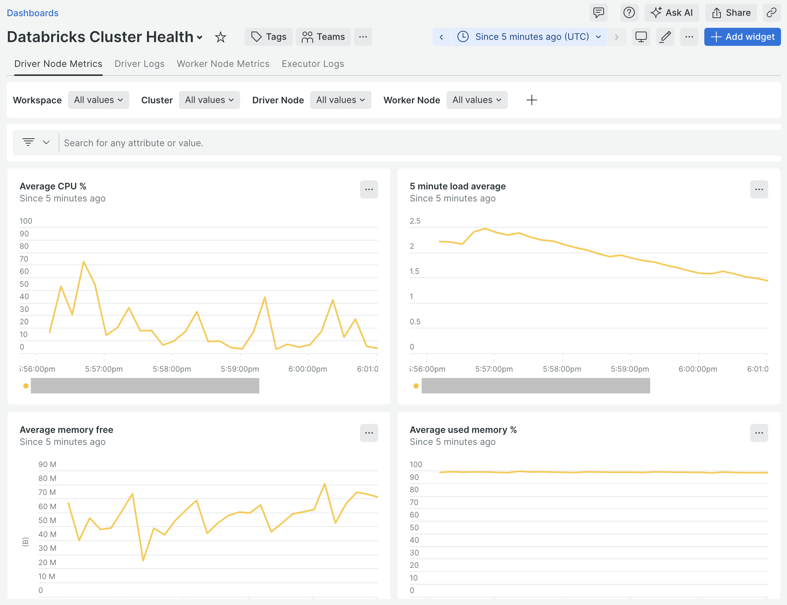

# Cluster Health

The [New Relic Infrastructure agent](https://docs.newrelic.com/docs/infrastructure/introduction-infra-monitoring/)
can be used to collect [infrastructure data](https://docs.newrelic.com/docs/infrastructure/infrastructure-data/default-infra-data/)
like CPU and memory usage from the nodes in a Databricks [cluster](https://docs.databricks.com/en/getting-started/concepts.html#cluster)
as well as the Spark driver and executor logs, the Spark driver event log, and
the logs from all init scripts on the driver and worker nodes.

## Installing the New Relic Infrastructure Agent

The [New Relic Infrastructure agent](https://docs.newrelic.com/docs/infrastructure/introduction-infra-monitoring/)
will be automatically installed on the driver and worker nodes of the cluster
as part of the process of [deploying the integration to a Databricks cluster](./installation.md#deploy-the-integration-to-a-databricks-cluster)
if the value of the `NEW_RELIC_INFRASTRUCTURE_ENABLED` environment variable is
set to `true`. In addition, if the value of the environment variable
`NEW_RELIC_INFRASTRUCTURE_LOGS_ENABLED` is set to `true`, the Spark driver and
executor logs, the Spark driver event log, and the logs from all init scripts
on the driver and worker nodes will be collected and [forwarded](https://docs.newrelic.com/docs/logs/forward-logs/forward-your-logs-using-infrastructure-agent/)
to [New Relic Logs](https://docs.newrelic.com/docs/logs/get-started/get-started-log-management/).

## Cluster Health Data

### Cluster health infrastructure data

When installed, the [New Relic infrastructure agent](https://docs.newrelic.com/docs/infrastructure/introduction-infra-monitoring/)
collects [all default infrastructure monitoring data](https://docs.newrelic.com/docs/infrastructure/infrastructure-data/default-infra-data/)
for the driver and worker nodes. Additionally, a host [entity](https://docs.newrelic.com/docs/new-relic-solutions/new-relic-one/core-concepts/what-entity-new-relic/#what-is-entity)
will show up for each node in the [cluster](https://docs.databricks.com/en/getting-started/concepts.html#cluster).

### Cluster health logs

When [log forwarding](https://docs.newrelic.com/docs/logs/forward-logs/forward-your-logs-using-infrastructure-agent/)
is configured, the following logs are collected.

* Spark driver standard out and standard error logs
* Spark driver [log4j](https://logging.apache.org/log4j/2.x/index.html) log
* Spark event log
* Standard out and standard error logs for all [init scripts](https://docs.databricks.com/aws/en/init-scripts/)
  on the driver node
* Spark application executor standard out and standard error logs on each worker
  node
* Standard out and standard error logs for all [init scripts](https://docs.databricks.com/aws/en/init-scripts/)
  on the worker nodes

### Cluster health attributes

The following attributes are included on all [infrastructure data](https://docs.newrelic.com/docs/infrastructure/infrastructure-data/default-infra-data/),
all `Log` events collected by the [infrastructure agent](https://docs.newrelic.com/docs/infrastructure/introduction-infra-monitoring/),
and on the host [entities](https://docs.newrelic.com/docs/new-relic-solutions/new-relic-one/core-concepts/what-entity-new-relic/#what-is-entity)
for all nodes in the [cluster](https://docs.databricks.com/en/getting-started/concepts.html#cluster).

| Attribute Name | Data Type | Description |
| --- | --- | --- |
| `databricksWorkspaceHost` | string | The [instance name](https://docs.databricks.com/en/workspace/workspace-details.html#workspace-instance-names-urls-and-ids) of the target Databricks instance as specified in the `NEW_RELIC_DATABRICKS_WORKSPACE_HOST` [environment variable](./installation.md#supported-init-script-environment-variables) |
| `databricksClusterId` | string | ID of the Databricks [cluster](https://docs.databricks.com/en/getting-started/concepts.html#cluster) where the metric, event, or `Log` originated from. On a host entity, the ID of the [cluster](https://docs.databricks.com/en/getting-started/concepts.html#cluster) the host is a part of. |
| `databricksClusterName` | string | Name of the Databricks [cluster](https://docs.databricks.com/en/getting-started/concepts.html#cluster) where the metric, event, or `Log` originated from. On a host entity, the name of the [cluster](https://docs.databricks.com/en/getting-started/concepts.html#cluster) the host is a part of. |
| `databricksIsDriverNode` | string | `true` if the metric, event, or `Log` originated from the driver node. `false` if the metric, event, or `Log` originated from a worker node. On a host entity, `true` if the host is the driver node or `false` if it is a worker node. |
| `databricksIsJobCluster` | string | `true` if the Databricks cluster where the metric, event or `Log` originated from is a job cluster, otherwise `false`. On a host entity, `true` if the cluster the host is a part of is a job cluster, otherwise `false`. |
| `databricksLogType` | string | The [type](#cluster-health-log-types) of log that generated the `Log` event. Only included on [cluster health `Log` events](#cluster-health-logs). |

### Cluster health log types

The `databricksLogType` attribute can have one of the following values. These
values can be used to determine the log which generated the `Log` event.

* `driver-stdout`

  Indicates the `Log` event originated from the driver standard out log.

* `driver-stderr`

  Indicates the `Log` event originated from the driver standard error log.

* `driver-log4j`

  Indicates the `Log` event originated from the driver [log4j](https://logging.apache.org/log4j/2.x/index.html)
  log.

* `spark-eventlog`

  Indicates the `Log` event originated from the Spark event log. The specific
  Spark context ID can be determined by examining the `filePath` attribute which
  takes the following form:

  `/databricks/driver/eventlogs/<sparkContextId>/eventlog`

* `driver-init-script-stdout`

  Indicates the `Log` event originated from the standard out log of an [init script](https://docs.databricks.com/aws/en/init-scripts/)
  on the driver node. The specific [init script](https://docs.databricks.com/aws/en/init-scripts/)
  can be determined by examining the `filePath` attribute which takes the
  following form:

  `/databricks/init_scripts/<date>_<time>_<number>_<scriptName>.stdout.log`

* `driver-init-script-stderr`

  Indicates the `Log` event originated from the standard error log of an [init script](https://docs.databricks.com/aws/en/init-scripts/)
  on the driver node. The specific [init script](https://docs.databricks.com/aws/en/init-scripts/)
  can be determined by examining the `filePath` attribute which takes the
  following form:

  `/databricks/init_scripts/<date>_<time>_<number>_<scriptName>.stderr.log`

* `executor-stdout`

  Indicates the `Log` event originated from the standard out log of a Spark
  application executor. The specific Spark application and executor can be
  determined by examining the `filePath` attribute which takes the following
  form:

  `/databricks/spark/work/<appId>/<executorId>/stdout`

* `executor-stderr`

  Indicates the `Log` event originated from the standard error log of a Spark
  application executor. The specific Spark application and executor can be
  determined by examining the `filePath` attribute which takes the following
  form:

  `/databricks/spark/work/<appId>/<executorId>/stderr`

* `worker-init-script-stdout`

  Indicates the `Log` event originated from the standard out log of an [init script](https://docs.databricks.com/aws/en/init-scripts/)
  on a worker node. The specific [init script](https://docs.databricks.com/aws/en/init-scripts/)
  can be determined by examining the `filePath` attribute which takes the
  following form:

  `/databricks/init_scripts/<date>_<time>_<number>_<scriptName>.stdout.log`

  The specific worker node can be determined by examining the `hostname` or
  `fullHostname` attribute.

* `worker-init-script-stderr`

  Indicates the `Log` event originated from the standard error log of an [init script](https://docs.databricks.com/aws/en/init-scripts/)
  on a worker node. The specific [init script](https://docs.databricks.com/aws/en/init-scripts/)
  can be determined by examining the `filePath` attribute which takes the
  following form:

  `/databricks/init_scripts/<date>_<time>_<number>_<scriptName>.stderr.log`

  The specific worker node can be determined by examining the `hostname` or
  `fullHostname` attribute.

## Example Cluster Health Queries

**Average CPU % of driver nodes by cluster and entity name over time**

```sql
FROM SystemSample
SELECT average(cpuPercent)
WHERE databricksIsDriverNode = 'true'
FACET databricksClusterName, entityName
TIMESERIES
```

**Average CPU % of worker nodes by cluster and entity name over time**

```sql
FROM SystemSample
SELECT average(cpuPercent)
WHERE databricksIsDriverNode = 'false'
FACET databricksClusterName, entityName
TIMESERIES
```

**Spark driver [log4j](https://logging.apache.org/log4j/2.x/index.html) logs**

```sql
WITH position(databricksWorkspaceHost, '.') AS firstDot
FROM Log
SELECT substring(databricksWorkspaceHost, 0, firstDot) AS 'Workspace', databricksClusterName AS 'Cluster', hostname AS Hostname, level AS Level, message AS Message
WHERE databricksClusterId IS NOT NULL
 AND databricksLogType = 'driver-log4j'
LIMIT 1000
```

**Spark event logs**

```sql
WITH position(databricksWorkspaceHost, '.') AS firstDot,
 capture(filePath, r'/databricks/driver/eventlogs/(?P<sparkContextId>[^/]+)/.*') AS sparkContextId
FROM Log
SELECT substring(databricksWorkspaceHost, 0, firstDot) AS 'Workspace', databricksClusterName AS 'Cluster', sparkContextId AS 'Spark Context ID', Event, `App Name`, `Job ID`, `Stage Info.Stage ID` AS 'Stage ID', `Task Info.Task ID` AS 'Task ID'
WHERE databricksClusterId IS NOT NULL
 AND databricksLogType = 'spark-eventlog'
LIMIT 1000
```

**Spark application executor standard out logs**

```sql
WITH position(databricksWorkspaceHost, '.') AS firstDot,
 capture(filePath, r'/databricks/spark/work/(?P<appName>[^/]+)/.*') AS appName
FROM Log
SELECT substring(databricksWorkspaceHost, 0, firstDot) AS 'Workspace', databricksClusterName AS 'Cluster', hostname AS Hostname, appName AS Application, message AS Message
WHERE databricksClusterId IS NOT NULL
 AND databricksLogType = 'executor-stdout'
LIMIT 1000
```

## Example Cluster Health Dashboard

A [sample dashboard](../examples/cluster-health-dashboard.json) is included
that shows examples of visualizing cluster health metrics and logs and the NRQL
statements to use to visualize the data.


