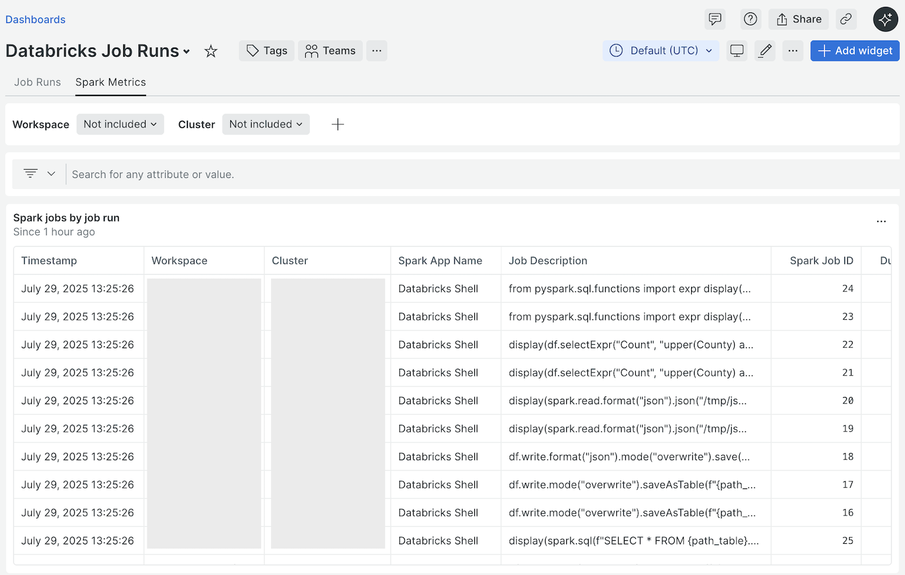

# Job Run Metrics

The Databricks Integration can collect telemetry about [Databricks Lakeflow Job](https://docs.databricks.com/en/jobs/index.html#what-are-databricks-jobs)
runs, such as job and task run durations and job and task termination codes and
types. This feature is enabled by default and can be enabled or disabled using
the [Databricks job runs `enabled`](./configuration.md#jobs--runs--enabled)
flag in the [integration configuration](./configuration.md).

## `startOffset` Configuration

On each harvest cycle, the integration uses the [Databricks ReST API](https://docs.databricks.com/api/workspace/introduction)
to retrieve job run data. By default, the [Databricks ReST API](https://docs.databricks.com/api/workspace/introduction)
endpoint for [listing job runs](https://docs.databricks.com/api/workspace/jobs/listruns)
returns a paginated list of _all_ historical job runs sorted in descending order
by start time. On systems with many jobs, there may be a large number of job
runs to retrieve and process, impacting the performance of the collector. To
account for this, the integration provides the [`startOffset`](./configuration.md#jobs--runs--startoffset)
configuration parameter. This parameter is used to tune the performance of the
collection of job run metrics by limiting the number of job runs to return when
listing job runs to job runs with start times greater than the current time at
collection minus the offset.

The effect of this behavior is that only job runs which have a start time _at_
or _after_ the calculated start time will be returned on the API call. For
example, using the default [`startOffset`](./configuration.md#jobs--runs--startoffset)
(86400 seconds or 24 hours), only job runs which started within the last 24
hours will be returned. This means that jobs that started more than 24 hours ago
will not be returned _even if_ some of those jobs are not yet in a `TERMINATED`
state. Therefore, it is important to carefully select a value for the
[`startOffset`](./configuration.md#jobs--runs--startoffset) parameter that will
account for long-running job runs without degrading the performance of the
integration.

## Job Run Events

Job run metrics are sent to New Relic as [event data](https://docs.newrelic.com/docs/data-apis/understand-data/new-relic-data-types/#event-data).
The provided events and attributes are listed in the sections below.

**NOTE:** Some of the descriptions in the following sections are sourced from
the [Databricks SDK Go module documentation](https://pkg.go.dev/github.com/databricks/databricks-sdk-go).

### Common job run event attributes

The following attributes are included on _all_ job run events.

| Attribute Name | Data Type | Description |
| --- | --- | --- |
| `databricksWorkspaceId` | string | [ID](https://docs.databricks.com/en/workspace/workspace-details.html#workspace-instance-names-urls-and-ids) of the Databricks workspace of the job associated with the job run |
| `databricksWorkspaceName` | string | [Instance name](https://docs.databricks.com/en/workspace/workspace-details.html#workspace-instance-names-urls-and-ids) of the Databricks workspace of the job associated with the job run |
| `databricksWorkspaceUrl` | string | [URL](https://docs.databricks.com/en/workspace/workspace-details.html#workspace-instance-names-urls-and-ids) of the Databricks workspace of the job associated with the job run |

The following attributes are included on all [`DatabricksJobRun`](#databricksjobrun-events)
and [`DatabricksTaskRun`](#databrickstaskrun-events) events when cluster
instance information is returned by the [list runs](https://docs.databricks.com/api/workspace/jobs/listruns)
API.

| Attribute Name | Data Type | Description |
| --- | --- | --- |
| `databricksClusterId` | string | ID of the Databricks [cluster](https://docs.databricks.com/en/getting-started/concepts.html#cluster) where the job run occurred |
| `databricksClusterName` | string | Name of the Databricks [cluster](https://docs.databricks.com/en/getting-started/concepts.html#cluster) where the job run occurred |
| `databricksClusterSource` | string | Source of the Databricks [cluster](https://docs.databricks.com/en/getting-started/concepts.html#cluster) where the job run occurred (one of `API`, `JOB`, `MODELS`, `PIPELINE`, `PIPELINE_MAINTENANCE`, `SQL`, or `UI`) |
| `databricksClusterInstancePoolId` | string | ID of the Databricks cluster [instance pool](https://docs.databricks.com/aws/en/compute/pool-index) used when creating the cluster for the job run |
| `databricksClusterSparkContextId` | string | The canonical identifier for the Spark context used by a run |

**NOTE:** During testing on a constantly running all-purpose cluster, cluster
instance information was only returned at the [task](https://docs.databricks.com/api/workspace/jobs/listruns#runs-tasks-cluster_instance)
level. It was not returned at the [job](https://docs.databricks.com/api/workspace/jobs/listruns#runs-cluster_instance)
level. Further, according to the [Databricks ReST API](https://docs.databricks.com/api/workspace/introduction)
documentation, if the job run is specified to use a new cluster, cluster
instance information is set only once the Jobs service has requested a cluster
for the run. For these reasons, the availability of cluster information on
[`DatabricksJobRun`](#databricksjobrun-events) and [`DatabricksTaskRun`](#databrickstaskrun-events)
events is not guaranteed.

### `DatabricksJobRun` events

The integration records a start event for each job run that starts while the
integration is running and a complete event for each job run that completes
while the integration is running. Both events are reported using the
`DatabricksJobRun` event type. The `event` attribute on the `DatabricksJobRun`
event can be used to differentiate between the start event (the `event`
attribute will be set to `start`) and the complete event (the `event` attribute
will be set to `complete`).

Each `DatabricksJobRun` start event includes the following attributes.

| Attribute Name | Data Type | Description |
| --- | --- | --- |
| `event` | string | Set to `start` for a start event and `complete` for a complete event |
| `jobId` | number | The canonical identifier of the Databricks job that contains the run |
| `jobRunId` | number | The canonical identifier of the run. This ID is unique across all runs of all jobs. |
| `jobRunType` | string | The type of the run; one of `JOB_RUN`, `WORKFLOW_RUN`, or `SUBMIT_RUN` |
| `jobRunName` | string | An optional name for the run |
| `jobRunStartTime` | number | The time at which the run started, in milliseconds since the epoch |
| `jobRunTrigger` | string | The type of trigger that fired the run; one of `PERIODIC`, `ONE_TIME`, `RETRY`, `RUN_JOB_TASK`, `FILE_ARRIVAL`, `TABLE`, `CONTINUOUS_RESTART`, or `MODEL` |
| `description` | string | Description of the run |
| `attempt` | number | The sequence number of the run attempt for a triggered job run. The initial attempt of a run has an attempt number of 0. |
| `isRetry` | boolean | `true` if the run attempt is a retry of a prior run attempt, otherwise `false` |
| `originalAttemptRunId` | number | If the run is a retry of a prior run attempt, the run ID of the original attempt; otherwise, the same as the `jobRunId` |

Each `DatabricksJobRun` complete event includes all the attributes on the start
event plus the following additional attributes.

| Attribute Name | Data Type | Description |
| --- | --- | --- |
| `state` | string | The state of the job run. This field will always be set to `TERMINATED`. |
| `terminationCode` | string | A code indicating why the run was terminated (see [the Databricks Go SDK documentation](https://pkg.go.dev/github.com/databricks/databricks-sdk-go/service/jobs#TerminationCodeCode) for valid codes) |
| `terminationType` | string | The termination type; one of `SUCCESS`, `INTERNAL_ERROR`, `CLIENT_ERROR`, or `CLOUD_FAILURE` |
| `jobRunEndTime` | number | The time at which the run ended, in milliseconds since the epoch |
| `duration` | number | The duration of the run, in milliseconds |
| `queueDuration` | number | The duration the run spent in the queue, in milliseconds |
| `setupDuration` | number | The duration it took to setup the cluster, in milliseconds; not set for multi-task job runs |
| `executionDuration` | number | The duration it took to execute the commands in the JAR or notebook, in milliseconds; not set for multi-task job runs |
| `cleanupDuration` | number | The duration it took to terminate the cluster and cleanup any associated artifacts, in milliseconds; not set for multi-task job runs |

### `DatabricksTaskRun` events

The integration records a start event for each task run that starts while the
integration is running and a complete event for each task run that completes
while the integration is running. Both events are reported using the
`DatabricksTaskRun` event type. The `event` attribute on the `DatabricksTaskRun`
event can be used to differentiate between the start event (the `event`
attribute will be set to `start`) and the complete event (the `event` attribute
will be set to `complete`).

Each `DatabricksTaskRun` start event includes the following attributes.

| Attribute Name | Data Type | Description |
| --- | --- | --- |
| `event` | string | Set to `start` for a start event and `complete` for a complete event |
| `jobId` | number | The canonical identifier of the Databricks job that contains the job run for this task run |
| `jobRunId` | number | The canonical identifier of the job run for this task run. This ID is unique across all runs of all jobs. |
| `jobRunType` | string | The type of the job run for this task run; one of `JOB_RUN`, `WORKFLOW_RUN`, or `SUBMIT_RUN` |
| `jobRunName` | string | An optional name for the job run for this task run |
| `jobRunStartTime` | number | The time at which the job run for this task run started, in milliseconds since the epoch |
| `jobRunTrigger` | string | The type of trigger that fired the job run for this task run; one of `PERIODIC`, `ONE_TIME`, `RETRY`, `RUN_JOB_TASK`, `FILE_ARRIVAL`, `TABLE`, `CONTINUOUS_RESTART`, or `MODEL` |
| `taskRunId` | number | The ID of the task run |
| `taskRunStartTime` | number | The time at which the task run started, in milliseconds since the epoch |
| `taskName` | string | A unique name for the task |
| `description` | string | An optional description for the task |
| `attempt` | number | The sequence number of the task run attempt for a triggered job run. The initial attempt of a task run has an attempt number of 0. |
| `isRetry` | boolean | `true` if the task run attempt is a retry of a prior attempt, otherwise `false` |

Each `DatabricksTaskRun` complete event includes all the attributes on the start
event plus the following additional attributes.

| Attribute Name | Data Type | Description |
| --- | --- | --- |
| `state` | string | The state of the task run. This field will always be set to `TERMINATED`. |
| `terminationCode` | string | A code indicating why the task run was terminated (see the [Databricks Go SDK documentation](https://pkg.go.dev/github.com/databricks/databricks-sdk-go/service/jobs#TerminationCodeCode) for valid codes) |
| `terminationType` | string | The termination type; one of `SUCCESS`, `INTERNAL_ERROR`, `CLIENT_ERROR`, or `CLOUD_FAILURE` |
| `taskRunEndTime` | number | The time at which the task run ended, in milliseconds since the epoch |
| `duration` | number | The duration of the run, in milliseconds |
| `queueDuration` | number | The duration the run spent in the queue, in milliseconds |
| `setupDuration` | number | The duration it took to setup the cluster, in milliseconds |
| `executionDuration` | number | The duration it took to execute the commands in the JAR or notebook, in milliseconds |
| `cleanupDuration` | number | The duration it took to terminate the cluster and cleanup any associated artifacts, in milliseconds |

### `DatabricksJobRunSummary`

On each harvest cycle, the integration records a `DatabricksJobRunSummary` event
with the following attributes.

| Attribute Name | Data Type | Description |
| --- | --- | --- |
| `blockedJobRunCount` | number | The number of blocked job runs, measured at the time of collection |
| `waitingJobRunCount` | number | The number of waiting job runs, measured at the time of collection |
| `pendingJobRunCount` | number | The number of pending job runs, measured at the time of collection |
| `queuedJobRunCount` | number | The number of queued job runs, measured at the time of collection |
| `runningJobRunCount` | number | The number of running job runs, measured at the time of collection |
| `terminatingJobRunCount` | number | The number of terminating job runs, measured at the time of collection |
| `blockedTaskRunCount` | number | The number of blocked task runs, measured at the time of collection |
| `waitingTaskRunCount` | number | The number of waiting task runs, measured at the time of collection |
| `pendingTaskRunCount` | number | The number of pending task runs, measured at the time of collection |
| `queuedTaskRunCount` | number | The number of queued task runs, measured at the time of collection |
| `runningTaskRunCount` | number | The number of running task runs, measured at the time of collection |
| `terminatingTaskRunCount` | number | The number of terminating task runs, measured at the time of collection |

**NOTE:**
* The count values in the `DatabricksJobRunSummary` event represent the sum
  total of jobs and tasks in each state measured at the time of collection. The
  measurement of jobs and tasks in a given state between two different runs of
  the integration may or may not include the same jobs and tasks. For example,
  if the same job is blocked when the integration runs at time `T` and when the
  integration runs at time `T + 1`, it will be counted in the
  `blockedJobRunCount` attribute for the `DatabricksJobRunSummary` events
  generated for each of those runs. For this reason, some aggregation functions
  do not produce meaningful values with these counts. For instance, in the
  previous example, the [`sum()`](https://docs.newrelic.com/docs/nrql/nrql-syntax-clauses-functions/#func-sum)
  function would count the blocked job twice when aggregated across times `T`
  and `T + 1`, making it seem as though there are a total of two blocked jobs in
  the aggregated time interval.
* The [`latest()`](https://docs.newrelic.com/docs/nrql/nrql-syntax-clauses-functions/#latest)
  aggregator function can be used with the count values in the
  `DatabricksJobRunSummary` event to display the "current" number of jobs and
  tasks in a given state. In general, the [`TIMESERIES`](https://docs.newrelic.com/docs/nrql/nrql-syntax-clauses-functions/#sel-timeseries)
  clause should not be used with the [`latest()`](https://docs.newrelic.com/docs/nrql/nrql-syntax-clauses-functions/#latest)
  aggregator function as it can obscure values when the selected time interval
  includes two or more events. For example, if one job is blocked at time `T`
  and zero jobs are blocked at time `T + 1`, the [`latest()`](https://docs.newrelic.com/docs/nrql/nrql-syntax-clauses-functions/#latest)
  aggregator function would show that zero jobs were blocked when aggregated
  across times `T` and `T + 1`.
* Count values for terminated jobs and tasks are not included in the
  `DatabricksJobRunSummary` event because terminated jobs and tasks can be
  counted simply by using the `count(*)` aggregator function on
  `DatabricksJobRun` and `DatabricksTaskRun` events, respectively, where the
  `event` attribute is set to `complete`.

### Job and task run durations

The Databricks integration stores the following job and task run durations on
each `DatabricksJobRun` and `DatabricksTaskRun` _complete_ event, respectively.

**NOTE:** Duration attributes are not set on `DatabricksJobRun` and
`DatabricksTaskRun` _start_ events.

* `DatabricksJobRun`

  * `duration`

    The `duration` field represents the total duration of the job run, in
    milliseconds.

  * `queueDuration`

    The `queueDuration` field represents the time that the job run has spent in
    the queue, in milliseconds.

  * `setupDuration`

    The `setupDuration` field represents the time it took to setup the cluster
    for the job run, in milliseconds.

    **NOTE:** For multi-task job runs, this field is always set to `0`.

  * `executionDuration`

    The `executionDuration` field represents the time, in milliseconds, it took
    to execute the commands in the JAR or notebook for the job run until they
    completed, failed, timed out, were cancelled, or encountered an unexpected
    error.

    **NOTE:** For multi-task job runs, this field is always set to `0`.

  * `cleanupDuration`

    The `cleanupDuration` field represents the time it took to terminate the
    cluster and cleanup any associated artifacts for the job run, in
    milliseconds.

    **NOTE:** For multi-task job runs, this field is always set to `0`.

* `DatabricksTaskRun`

  * `duration`

    The `duration` field represents the total duration of the task run, in
    milliseconds.

  * `queueDuration`

    The `queueDuration` field represents the time that the task run has spent in
    the queue, in milliseconds.

  * `setupDuration`

    The `setupDuration` field represents the time it took to setup the cluster
    for the task run, in milliseconds.

  * `executionDuration`

    The `executionDuration` field represents the time, in milliseconds, it took
    to execute the commands in the JAR or notebook for the task run until they
    completed, failed, timed out, were cancelled, or encountered an unexpected
    error.

  * `cleanupDuration`

    The `cleanupDuration` field represents the time it took to terminate the
    cluster and cleanup any associated artifacts for the task run, in
    milliseconds.

## Example Job Run Queries

**Current count of running job runs by workspace**

```sql
FROM DatabricksJobRunSummary
SELECT latest(runningJobRunCount)
FACET substring(databricksWorkspaceName, 0, position(databricksWorkspaceName, '.'))
```

**Current count of blocked task runs by workspace**

```sql
FROM DatabricksJobRunSummary
SELECT latest(blockedTaskRunCount)
FACET substring(databricksWorkspaceName, 0, position(databricksWorkspaceName, '.'))
```

**Running job runs by workspace, job run ID, job run name, and job run start time**

The following query displays job runs which are currently running by looking for
job runs which have produced a `DatabricksJobRun` start event but no
`DatabricksJobRun` complete event. The nested query returns the number of unique
values for the `event` attribute and the value of the `event` attribute of the
first `DatabricksJobRun` row returned when grouping job runs by workspace name,
workspace URL, job ID, job run ID, job run name, and job run start time (which
uniquely identifies a job run) and ordering by latest timestamp. The outer query
counts the number of results where the unique number of values for the `event`
attribute is equal to 1 and the value of that attribute is equal to `start`.

The query also shows an example of constructing a URL that links directly to the
job run details page within the Databricks workspace UI.

```sql
WITH
 substring(databricksWorkspaceName, 0, position(databricksWorkspaceName, '.')) AS workspace,
 concat(databricksWorkspaceUrl, '/jobs/', jobId, '/runs/', jobRunId) AS databricksJobRunURL
SELECT count(*)
FROM (
 FROM DatabricksJobRun
 SELECT
  uniqueCount(event) as 'total',
  latest(event) as 'state'
 FACET databricksWorkspaceName, databricksWorkspaceUrl, jobId, jobRunId, jobRunName, toDatetime(jobRunStartTime, 'MMMM dd, YYYY HH:mm:ss') AS startTime
 ORDER BY max(timestamp)
 LIMIT 100)
WHERE total = 1 AND state = 'start'
FACET workspace AS Workspace, jobRunId AS 'Job Run ID', jobRunName AS 'Job Run Name', startTime AS 'Job Run Start Time', databricksJobRunURL AS 'Databricks Link'
LIMIT 100
```

**Average duration of completed job runs, in seconds, by job name over time**

```sql
FROM DatabricksJobRun
SELECT average(duration / 1000)
WHERE event = 'complete'
FACET jobRunName
TIMESERIES
```

**NOTE:** Make sure to use the condition `event = 'complete'` to target only
job run complete events.

**Average duration of completed task runs, in seconds, by job run name and task name over time**

```sql
FROM DatabricksTaskRun
SELECT average(duration / 1000)
WHERE event = 'complete'
FACET jobRunName, taskName
TIMESERIES
```

**NOTE:** Make sure to use the condition `event = 'complete'` to target only
task run complete events.

**Average task run queued duration, in seconds, by task name over time**

```sql
FROM DatabricksTaskRun
SELECT average(queueDuration / 1000)
WHERE event = 'complete'
FACET taskName
TIMESERIES
```

**NOTE:** Make sure to use the condition `event = 'complete'` to target only
task run complete events.

**Job run details for completed job runs ordered by slowest job run**

```sql
WITH
 substring(databricksWorkspaceName, 0, position(databricksWorkspaceName, '.')) AS workspace,
 concat(databricksWorkspaceUrl, '/jobs/', jobId, '/runs/', jobRunId) AS databricksJobRunURL
FROM DatabricksJobRun
SELECT workspace AS Workspace,
 jobId AS 'Job ID',
 jobRunId AS 'Job Run ID',
 jobRunName,
 attempt,
 jobRunStartTime,
 jobRunEndTime,
 jobRunType,
 jobRunTrigger,
 terminationCode,
 terminationType,
 duration,
 databricksJobRunURL AS 'Databricks Link'
WHERE event = 'complete'
ORDER BY duration DESC
LIMIT 100
```

**NOTE:** Make sure to use the condition `event = 'complete'` to target only
job run complete events.

**Spark job details by job run**

The following query shows an example of how Spark job metrics can be shown along
with the Databricks task run information for the Databricks task run that
initiated the Spark job.

**NOTE:** This query will only display results when the integration is able to
[map Spark metrics to Databricks job runs](./spark.md#mapping-spark-metrics-to-databricks-jobs-and-pipelines).

```sql
WITH
 concat(databricksWorkspaceUrl, '/jobs/', databricksJobId, '/runs/', databricksJobRunTaskRunId) AS databricksJobRunURL
FROM SparkJob
SELECT
 substring(databricksWorkspaceName, 0, position(databricksWorkspaceName, '.')) AS Workspace,
 databricksclustername AS Cluster,
 sparkAppName AS 'Spark App Name',
 description AS 'Job Description',
 jobId AS 'Spark Job ID',
 duration / 1000 AS Duration,
 databricksJobId AS 'Databricks Job ID',
 databricksJobRunTaskRunId as 'Databricks Task Run ID',
 databricksJobRunURL AS 'Databricks Link'
WHERE event = 'complete' AND
 databricksJobId IS NOT NULL AND
 databricksJobRunTaskRunId IS NOT NULL
LIMIT MAX
```

## Example Job Runs Dashboard

A [sample dashboard](../examples/job-runs-dashboard.json) is included that shows
examples of the types of job run information that can be displayed and the NRQL
statements to use to visualize the data.



