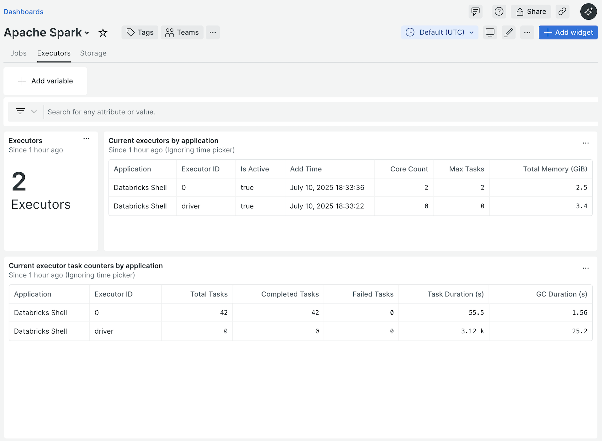
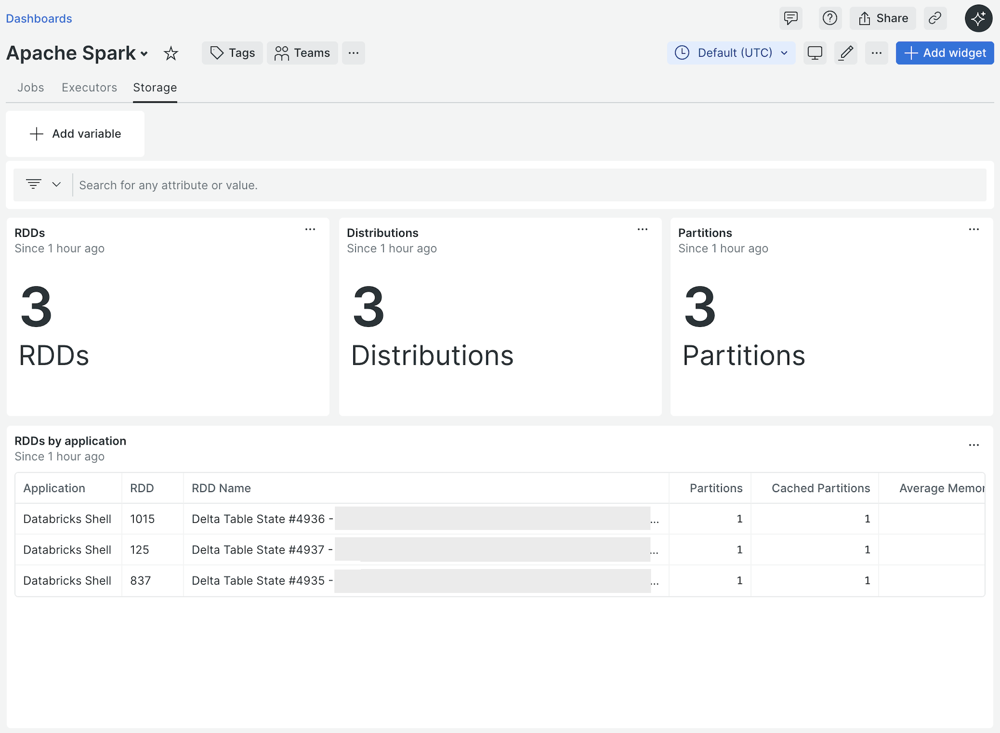

# Apache Spark Application Metrics

The Databricks Integration can collect [Apache Spark](https://spark.apache.org/docs/latest/index.html)
[application](https://spark.apache.org/docs/latest/submitting-applications.html)
metrics for all running applications in a given [Spark cluster](https://spark.apache.org/docs/3.5.4/cluster-overview.html).
Metrics are collected by accessing the monitoring [ReST API](https://spark.apache.org/docs/latest/monitoring.html#rest-api)
through the [Web UI](https://spark.apache.org/docs/latest/web-ui.html) of a
given [`SparkContext`](https://spark.apache.org/docs/3.5.4/rdd-programming-guide.html#initializing-spark).

When the Spark collector is enabled (the top-level [`spark`](./configuration.md#spark)
node is specified), Spark application metrics are collected from the [Web UI](https://spark.apache.org/docs/latest/web-ui.html)
URL specified in the [`webUiUrl`](./configuration.md#webuiurl) or from the [Web UI](https://spark.apache.org/docs/latest/web-ui.html)
URL `https://localhost:4040` by default.

**NOTE:** In some cases, the Databricks Integration can be used to collect Spark
telemetry from non-Databricks Spark deployments.

## Spark Application Events

Spark application metrics are sent to New Relic as [event data](https://docs.newrelic.com/docs/data-apis/understand-data/new-relic-data-types/#event-data).
The provided events and attributes are listed in the sections below.

**NOTE:** Many of the descriptions in the following sections are sourced from
the Apache Spark monitoring [ReST API documentation](https://spark.apache.org/docs/latest/monitoring.html#rest-api),
the [Javadoc for the Spark Java API](https://spark.apache.org/docs/latest/api/java/index.html),
and the [Apache Spark source code](https://github.com/apache/spark/tree/master).

### Spark API metric types

The Apache Spark monitoring [ReST API](https://spark.apache.org/docs/latest/monitoring.html#rest-api)
returns two types of metrics: monotonically increasing counters (referred to
below simply as "counters") and gauges, with the majority of metrics being
counters. Both types of metrics are stored as numeric attributes on the New
Relic events generated by the integration for Apache Spark data.

Unlike gauges, counter metrics are additive. Each successive value of a counter
metric will include the previous value of the metric. The metric is _not_ reset
to zero each time it is reported. Because of this, only the [`latest()`](https://docs.newrelic.com/docs/nrql/nrql-syntax-clauses-functions/#latest)
aggregator function will provide meaningful results when visualizing or alerting
on these metrics (for example, taking the average of a set of data points that
represent a monotonically increasing counter makes no sense). Aggregation
functions such as `average()` and `median()` can not, unfortunately, be used
with these counter metrics.

For example, the `totalTaskDuration` metric on the `SparkExecutorSample` event
is a counter which will be reported each time the integration collects [Spark executor metrics](#spark-application-executor-data).
As more tasks run on the executor, the `totalTaskDuration` will increase by the
duration of each task as depicted below.

| Collection time | Task duration delta | Reported `totalTaskDuration` |
| --- | --- | --- |
| `00s` | `500ms` | `500` |
| `30s` | `5000ms` | `5500` |
| `60s` | `00ms` | `5500` |
| `90s` | `15000ms` | `20500` |

In this case, using the `average()` aggregator function on `totalTaskDuration`
would yield `8000ms` but the actual average task duration is `5125ms`.

Counter metrics which are reported on multiple samples are indicated below with
the text `(counter)`.

### Common Spark application event attributes

The following attributes are included on _all_ Spark application events.

| Attribute Name | Data Type | Description |
| --- | --- | --- |
| `sparkAppId` | string | Spark application ID |
| `sparkAppName` | string | Spark application name |
| `databricksWorkspaceId` | string | **Databricks only** [ID](https://docs.databricks.com/en/workspace/workspace-details.html#workspace-instance-names-urls-and-ids) of the Databricks workspace of the Databricks cluster running the application |
| `databricksWorkspaceName` | string | **Databricks only** [Instance name](https://docs.databricks.com/en/workspace/workspace-details.html#workspace-instance-names-urls-and-ids) of the Databricks workspace of the Databricks cluster running the application |
| `databricksWorkspaceUrl` | string | **Databricks only** [URL](https://docs.databricks.com/en/workspace/workspace-details.html#workspace-instance-names-urls-and-ids) of the Databricks workspace of the Databricks cluster running the application |
| `databricksClusterId` | string | **Databricks only** Databricks cluster ID |
| `databricksClusterName` | string | **Databricks only** Databricks cluster name |

### Spark application executor data

On each harvest cycle, the integration reports one `SparkExecutorSample` event
for each Spark executor in each Spark application.

Each `SparkExecutorSample` event includes the following attributes.

| Attribute Name | Data Type | Description |
| --- | --- | --- |
| `executorId` | string | ID of the executor within the Spark application |
| `isActive` | boolean | `true` if the executor is currently active, otherwise `false` |
| `isExcluded` | boolean | `true` if the executor has been excluded from task scheduling, otherwise `false` |
| `isBlacklisted` | boolean | `true` if the executor has been marked as blacklisted, otherwise `false` |
| `addTime` | number | The time the executor was added, in milliseconds since the epoch |
| `rddBlockCount` | number | RDD blocks in the block manager of this executor |
| `memoryUsedBytes` | number | Storage memory used by this executor |
| `diskUsedBytes` | number | Disk space used for RDD storage by this executor |
| `coreCount` | number (counter) | Number of cores available in this executor |
| `maxTasks` | number (counter) | Maximum number of tasks that can run concurrently in this executor |
| `activeTaskCount` | number | Number of tasks currently executing |
| `failedTaskCount` | number (counter) | Number of tasks that have failed in this executor |
| `completedTaskCount` | number (counter) | Number of tasks that have completed in this executor |
| `taskCount` | number (counter) | Total number of tasks (running, failed and completed) in this executor |
| `taskDuration` | number (counter) | Elapsed time the JVM spent executing tasks in this executor. The value is expressed in milliseconds. |
| `gcDuration` | number (counter) | Elapsed time the JVM spent in garbage collection summed in this executor. The value is expressed in milliseconds. |
| `inputBytes` | number (counter) | Total input bytes summed in this executor |
| `shuffleReadBytes` | number (counter) | Total shuffle read bytes summed in this executor |
| `shuffleWriteBytes` | number (counter) | Total shuffle write bytes summed in this executor |
| `memoryTotalBytes` | gauge | Total amount of memory available for storage, in bytes |
| `onHeapMemoryUsedBytes` | gauge | Used on heap memory currently for storage, in bytes |
| `offHeapMemoryUsedBytes` | gauge | Used off heap memory currently for storage, in bytes |
| `onHeapMemoryTotalBytes` | gauge | Total available on heap memory for storage, in bytes. This amount can vary over time, depending on the MemoryManager implementation. |
| `offHeapMemoryTotalBytes` | gauge | Total available off heap memory for storage, in bytes. This amount can vary over time, depending on the MemoryManager implementation. |
| `peakJvmHeapMemoryUsedBytes` | number (counter) | Peak memory usage of the heap that is used for object allocation by the Java virtual machine |
| `peakJvmOffHeapMemoryUsedBytes` | number (counter) | Peak memory usage of non-heap memory that is used by the Java virtual machine |
| `peakOnHeapExecutionMemoryUsedBytes` | number (counter) | Peak on heap execution memory usage, in bytes |
| `peakOffHeapExecutionMemoryUsedBytes` | number (counter) | Peak off heap execution memory usage, in bytes |
| `peakOnHeapStorageMemoryUsedBytes` | number (counter) | Peak on heap storage memory usage, in bytes |
| `peakOffHeapStorageMemoryUsedBytes` | number (counter) | Peak off heap storage memory usage, in bytes |
| `peakOnHeapUnifiedMemoryUsedBytes` | number (counter) | Peak on heap memory usage (execution and storage), in bytes |
| `peakOffHeapUnifiedMemoryUsedBytes` | number (counter) | Peak off heap memory usage (execution and storage), in bytes |
| `peakDirectPoolMemoryUsedBytes` | number (counter) | Peak JVM memory usage for direct buffer pool (java.lang.management.BufferPoolMXBean), in bytes |
| `peakMappedPoolMemoryUsedBytes` | number (counter) | Peak JVM memory usage for mapped buffer pool (java.lang.management.BufferPoolMXBean), in bytes |
| `peakProcessTreeJvmVirtualBytes` | number (counter) | Peak virtual memory size, in bytes |
| `peakProcessTreeJvmRSS` | number (counter) | Peak Resident Set Size (number of pages the process has in real memory) |
| `peakProcessTreePythonVirtualBytes` | number (counter) | Peak virtual memory size for Python, in bytes |
| `peakProcessTreePythonRSS` | number (counter) | Peak resident Set Size for Python |
| `peakProcessTreeOtherVirtualBytes` | number (counter) | Peak virtual memory size for other kinds of processes, in bytes |
| `peakProcessTreeOtherRSS` | number (counter) | Peak resident Set Size for other kinds of processes |
| `peakMinorGCCount` | number (counter) | Total number of minor GCs that have occurred |
| `peakMinorGCDuration` | number (counter) | Total elapsed time spent doing minor GCs. The value is expressed in milliseconds. |
| `peakMajorGCCount` | number (counter) | Total number of major GCs that have occurred |
| `peakMajorGCDuration` | number (counter) | Total elapsed time spent doing major GCs. The value is expressed in milliseconds. |
| `peakTotalGCDuration` | number (counter) | Total elapsed time spent doing GC (major + minor). The value is expressed in milliseconds. |
| `peakNettyDirectMemory` | number (counter) | **Databricks only** |
| `peakJvmDirectMemory` | number (counter) | **Databricks only** |
| `peakSparkDirectMemoryOverLimit` | number (counter) | **Databricks only** |
| `peakTotalOffHeapMemory` | number (counter) | **Databricks only** |

### Spark application job data

The integration records a start event for each job that starts while the
integration is running and a complete event for each job that completes while
the integration is running. Both events are reported using the `SparkJob` event
type. The `event` attribute on the `SparkJob` event can be used to differentiate
between the start event (the `event` attribute will be set to `start`) and the
complete event (the `event` attribute will be set to `complete`).

Each `SparkJob` start event includes the following attributes.

| Attribute Name | Data Type | Description |
| --- | --- | --- |
| `event` | string | Set to `start` for a start event and `complete` for a complete event |
| `jobId` | number | Spark job ID |
| `jobName` | string | Spark job name |
| `jobGroup` | string | Spark job group |
| `jobTags` | string | Comma-separated list of Spark [job tags](https://spark.apache.org/docs/latest/api/python/reference/api/pyspark.SparkContext.getJobTags.html) |
| `description` | string | Spark job description (value of the Spark context property `spark.job.description`) |
| `submissionTime` | number | Time the job was submitted, in milliseconds since the epoch |

Each `SparkJob` complete event includes all the attributes on the `SparkJob`
start event plus the following additional attributes.

| Attribute Name | Data Type | Description |
| --- | --- | --- |
| `status` | string | Spark job [status](#spark-job-stage-and-task-status) |
| `completionTime` | number | Time the job completed, in milliseconds since the epoch |
| `duration` | number | Duration of the job. The value is expressed in milliseconds. |
| `completedIndexCount` | number | This metric is not documented in the Apache Spark monitoring [ReST API documentation](https://spark.apache.org/docs/latest/monitoring.html#rest-api) |
| `activeStageCount` | number | The number of stages currently running. This number should always be `0` as there should be no stages running once a job has completed. |
| `completedStageCount` | number | The number of stages that completed successfully |
| `skippedStageCount` | number | The number of stages that were skipped for this job |
| `failedStageCount` | number | The number of stages that failed for this job |
| `taskCount` | number | The number of tasks for this job |
| `activeTaskCount` | number | The number of tasks currently running for this job. This number should always be `0` as there should be no tasks running once a job has completed. |
| `completedTaskCount` | number | The number of tasks that completed successfully for this job |
| `skippedTaskCount` | number | The number of tasks that were skipped for this job |
| `failedTaskCount` | number | The number of tasks that failed for this job |
| `killedTaskCount` | number | The number of tasks that were killed for this job |

### Spark application stage data

The integration records a start event for each stage that starts while the
integration is running and a complete event for each stage that completes while
the integration is running. Both events are reported using the `SparkStage`
event type. The `event` attribute on the `SparkStage` event can be used to
differentiate between the start event (the `event` attribute will be set to
`start`) and the complete event (the `event` attribute will be set to
`complete`).

**NOTE:** The metrics in this section are not documented in the
Apache Spark monitoring [ReST API documentation](https://spark.apache.org/docs/latest/monitoring.html#rest-api).
The descriptions provided below were deduced primarily via analysis of the
[Apache Spark source code](https://github.com/apache/spark/tree/master) and
are not necessarily determinate.

Each `SparkStage` start event includes the following attributes.

| Attribute Name | Data Type | Description |
| --- | --- | --- |
| `event` | string | Set to `start` for a start event and `complete` for a complete event |
| `stageId` | number | Spark stage ID |
| `stageName` | string | Spark stage name (call site short form) |
| `jobDescription` | string | Description (value of the Spark context property `spark.job.description`) of the job for this stage  |
| `details` | string | Spark stage details (call site long form) |
| `attemptId` | number | Spark stage attempt ID |
| `schedulingPool` | string | Name of the Spark fair scheduler pool that this stage is a part of |
| `resourceProfileId` | number | ID of the resource profile applied during this stage |
| `submissionTime` | number | Time the stage was submitted, in milliseconds since the epoch |
| `firstTaskLaunchedTime` | number | Time the first task for this stage was launched, in milliseconds since the epoch |

Each `SparkStage` complete event includes all the attributes on the `SparkStage`
start event plus the following additional attributes.

| Attribute Name | Data Type | Description |
| --- | --- | --- |
| `status` | string | Spark stage [status](#spark-job-stage-and-task-status) |
| `completionTime` | number | Time the stage completed, in milliseconds since the epoch |
| `duration` | number | Duration of the stage. The value is the number of milliseconds between the completion time and the first task launched time. |
| `taskCount` | number | Number of tasks for this stage |
| `activeTaskCount` | number | The number of tasks currently running for this stage. This number should always be `0` as there should be no tasks running once a stage has completed. |
| `completedTaskCount` | number | The number of tasks that completed successfully for this stage |
| `failedTaskCount` | number | The number of tasks that failed for this stage |
| `killedTaskCount` | number | The number of tasks that were killed for this stage |
| `completedIndexCount` | number | This metric is not documented in the Apache Spark monitoring [ReST API documentation](https://spark.apache.org/docs/latest/monitoring.html#rest-api) |
| `executorDeserializeDuration` | number | Total elapsed time spent by executors deserializing tasks for the named stage. The value is expressed in milliseconds. |
| `executorDeserializeCpuDuration` | number | Total CPU time spent by executors to deserialize tasks for the named stage. The value is expressed in nanoseconds. |
| `executorRunDuration` | number | Total elapsed time spent running tasks on executors for the named stage. The value is expressed in milliseconds. |
| `executorCpuDuration` | number | Total CPU time spent running tasks on executors for the named stage. This includes time fetching shuffle data. The value is expressed in nanoseconds. |
| `resultSizeBytes` | number | The total number of bytes transmitted back to the driver by all tasks for the named stage |
| `gcDuration` | number | Total elapsed time the JVM spent in garbage collection while executing tasks for the named stage. The value is expressed in milliseconds. |
| `resultSerializationDuration` | number | Total elapsed time spent serializing task results for the named stage. The value is expressed in milliseconds. |
| `memorySpilledBytes` | number | Sum of the in-memory bytes spilled by all tasks for the named stage |
| `diskSpilledBytes` | number | Sum of the number of on-disk bytes spilled by all tasks for the named stage |
| `peakExecutionMemoryUsedBytes` | number | Sum of the peak memory used by internal data structures created during shuffles, aggregations and joins by all tasks for the named stage |
| `inputBytes` | number | Sum of the number of bytes read from org.apache.spark.rdd.HadoopRDD or from persisted data by all tasks for the named stage |
| `inputRecords` | number | Sum of the number of records read from org.apache.spark.rdd.HadoopRDD or from persisted data by all tasks for the named stage |
| `outputBytes` | number | Sum of the number of bytes written externally (e.g. to a distributed filesystem) by all tasks with output for the named stage |
| `outputRecords` | number | Sum of the number of records written externally (e.g. to a distributed filesystem) by all tasks with output for the named stage |
| `shuffleRemoteFetchedBlockCount` | number | Sum of the number of remote blocks fetched in shuffle operations by all tasks for the named stage  |
| `shuffleLocalFetchedBlockCount` | number | Sum of the number of local (as opposed to read from a remote executor) blocks fetched in shuffle operations by all tasks for the named stage |
| `shuffleFetchWaitDuration` | number | Total time tasks spent waiting for remote shuffle blocks for the named stage |
| `shuffleRemoteReadBytes` | number | Sum of the number of remote bytes read in shuffle operations by all tasks for the named stage |
| `shuffleRemoteReadToDiskBytes` | number | Sum of the number of remote bytes read to disk in shuffle operations by all tasks for the named stage |
| `shuffleLocalReadBytes` | number | Sum of the number of bytes read in shuffle operations from local disk (as opposed to read from a remote executor) by all tasks for the named stage |
| `shuffleReadBytes` | number | This metric is not documented in the Apache Spark monitoring [ReST API documentation](https://spark.apache.org/docs/latest/monitoring.html#rest-api) |
| `shuffleReadRecords` | number | Sum of the number of records read in shuffle operations by all tasks for the named stage |
| `shuffleCorruptMergedBlockChunkCount` | number | Sum of the number of corrupt merged shuffle block chunks encountered by all tasks (remote or local) for the named stage |
| `shuffleMergedFetchFallbackCount` | number | Sum of the number of times tasks had to fallback to fetch original shuffle blocks for a merged shuffle block chunk (remote or local) for the named stage |
| `shuffleRemoteMergedFetchedBlockCount` | number | Sum of the number of remote merged blocks fetched by all tasks for the named stage  |
| `shuffleLocalMergedFetchedBlockCount` | number | Sum of the number of local merged blocks fetched by all tasks for the named stage |
| `shuffleRemoteMergedFetchedChunkCount` | number | Sum of the number of remote merged chunks fetched by all tasks for the named stage |
| `shuffleLocalMergedFetchedChunkCount` | number | Sum of the number of local merged chunks fetched by all tasks for the named stage |
| `shuffleRemoteMergedReadBytes` | number | Sum of the number of remote merged bytes read by all tasks for the named stage |
| `shuffleLocalMergedReadBytes` | number | Sum of the number of local merged bytes read by all tasks for the named stage |
| `shuffleRemoteReqsDuration` | number | Total time tasks took executing remote requests for the named stage |
| `shuffleRemoteMergedReqsDuration` | number | Total time tasks took executing remote merged requests for the named stage |
| `shuffleWriteBytes` | number | Sum of the number of bytes written in shuffle operations by all tasks for the named stage |
| `shuffleWriteDuration` | number | Total time tasks spent blocking on writes to disk or buffer cache for the named stage. The value is expressed in nanoseconds. |
| `shuffleWriteRecords` | number | Sum of the number of records written in shuffle operations by all tasks for the named stage |
| `shuffleMergersCount` | number | The number of shuffle merges that occurred during this stage |
| `stage.peakNettyDirectMemory` | number | **Databricks only**  |
| `stage.peakJvmDirectMemory` | number | **Databricks only**  |
| `stage.peakSparkDirectMemoryOverLimit` | number | **Databricks only** |
| `stage.peakTotalOffHeapMemory` | number | **Databricks only** |
| `peakJvmHeapMemoryUsedBytes` | number | Peak memory usage of the heap that is used for object allocation by the Java virtual machine while executing tasks for the named stage, in bytes |
| `peakJvmOffHeapMemoryUsedBytes` | number | Peak memory usage of non-heap memory by the Java virtual machine while executing tasks for the named stage, in bytes |
| `peakOnHeapExecutionMemoryUsedBytes` | number | Peak on heap execution memory usage while executing tasks for the named stage, in bytes |
| `peakOffHeapExecutionMemoryUsedBytes` | number | Peak off heap execution memory usage while executing tasks for the named stage, in bytes |
| `peakOnHeapStorageMemoryUsedBytes` | number | Peak on heap storage memory usage while executing tasks for the named stage, in bytes |
| `peakOffHeapStorageMemoryUsedBytes` | number | Peak off heap storage memory usage while executing tasks for the named stage, in bytes |
| `peakOnHeapUnifiedMemoryUsedBytes` | number | Peak on heap memory usage (execution and storage) while executing tasks for the named stage, in bytes |
| `peakOffHeapUnifiedMemoryUsedBytes` | number | Peak off heap memory usage (execution and storage) while executing tasks for the named stage, in bytes |
| `peakDirectPoolMemoryUsedBytes` | number | Peak JVM memory usage for the direct buffer pool (java.lang.management.BufferPoolMXBean) while executing tasks for the named stage, in bytes |
| `peakMappedPoolMemoryUsedBytes` | number | Peak JVM memory usage for the mapped buffer pool (java.lang.management.BufferPoolMXBean) while executing tasks for the named stage, in bytes |
| `peakProcessTreeJvmVirtualBytes` | number | Peak virtual memory size while executing tasks for the named stage, in bytes |
| `peakProcessTreeJvmRSS` | number | Peak Resident Set Size (number of pages the process has in real memory) while executing tasks for the named stage |
| `peakProcessTreePythonVirtualBytes` | number | Peak virtual memory size for Python while executing tasks for the named stage, in bytes |
| `peakProcessTreePythonRSS` | number | Peak Resident Set Size for Python while executing tasks for the named stage |
| `peakProcessTreeOtherVirtualBytes` | number | Peak virtual memory size for other kinds of processes while executing tasks for the named stage, in bytes |
| `peakProcessTreeOtherRSS` | number | Peak resident Set Size for other kinds of processes while executing tasks for the named stage |
| `peakMinorGCCount` | number | Total number of minor GCs that occurred while executing tasks for the named stage |
| `peakMinorGCDuration` | number | Total elapsed time spent doing minor GCs while executing tasks for the named stage. The value is expressed in milliseconds. |
| `peakMajorGCCount` | number | Total number of major GCs that occurred while executing tasks for the named stage |
| `peakMajorGCDuration` | number | Total elapsed time spent doing major GCs while executing tasks for the named stage. The value is expressed in milliseconds. |
| `peakTotalGCDuration` | number | Total elapsed time spent doing GC while executing tasks for the named stage. The value is expressed in milliseconds. |
| `peakNettyDirectMemory` | number | **Databricks only**  |
| `peakJvmDirectMemory` | number | **Databricks only**  |
| `peakSparkDirectMemoryOverLimit` | counter | **Databricks only** |
| `peakTotalOffHeapMemory` | number | **Databricks only** |

**NOTE:** For skipped stages, only a `SparkStage` complete event is recorded.
No `SparkStage` start event is recorded. Furthermore, `SparkStage` complete
events for skipped stages _only_ include the following attributes listed above:

* `event`
* `stageId`
* `stageName`
* `jobDescription`
* `details`
* `attemptId`
* `schedulingPool`
* `resourceProfileId`
* `status`
* `taskCount`

### Spark application task data

The integration records a start event for each task that starts while the
integration is running and a complete event for each task that completes while
the integration is running. Both events are reported using the
`SparkTask` event type. The `event` attribute on the `SparkTask` event can be
used to differentiate between the start event (the `event` attribute will be set
to `start`) and the complete event (the `event` attribute will be set to
`complete`).

Each `SparkTask` start event includes the following attributes.

| Attribute Name | Data Type | Description |
| --- | --- | --- |
| `event` | string | Set to `start` for a start event and `complete` for a complete event |
| `stageId` | number | Spark stage ID |
| `stageName` | string | Spark stage name |
| `stageStatus` | string | Spark stage [status](#spark-job-stage-and-task-status) |
| `stageAttemptId` | number | Spark stage attempt ID |
| `taskId` | string | Spark task ID |
| `index` | number | The index of this task within its task set |
| `attemptId` | number | Spark task attempt number |
| `executorId` | string | Spark executor ID |
| `locality` | string | [Locality](https://spark.apache.org/docs/3.5.4/tuning.html#data-locality) of the data this task operates on |
| `speculative` | boolean | `true` if this is a [speculative task execution](https://kb.databricks.com/scala/understanding-speculative-execution), otherwise `false` |
| `partitionId` | number | The ID of the RDD partition this task is reponsible for computing  |
| `launchTime` | number | Time the task was launched, in milliseconds since the epoch |

Each `SparkTask` complete event includes all the attributes on the start event
plus the following additional attributes.

| Attribute Name | Data Type | Description |
| --- | --- | --- |
| `status` | string | Spark task [status](#spark-job-stage-and-task-status) |
| `completionTime` | number | Time the task completed, in milliseconds since the epoch |
| `duration` | number | Duration of the task. The value is expressed in milliseconds. |
| `schedulerDelay` | number | The time between when the task was created by the scheduler and when the task began executing on an executor |
| `gettingResultDuration` | number | The time it took to transmit the result from the executor to the driver. The value is expressed in milliseconds. |
| `executorDeserializeDuration` | number | Elapsed time spent to deserialize this task. The value is expressed in milliseconds. |
| `executorDeserializeCpuDuration` | number | CPU time taken on the executor to deserialize this task. The value is expressed in nanoseconds. |
| `executorRunDuration` | number | Elapsed time the executor spent running this task. This includes time fetching shuffle data. The value is expressed in milliseconds. |
| `executorCpuDuration` | number | CPU time the executor spent running this task. This includes time fetching shuffle data. The value is expressed in nanoseconds. |
| `resultSizeBytes` | number | The number of bytes this task transmitted back to the driver as the TaskResult |
| `gcDuration` | number | Elapsed time the JVM spent in garbage collection while executing this task. The value is expressed in milliseconds. |
| `resultSerializationDuration` | number | Elapsed time spent serializing the task result. The value is expressed in milliseconds. |
| `memorySpilledBytes` | number | The number of in-memory bytes spilled by this task |
| `diskSpilledBytes` | number | The number of on-disk bytes spilled by this task |
| `peakExecutionMemoryUsedBytes` | number | Peak memory used by internal data structures created during shuffles, aggregations and joins. The value of this accumulator should be approximately the sum of the peak sizes across all such data structures created in this task. For SQL jobs, this only tracks all unsafe operators and ExternalSort. |
| `inputReadBytes` | number | Total number of bytes read from org.apache.spark.rdd.HadoopRDD or from persisted data |
| `inputReadRecords` | number | Total number of records read from org.apache.spark.rdd.HadoopRDD or from persisted data |
| `outputWriteBytes` | number | Total number of bytes written externally (e.g. to a distributed filesystem). Defined only in tasks with output. |
| `outputWriteRecords` | number | Total number of records written externally (e.g. to a distributed filesystem). Defined only in tasks with output. |
| `shuffleReadRemoteFetchedBlockCount` | number | Number of remote blocks fetched in shuffle operations |
| `shuffleReadLocalFetchedBlockCount` | number | Number of local (as opposed to read from a remote executor) blocks fetched in shuffle operations |
| `shuffleReadFetchWaitDuration` | number | Time the task spent waiting for remote shuffle blocks. This only includes the time blocking on shuffle input data. For instance if block B is being fetched while the task is still not finished processing block A, it is not considered to be blocking on block B. The value is expressed in milliseconds. |
| `shuffleReadRemoteReadBytes` | number | Number of remote bytes read in shuffle operations |
| `shuffleReadRemoteReadToDiskBytes` | number | Number of remote bytes read to disk in shuffle operations. Large blocks are fetched to disk in shuffle read operations, as opposed to being read into memory, which is the default behavior |
| `shuffleReadLocalReadBytes` | number | Number of bytes read in shuffle operations from local disk (as opposed to read from a remote executor) |
| `shuffleReadReadRecords` | number | Number of records read in shuffle operations |
| `shuffleReadRemoteReqsDuration` | number | Total time taken for remote requests to complete by this task. This doesn't include duration of remote merged requests. |
| `shufflePushReadCorruptMergedBlockChunkCount` | number | Number of corrupt merged shuffle block chunks encountered by this task (remote or local) |
| `shufflePushReadMergedFetchFallbackCount` | number | Number of times the task had to fallback to fetch original shuffle blocks for a merged shuffle block chunk (remote or local) |
| `shufflePushReadRemoteMergedFetchedBlockCount` | number | Number of remote merged blocks fetched  |
| `shufflePushReadLocalMergedFetchedBlockCount` | number | Number of local merged blocks fetched |
| `shufflePushReadRemoteMergedFetchedChunkCount` | number | Number of remote merged chunks fetched |
| `shufflePushReadLocalMergedFetchedChunkCount` | number | Number of local merged chunks fetched |
| `shufflePushReadRemoteMergedReadBytes` | number | Total number of remote merged bytes read |
| `shufflePushReadLocalMergedReadBytes` | number | Total number of local merged bytes read |
| `shufflePushReadRemoteMergedReqsDuration` | number | Total time taken for remote merged requests |
| `shuffleWriteWriteBytes` | number | Number of bytes written in shuffle operations |
| `shuffleWriteWriteDuration` | number | Time spent blocking on writes to disk or buffer cache. The value is expressed in nanoseconds. |
| `shuffleWriteWriteRecords` | number | Number of records written in shuffle operations |
| `photonOffHeapMinMemorySize` | number | **Databricks only** |
| `photonOffHeapMaxMemorySize` | number | **Databricks only** |
| `photonBufferPoolMinMemorySize` | number | **Databricks only** |
| `photonBufferPoolMaxMemorySize` | number | **Databricks only** |
| `photonizedTaskTimeNs` | number | **Databricks only** |
| `snapstartedTaskCount` | number | **Databricks only** |

### Spark application RDD data

On each harvest cycle, the integration reports one `SparkRDDSample` event for
each Spark RDD in each Spark application. In addition, it records one
`SparkRDDDistributionSample` for each RDD distribution for each Spark RDD in
each Spark application and one `SparkRDDPartitionSample` for each RDD partition
for each Spark RDD in each Spark application.

**NOTE:** The metrics in this section are not documented in the
Apache Spark monitoring [ReST API documentation](https://spark.apache.org/docs/latest/monitoring.html#rest-api).
The descriptions provided below were deduced primarily via analysis of the
[Apache Spark source code](https://github.com/apache/spark/tree/master) and
are not necessarily determinate.

Each `SparkRDDSample` event includes the following attributes.

| Attribute Name | Data Type | Description |
| --- | --- | --- |
| `rddId` | number | Spark RDD ID |
| `rddName` | string | Spark RDD name |
| `storageLevel` | string | A string that describes the storage level options used to persist this RDD |
| `partitionCount` | number | The total number of partitions for this RDD |
| `cachedPartitionCount` | number | The total number of partitions that have been persisted (cached) in memory and/or on disk  |
| `memoryUsedBytes` | number | The total amount of memory used by this RDD across all partitions, in bytes |
| `diskUsedBytes` | number | The total amount of disk space used by this RDD across all partitions, in bytes |

Each `SparkRDDDistributionSample` event includes the following attributes.

| Attribute Name | Data Type | Description |
| --- | --- | --- |
| `rddId` | number | Spark RDD ID |
| `rddName` | string | Spark RDD name |
| `distributionIndex` | number | Numerical index of the RDD distribution in the list of distributions returned for this RDD by the Spark application RDD endpoint of the [ReST API](https://spark.apache.org/docs/latest/monitoring.html#rest-api) |
| `memoryUsedBytes` | number | Unknown |
| `memoryFreeBytes` | number | Unknown |
| `diskUsedBytes` | number | Unknown |
| `onHeapMemoryUsedBytes` | number | Unknown |
| `onHeapMemoryFreeBytes` | number | Unknown |
| `offHeapMemoryUsedBytes` | number | Unknown |
| `offHeapMemoryFreeBytes` | number | Unknown |

Each `SparkRDDPartitionSample` event includes the following attributes.

| Attribute Name | Data Type | Description |
| --- | --- | --- |
| `rddId` | number | Spark RDD ID |
| `rddName` | string | Spark RDD name |
| `blockName` | string | Name of the block where the RDD partition is stored |
| `storageLevel` | string | A string that describes the effective storage level options used to persist this RDD |
| `memoryUsedBytes` | number | The total amount of memory used by this RDD partition, in bytes |
| `diskUsedBytes` | number | The total amount of disk space used by this RDD partition, in bytes |
| `executorIds` | string | Comma-separated list of executor IDs |

### Spark job, stage, and task status

`SparkJob`, `SparkStage`, and `SparkTask` complete events always include a
`status` attribute that indicates the completion status of the Spark job, stage,
or task recorded in the event. The possible values for the `status` field for
each event type are listed below.

* `SparkJob`

  * `succeeded` - job completed successfully
  * `failed` - job failed

* `SparkStage`

  * `complete` - stage completed successfully
  * `skipped` - stage was skipped because it did not need to be recomputed
  * `failed` - stage failed

* `SparkTask`

  * `complete` - task completed successfully
  * `skipped` - task was skipped because the stage was skipped
  * `failed` - task failed
  * `killed` - task was explicitly killed

In addition, the `SparkTask` complete event includes a `stageStatus` attribute
that indicates the status of the task's "parent" stage at the time that the
task completed. In addition to the status values listed above for the
`SparkStage` event, the `stageStatus` attribute can also have the value
`active`, indicating that the stage was still running when the stage and task
data were retrieved from the Spark [ReST API](https://spark.apache.org/docs/latest/monitoring.html#rest-api).

### Mapping Spark metrics to Databricks Jobs and Pipelines

When the Databricks Integration is [deployed to a Databricks cluster](./installation.md#deploy-the-integration-to-a-databricks-cluster),
all [Spark application events](#spark-application-events) will have the
following attributes.

| Name                     | Data Type | Data Description                                                                                                                                |
| ------------------------ | --------- | ----------------------------------------------------------------------------------------------------------------------------------------------- |
| `databricksWorkspaceId`   | string    | [ID](https://docs.databricks.com/en/workspace/workspace-details.html#workspace-instance-names-urls-and-ids) of the Databricks workspace of the Databricks cluster running the application |
| `databricksWorkspaceName` | string    | [Instance name](https://docs.databricks.com/en/workspace/workspace-details.html#workspace-instance-names-urls-and-ids) of the Databricks workspace of the Databricks cluster running the application |
| `databricksWorkspaceUrl`  | string    | [URL](https://docs.databricks.com/en/workspace/workspace-details.html#workspace-instance-names-urls-and-ids) of the Databricks workspace of the Databricks cluster running the application |

Additionally, the integration will attempt to map Spark job, stage, and task
metrics to either a Databricks job task run or a Databricks pipeline (and in
some cases a specific update flow). This is done by examining the `jobGroup`
field that is returned for each Spark job retrieved via the Spark [ReST API](https://spark.apache.org/docs/latest/monitoring.html#rest-api).

By default, the value of the `jobGroup` field is a string with a specific
format. For Spark jobs associated with a Databricks job run, the value includes
the Databricks job ID and task run ID. For Spark jobs associated with a
Databricks pipeline update, the value includes the Databricks pipeline ID and,
in some cases, the pipeline update ID and pipeline update flow ID.

When collecting Spark job metrics, the Databricks integration will examine the
value of the `jobGroup` field. If the value follows one of the recognized
formats, the integration will parse the IDs out of the field and include the IDs
as attributes on each `SparkJob` event. In addition the integration will
propagate the IDs from the `jobGroup` field for a given Spark job to the
`SparkStage` and `SparkTask` events for the stages and tasks that are part of
the Spark job.

* For Spark jobs, stages, and tasks associated with a Databricks job task run,
  the following attributes are added to each `SparkJob`, `SparkStage`, and
  `SparkTask` event:

  | Name                        | Data Type | Description                                                |
  | --------------------------- | --------- | ---------------------------------------------------------- |
  | `databricksJobId`           | number    | The job ID for the associated Databricks job task run      |
  | `databricksJobRunTaskRunId` | number    | The task run ID for the associated Databricks job task run |

* For Spark jobs, stages, and tasks associated with a Databricks pipeline
  update, the following attributes are added to each `SparkJob`, `SparkStage`,
  and `SparkTask` event:

  | Name                         | Data Type | Description                                                                                                                                                             |
  | ---------------------------- | --------- | ----------------------------------------------------------------------------------------------------------------------------------------------------------------------- |
  | `databricksPipelineId`       | string    | The pipeline ID for the associated Databricks pipeline                                                                                                                  |
  | `databricksPipelineUpdateId` | string    | The pipeline update ID for the associated Databricks pipeline update (only included if the pipeline update ID is present in the `jobGroup` field)                       |
  | `databricksPipelineFlowId`   | string    | The pipeline update flow ID for the flow in the associated Databricks pipeline update (only included if the pipeline update flow ID is present in the `jobGroup` field) |

If the value of the `jobGroup` field does _not_ follow one of the recognized
formats (for example, if the `jobGroup` has been customized using the
[`setJobGroup`](https://spark.apache.org/docs/latest/api/python/reference/api/pyspark.SparkContext.setJobGroup.html)
function), the field value will not be parsed and none of the additional
attributes will be available on the associated `SparkJob`, `SparkStage` and
`SparkTask` events. Only the workspace related attributes will be available.

## Example Spark Queries

**Number of completed jobs by application name and job status**

```sql
FROM SparkJob
SELECT count(*)
WHERE event = 'complete'
FACET sparkAppName AS Application, status
```

**NOTE:** Make sure to use the condition `event = 'complete'` to target only
Spark job complete events.

**Number of jobs that failed by application name**

```sql
FROM SparkJob
SELECT count(*)
WHERE event = 'complete' AND status = 'failed'
FACET sparkAppName AS Application
```

**NOTE:** Make sure to use the condition `event = 'complete'` to target only
Spark job complete events.

**Number of running jobs by application name**

The following query displays Spark jobs which are currently running by looking
for jobs which have produced a `SparkJob` start event but no `SparkJob` complete
event. The nested query returns the number of unique values for the `event`
attribute and the value of the `event` attribute of the first `SparkJob` row
returned when grouping Spark jobs by Spark application name, job ID,
description, and submission time (which uniquely identifies a job) and ordering
by latest timestamp. The outer query counts the number of results where the
unique number of values for the `event` attribute is equal to 1 and the value of
that attribute is equal to `start`.

```sql
SELECT count(*)
FROM (
 FROM SparkJob
 SELECT
  uniqueCount(event) as 'total',
  latest(event) as 'state'
 FACET sparkAppName, jobId, description, submissionTime
 ORDER BY max(timestamp)
 LIMIT MAX)
WHERE total = 1 AND state = 'start'
FACET sparkAppName AS Application, jobId AS 'Job ID', description, toDatetime(submissionTime)
LIMIT MAX
```

**Number of job stages completed, skipped, and failed by application name and job ID**

```sql
FROM SparkJob
SELECT latest(completedStageCount), latest(skippedStageCount), latest(failedStageCount)
WHERE event = 'complete'
FACET sparkAppName AS Application, jobId AS 'Job ID', toDatetime(submissionTime)
```

**NOTE:**
* Make sure to use the condition `event = 'complete'` to target only
  Spark job complete events.
* Note the use of the `*Count` fields on the `SparkJob` event rather than
  using `count(*)` on the `SparkStage`. This is required in order to group the
  results by job ID.
* Spark job IDs are not always unique. For example, if an executor is
  removed and then a new executor is later added, the job IDs restart from 0.
  Therefore in order to ensure we are looking at unique jobs in the above query,
  we need to also group by the the submission time.

**Number of completed stages by application name and stage status**

```sql
FROM SparkStage
SELECT count(*)
WHERE event = 'complete'
FACET sparkAppName AS Application, status
```

**NOTE:** Make sure to use the condition `event = 'complete'` to target only
Spark stage complete events.

**Number of stages that completed successfully by application name**

```sql
FROM SparkStage
SELECT count(*)
WHERE event = 'complete' AND status = 'complete'
FACET sparkAppName AS Application
```

**NOTE:** Make sure to use the condition `event = 'complete'` to target only
Spark stage complete events.

**Number of stages that were skipped by application name**

```sql
FROM SparkStage
SELECT count(*)
WHERE event = 'complete' AND status = 'skipped'
FACET sparkAppName AS Application
```

**NOTE:** Make sure to use the condition `event = 'complete'` to target only
Spark stage complete events.

**Number of stage tasks completed, killed, and failed by application name, stage ID, attempt ID, and submission time**

```sql
FROM SparkStage
SELECT latest(completedTaskCount), latest(killedTaskCount), latest(failedTaskCount)
WHERE event = 'complete'
FACET sparkAppName AS Application, stageId AS 'Stage ID', attemptId AS 'Attempt ID', toDateTime(submissionTime)
```

**NOTE:**
* Make sure to use the condition `event = 'complete'` to target only
  Spark stage complete events.
* Note the use of the `*Count` fields on the `SparkStage` event rather than
  using `count(*)` on the `SparkTask`. This is required in order to group the
  results by submission time.
* Spark stage IDs are not always unique. For example, if an executor is
  removed and then a new executor is later added, the stage IDs restart from 0.
  Therefore in order to ensure we are looking at unique stage attempts in the
  above query, we need to also group by the attempt ID and the submission time.

**Number of completed tasks by application name, stage ID, and task status**

```sql
FROM SparkTask
SELECT count(*)
WHERE event = 'complete'
FACET sparkAppName AS Application, stageId AS 'Stage ID', status
```

**NOTE:** Make sure to use the condition `event = 'complete'` to target only
Spark task complete events.

**Number of tasks that were killed by application name and stage ID**

```sql
FROM SparkTask
SELECT count(*)
WHERE event = 'complete' AND status = 'killed'
FACET sparkAppName AS Application, stageId AS 'Stage ID'
```

**NOTE:** Make sure to use the condition `event = 'complete'` to target only
Spark task complete events.

**Number of failed tasks by application name and job ID**

```sql
FROM SparkJob
SELECT latest(failedTaskCount)
WHERE event = 'complete'
FACET sparkAppName AS Application, jobId AS 'Job ID', attemptId AS 'Attempt ID', toDatetime(submissionTime)
```

**NOTE:**
* Make sure to use the condition `event = 'complete'` to target only
  Spark job complete events.
* Note the use of the `failedTaskCount` field on the `SparkJob` event rather
  than using `count(*)` on the `SparkTask` where `status` is `failed`. This is
  required in order to group the results by job ID.
* Spark job IDs are not always unique. For example, if an executor is
  removed and then a new executor is later added, the job IDs restart from 0.
  Therefore in order to ensure we are looking at unique jobs in the above query,
  we need to also group by the attempt ID and the submission time.

**Average job duration, in seconds, by application name over time**

```sql
FROM SparkJob
SELECT average(duration / 1000) AS Duration
WHERE event = 'complete'
FACET sparkAppName AS Application
TIMESERIES
```

**NOTE:** Make sure to use the condition `event = 'complete'` to target only
Spark job complete events.

**Job details (application name, job ID, job description, submission time, completion time, status, duration) for each job ordered by slowest job**

```sql
FROM SparkJob
SELECT sparkAppName AS Application, jobId AS 'Job ID', description, submissionTime, completionTime, status, duration
WHERE event = 'complete'
LIMIT MAX
ORDER BY duration DESC
```

**NOTE:** Make sure to use the condition `event = 'complete'` to target only
Spark job complete events.

**Average stage duration, in seconds, by application name and job description**

```sql
FROM SparkStage
SELECT average(duration / 1000) AS Duration
WHERE event = 'complete'
FACET sparkAppName AS Application, jobDescription
```

**NOTE:** Make sure to use the condition `event = 'complete'` to target only
Spark stage complete events.

**Stage details (application name, job description, stage ID, attempt ID, submission time, first task launched time, completion time, status, duration) for each stage ordered by slowest stage**

```sql
FROM SparkStage
SELECT sparkAppName AS Application, jobDescription, stageId AS 'Stage ID', attemptId AS 'Attempt ID', submissionTime, firstTaskLaunchedTime, completionTime, status, duration
WHERE event = 'complete'
LIMIT MAX
ORDER BY duration DESC
```

**NOTE:** Make sure to use the condition `event = 'complete'` to target only
Spark stage complete events.

**Average task duration, in seconds, by application name and job description**

```sql
FROM SparkTask
SELECT average(duration / 1000) AS Duration
WHERE event = 'complete'
FACET sparkAppName AS Application, jobDescription
```

**NOTE:** Make sure to use the condition `event = 'complete'` to target only
Spark task complete events.

**Task details (application name, job description, stage ID, stage attempt ID, task ID, task attempt ID, launch time, completion time, status, duration) for each task ordered by slowest task**

```sql
FROM SparkTask
SELECT sparkAppName AS Application, jobDescription, stageId AS 'Stage ID', stageAttemptId AS 'Stage Attempt ID', taskId AS 'Task ID', attemptId AS 'Attempt ID', launchTime, completionTime, status, duration
WHERE event = 'complete'
LIMIT MAX
ORDER BY duration DESC
```

**NOTE:** Make sure to use the condition `event = 'complete'` to target only
Spark task complete events.

**Average elapsed stage executor run time, in seconds, by application name and job description**

```sql
FROM SparkStage
SELECT average(executorRunDuration / 1000) AS Duration
WHERE event = 'complete'
FACET sparkAppName AS Application, jobDescription
```

**NOTE:** Make sure to use the condition `event = 'complete'` to target only
Spark stage complete events.

**Average elapsed stage JVM GC time, in seconds, by application name and job description**

```sql
FROM SparkStage
SELECT average(gcDuration / 1000) AS Duration
WHERE event = 'complete'
FACET sparkAppName AS Application, jobDescription
```

**NOTE:** Make sure to use the condition `event = 'complete'` to target only
Spark stage complete events.

**Average memory used, in bytes, by application name and executor ID over time**

```sql
FROM SparkExecutorSample
SELECT average(memoryUsedBytes)
FACET sparkAppName, executorId
TIMESERIES
```

**Number of active executors by application name**

```sql
FROM SparkExecutorSample
SELECT uniqueCount(executorId)
WHERE isActive = true
FACET sparkAppName AS Application
```

**Number of unique RDD partitions by application name**

```sql
FROM SparkRDDPartitionSample
SELECT uniqueCount(concat(rddId, rddName, blockName))
FACET sparkAppName AS Application
```

**Average RDD memory used, in bytes, by application name and RDD over time**

```sql
FROM SparkRDDSample
SELECT average(memoryUsedBytes)
FACET sparkAppName AS Application, rddId AS 'RDD ID', rddName
TIMESERIES
```

**Average RDD partition memory used, in bytes, by application name, RDD, and block name over time**

```sql
FROM SparkRDDPartitionSample
SELECT average(memoryUsedBytes)
FACET sparkAppName AS Application, rddId AS 'RDD ID', rddName, blockName
TIMESERIES
```

## Example Apache Spark Dashboard

A [sample dashboard](../examples/spark-daskboard.json) is included that shows
examples of the types of Apache Spark information that can be displayed and the
NRQL statements to use to visualize the data.




