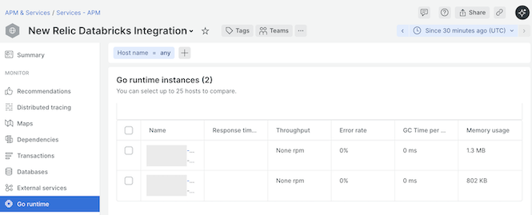
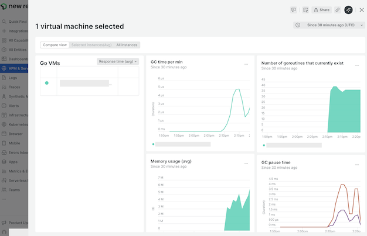
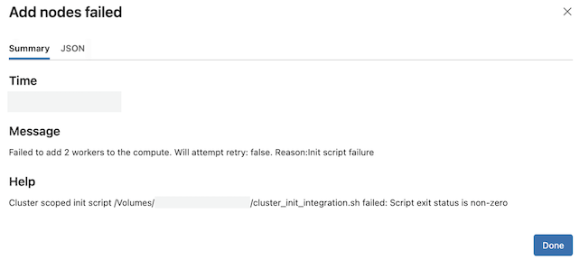
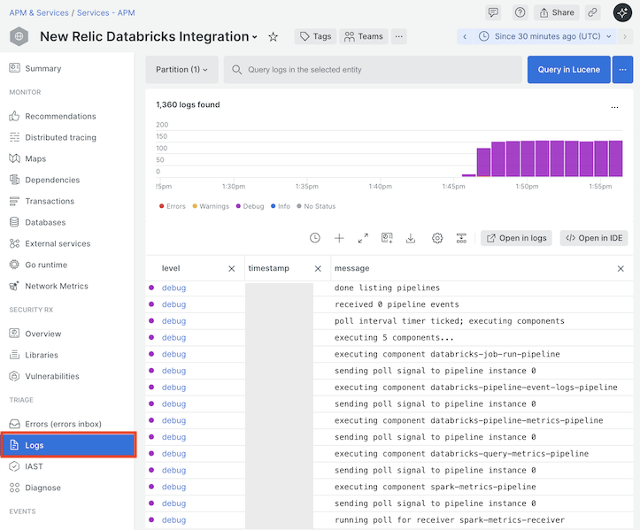

# Troubleshooting

The following sections are designed to help you quickly identify and resolve
common issues encountered when deploying or maintaining the Databricks
Integration.

* [Common Issues & Resolutions](#common-issues--resolutions)
  * [Standard Diagnostics](#standard-diagnostics)
  * [No Data Appears](#no-data-appears)
  * [Messages in the `cluster_init_integration.sh` stderr log](#messages-in-the-cluster_init_integrationsh-stderr-log)
* [New Relic Diagnostics Notebook](#new-relic-diagnostics-notebook)
* [Log Data](#log-data)
  * [Working with Logs when Deployed to a Cluster](#working-with-logs-when-deployed-to-a-cluster)
  * [Working with Logs when Deployed Remotely](#working-with-logs-when-deployed-remotely)
* [New Relic Databricks Integration APM Entity](#new-relic-databricks-integration-apm-entity)

## Common Issues & Resolutions

### Standard Diagnostics

Prior to running any of the diagnostic steps in the issue-specific sections
below, run the diagnostic steps in the following sections.

#### Verify running processes

To verify that the integration process and, when the integration is deployed to
a cluster, the infrastructure agent and Fluent Bit processes are running, refer
to the diagnostic procedures below.

##### Verify running processes - cluster deployment

If the integration is
[deployed to a cluster](./installation.md#deploy-the-integration-to-a-databricks-cluster),
perform the following steps.

1. Ensure that you have installed the
   [New Relic Diagnostics notebook](#new-relic-diagnostics-notebook).
1. Navigate to the New Relic Diagnostics notebook within your workspace.
1. Make sure to execute the first cell in the notebook if you have not already
   done so.
1. Locate the cell with the instructions to
   "Verify running processes".
1. Execute the cell beneath it.

The result should be something like the following.

```text
Integration process running .............. YES
Infrastructure processes running ......... YES
Fluent Bit process running ............... YES
```

If the integration process is not running, enable the
[startup logs](#enabling-startup-logs-when-deployed-to-a-cluster) and inspect
the startup logs for errors. If the startup logs are missing or contain no
errors,
[collect the cluster init script logs](#collecting-cluster-init-script-logs) and
inspect the logs for errors.

If the infrastructure process is enabled but not running or the Fluent Bit
process is not running and infrastructure logs is enabled,
[collect the cluster init script logs](#collecting-cluster-init-script-logs) and
inspect the logs for errors.

##### Verify running processes - remote deployment

If the integration is
[deployed remotely](./installation.md#deploy-the-integration-remotely), run the
following command in a system shell:

```sh
ps -ef | grep 'newrelic-databricks-integration' | grep -v grep | wc -l
```

If the result is `1`, the integration process is running. If the result is `0`,
[enable the integration debug logs](#enabling-debug-logs-when-deployed-remotely)
and inspect the logs for errors.

#### Verify connectivity

##### Verify connectivity - cluster deployment

If the integration is
[deployed to a cluster](./installation.md#deploy-the-integration-to-a-databricks-cluster),
perform the following steps.

1. Ensure that you have installed the
   [New Relic Diagnostics notebook](#new-relic-diagnostics-notebook).
1. Navigate to the New Relic Diagnostics notebook within your workspace.
1. Make sure to execute the first cell in the notebook if you have not already
   done so.
1. Locate the cell with the instructions to
   "Verify connectivity".
1. Execute the cell beneath it.

To verify that this test is successful, first confirm that the last line of the
output is the following:

```json
{"success":true, "uuid":"[RANDOM-UUID]"}
```

Second, use the
[query builder](https://one.newrelic.com/data-exploration/query-builder)
to run the following NRQL:

```sql
SELECT * FROM DatabricksTest
```

The result should be the following.

| Timestamp      | Message                  |
| -------------- | ------------------------ |
| [DATE], [TIME] | Hello, Databricks world! |

If the test is unsuccessful, work with your Databricks administrator to
determine if proxy, firewall, or other network issues may be blocking access to
New Relic. For details on New Relic endpoints, ports, IP ranges, and other
networking requirements, please consult the
[New Relic network traffic documentation](https://docs.newrelic.com/docs/new-relic-solutions/get-started/networks/).

##### Verify connectivity - remote deployment

If the integration is
[deployed remotely](./installation.md#deploy-the-integration-remotely), run the
following command in a system shell:

```sh
echo '[{"eventType": "DatabricksTest", "message": "Hello, Databricks world!"}]' | \
  gzip | \
  curl -v \
    -H "Content-Type: application/json" \
    -H "Accept: application/json" \
    -H "Api-Key: $NEW_RELIC_LICENSE_KEY" \
    -H "Content-Encoding: gzip" \
    https://insights-collector.newrelic.com/v1/accounts/$NEW_RELIC_ACCOUNT_ID/events \
    --data-binary \
    @-
```

See the instructions in the
[cluster deployment](#verify-connectivity---cluster-deployment) section above to
verify the test and resolve any issues.

#### Verify data reporting

Reporting that data is flowing from the integration to New Relic can be done in
two ways.

**NOTE:** After starting a cluster or remote deployment, please wait 1–2 minutes
for the integration to initialize before verifying that data is reporting to New
Relic.

##### Verify data reporting from a cluster deployment using NRQL

When the integration is
[deployed to a cluster](./installation.md#deploy-the-integration-to-a-databricks-cluster),
the easiest way to verify that data is flowing is to use the
[query builder](https://one.newrelic.com/data-exploration/query-builder) in New
Relic to run the following query, replacing `[YOUR_CLUSTER_NAME]` with the
_name_ of the Databricks cluster _where the integration was installed_ (note
that if your cluster name includes a `'`, you must escape it with a `\`):

`SELECT uniqueCount(executorId) AS Executors FROM SparkExecutorSample WHERE databricksClusterName = '[YOUR_CLUSTER_NAME]'`

The result of the query should be **a number greater than zero**.

##### Verify data reporting from a remote deployment using NRQL

When the integration is
[deployed remotely](./installation.md#deploy-the-integration-remotely), the
easiest way to verify that data is flowing is to use the
[query builder](https://one.newrelic.com/data-exploration/query-builder) in New
Relic to run the following query, replacing `[YOUR_WORKSPACE_INSTANCE_NAME]` with the
[instance name](https://docs.databricks.com/en/workspace/workspace-details.html#workspace-instance-names-urls-and-ids)
of the Databricks workspace that your integration is configured to connect to:

`SELECT count(*) FROM DatabricksPipelineSummary WHERE databricksWorkspaceName = '[YOUR_WORKSPACE_INSTANCE_NAME]'`

The result of the query should be **a number greater than zero**.

##### Verify data reporting using the APM application entity

The Databricks Integration is instrumented with the
[Go APM agent](https://docs.newrelic.com/docs/apm/agents/go-agent/installation/install-new-relic-go/).
As a result, an APM application entity named `New Relic Databricks Integration`
is automatically created for the integration. This APM application entity can be
used to verify that the integration is reporting. To do this, perform the
following steps.

1. Refer to the steps in the section
   ["New Relic Databricks Integration APM Entity"](#new-relic-databricks-integration-apm-entity)
   to locate and access the APM application entity.
1. Click on the "Go runtime" tab to view the Go runtime instances for each host
   on which the integration is running.

   

1. Click on the instance name link to view the Go runtime metrics for the
   selected Go runtime instance.

   

1. Verify that data is shown for charts such as "Memory usage (avg)" and
   "GC pause time".

### No Data Appears

If data does not appear in the New Relic UI within two to three minutes after
starting a cluster or remote deployment, refer to the sections below to diagnose
the problem.

#### Common Causes of Missing Data

##### Missing SQL warehouse ID

The Databricks Integration will fail to start if Databricks
[consumption and cost data](./consumption-cost.md) collection is enabled but a
[SQL warehouse ID](./configuration.md#usage--warehouseid) is not specified.

**Symptom:**

When consumption and cost data collection is enabled but a SQL warehouse ID is
not specified, the following message will be seen in the
[integration logs](#log-data).

```log
FATA[0000] FATAL: can't continue: warehouse ID required for querying usage
```

**NOTE:** This error can be seen without enabling the integration debug logs.
When the integration is
[deployed remotely](./installation.md#deploy-the-integration-remotely), it will
be displayed directly on the console connected to the integration process.
However, when the integration is
[deployed to a cluster](./installation.md#deploy-the-integration-to-a-databricks-cluster),
the log message occurs too early to be captured in the log output associated
with the [APM application entity](#new-relic-databricks-integration-apm-entity).
Because of this, you must
[enable the integration startup logs](#enabling-startup-logs-when-deployed-to-a-cluster)
to see the error.

**Solution:**

If you have deployed the integration
[to a Databricks cluster](./installation.md#deploy-the-integration-to-a-databricks-cluster)
perform the following steps.

1. Follow the steps to
   [set compute environment variables](https://docs.databricks.com/en/compute/configure.html#environment-variables)
   to add or update the compute environment variables as follows:

   1. To enable consumption and cost data collection, set the following
      environment variables, replacing `[YOUR_SQL_WAREHOUSE_ID]` with a valid
      SQL warehouse ID:

      ```sh
      NEW_RELIC_DATABRICKS_USAGE_ENABLED=true
      NEW_RELIC_DATABRICKS_SQL_WAREHOUSE=[YOUR_SQL_WAREHOUSE_ID]
      ```

      Optionally, set the `NEW_RELIC_DATABRICKS_USAGE_RUN_TIME` environment
      variable and the `NEW_RELIC_DATABRICKS_USAGE_INCLUDE_IDENTITY_METADATA`
      environment variable as appropriate.
   1. To disable consumption and cost data collection, set the following
      environment variable:

      ```sh
      NEW_RELIC_DATABRICKS_USAGE_ENABLED=false
      ```
1. If your cluster is not running, click on the button labeled `Confirm` to
   save your changes. Then, restart the cluster. If your cluster is already
   running, click on the button labeled `Confirm and restart` to save your
   changes and restart the cluster.

If you have deployed the integration
[remotely](./installation.md#deploy-the-integration-remotely), perform the
following steps.

1. To enable consumption and cost data collection, set the
   usage [`enabled`](./configuration.md#usage--enabled) configuration parameter
   to `true` and set the usage
   [`warehouseId`](./configuration.md#usage--warehouseid) configuration
   parameter to a valid SQL warehouse ID. Optionally, set the usage
   [`runTime`](./configuration.md#usage--runtime) configuration parameter, the
   usage
   [`includeIdentityMetadata`](./configuration.md#usage--includeidentitymetadata)
   configuration parameter, and any of the usage
   [`optionalQueries`](./configuration.md#usage--optionalqueries) configuration
   parameters.
1. To disable consumption and cost data collection, set the
   usage [`enabled`](./configuration.md#usage--enabled) configuration parameter
   to `false`.
1. Restart the integration.

##### Authentication fails in Azure using OAuth M2M configuration when Microsoft Entra authentication is required

The Databricks Integration will fail to start if your Databricks workspace
requires Microsoft Entra authentication (managed identity or service principal)
but you have configured the integration to use OAuth M2M authentication using
the [`oauthClientId`](./configuration.md#oauthclientid) and
[`oauthClientSecret`](./configuration.md#oauthclientsecret) configuration
parameters. These configuration parameters should only be used when
authenticating to Databricks using
[OAuth for service principals](https://docs.databricks.com/aws/en/dev-tools/auth/oauth-m2m)
([Azure documentation](https://learn.microsoft.com/en-us/azure/databricks/dev-tools/auth/oauth-m2m)).
It should not be used when using
[Azure managed identity authentication](https://learn.microsoft.com/en-us/azure/databricks/dev-tools/auth/azure-mi)
or
[Microsoft Entra service principal authentication](https://learn.microsoft.com/en-us/azure/databricks/dev-tools/auth/azure-sp).

**Symptom:**

When you are trying to use OAuth M2M authentication with a workspace that
requires Microsoft Entra authentication, the following message will be seen in
the [integration logs](#log-data).

```text
time="2025-03-25T20:24:36Z" level=error msg="poll failed: failed during request
visitor: oauth-m2m auth: oidc: databricks OAuth is not supported for this host.
Config: host=https://fake-workspace.azuredatabricks.net,
client_id=fake-client-id, client_secret=***"
```

**NOTE:** This error can be seen without enabling the integration debug logs.
When the integration is
[deployed remotely](./installation.md#deploy-the-integration-remotely), it will
be displayed directly on the console connected to the integration process.
However, when the integration is
[deployed to a cluster](./installation.md#deploy-the-integration-to-a-databricks-cluster),
the log message occurs too early to be captured in the log output associated
with the [APM application entity](#new-relic-databricks-integration-apm-entity).
Because of this, you must
[enable the integration startup logs](#enabling-startup-logs-when-deployed-to-a-cluster)
to see the error.

**Solution:**

To use
[_Azure managed identity authentication_](https://learn.microsoft.com/en-us/azure/databricks/dev-tools/auth/azure-mi),
perform the following steps:

If you have deployed the integration
[to a Databricks cluster](./installation.md#deploy-the-integration-to-a-databricks-cluster):

1. Follow the steps to
   [set compute environment variables](https://learn.microsoft.com/en-us/azure/databricks/compute/configure#env-var)
   to add or update the compute environment variables as follows:

   ```sh
   NEW_RELIC_DATABRICKS_AZURE_MSI_ENABLED=true
   NEW_RELIC_DATABRICKS_AZURE_CLIENT_ID=[YOUR_MANAGED_IDENTITY_CLIENT_ID]
   ```

   Optionally, specify the environment variable
   `NEW_RELIC_DATABRICKS_AZURE_RESOURCE_ID` to the Azure resource ID of your
   Azure Databricks workspace. See the
   [supported init script environment variables](./installation.md#supported-init-script-environment-variables)
   notes for important information about specifying the Databricks Azure
   resource ID.
1. Ensure the environment variables `NEW_RELIC_DATABRICKS_OAUTH_CLIENT_ID`,
   `NEW_RELIC_DATABRICKS_OAUTH_CLIENT_SECRET`, and
   `NEW_RELIC_DATABRICKS_ACCESS_TOKEN` are not set.
1. If your cluster is not running, click on the button labeled `Confirm` to
   save your changes. Then, restart the cluster. If your cluster is already
   running, click on the button labeled `Confirm and restart` to save your
   changes and restart the cluster.

If you have deployed the integration
[remotely](./installation.md#deploy-the-integration-remotely):

1. Set the following configuration parameters in the
   [integration configuration](./configuration.md):

   ```sh
   azureMsiEnabled: true
   azureClientId: "[YOUR_MANAGED_IDENTITY_CLIENT_ID]"
   ```

   Optionally, specify the
   [`azureResourceId`](./configuration.md#azureresourceid) to the Azure resource
   ID of your Azure Databricks workspace. See the
   [`azureResourceId`](./configuration.md#azureresourceid) note for important
   information about specifying the Databricks Azure resource ID.
1. Ensure the [`oauthClientId`](./configuration.md#oauthclientid), the
   [`oauthClientSecret`](./configuration.md#oauthclientsecret), and the
   [`accessToken`](./configuration.md#accesstoken) configuration parameters (or
   the corresponding environment variables) are not set.
1. Restart the integration.

To use
[_Microsoft Entra service principal authentication_](https://learn.microsoft.com/en-us/azure/databricks/dev-tools/auth/azure-sp),
perform the following steps:

If you have deployed the integration
[to a Databricks cluster](./installation.md#deploy-the-integration-to-a-databricks-cluster):

1. Follow the steps to
   [set compute environment variables](https://learn.microsoft.com/en-us/azure/databricks/compute/configure#env-var)
   to add or update the compute environment variables as follows:

   ```sh
   NEW_RELIC_DATABRICKS_AZURE_MSI_ENABLED=false
   NEW_RELIC_DATABRICKS_AZURE_CLIENT_ID=[YOUR_ENTRA_SERVICE_PRINCIPAL_CLIENT_ID]
   NEW_RELIC_DATABRICKS_AZURE_CLIENT_SECRET=[YOUR_ENTRA_SERVICE_PRINCIPAL_CLIENT_SECRET]
   NEW_RELIC_DATABRICKS_AZURE_TENANT_ID=[YOUR_ENTRA_SERVICE_PRINCIPAL_TENANT_ID]
   ```

   Optionally, specify the environment variable
   `NEW_RELIC_DATABRICKS_AZURE_RESOURCE_ID` to the Azure resource ID of your
   Azure Databricks workspace. See the
   [supported init script environment variables](./installation.md#supported-init-script-environment-variables)
   notes for important information about specifying the Databricks Azure
   resource ID.
1. Ensure the environment variables `NEW_RELIC_DATABRICKS_OAUTH_CLIENT_ID`,
   `NEW_RELIC_DATABRICKS_OAUTH_CLIENT_SECRET`, and
   `NEW_RELIC_DATABRICKS_ACCESS_TOKEN` are not set.
1. If your cluster is not running, click on the button labeled `Confirm` to
   save your changes. Then, restart the cluster. If your cluster is already
   running, click on the button labeled `Confirm and restart` to save your
   changes and restart the cluster.

If you have deployed the integration
[remotely](./installation.md#deploy-the-integration-remotely):

1. Set the following configuration parameters in the
   [integration configuration](./configuration.md):

   ```sh
   azureMsiEnabled: false
   azureClientId: "[YOUR_ENTRA_SERVICE_PRINCIPAL_CLIENT_ID]"
   azureClientSecret: "[YOUR_ENTRA_SERVICE_PRINCIPAL_CLIENT_SECRET]"
   azureTenantId: "[YOUR_ENTRA_SERVICE_PRINCIPAL_TENANT_ID]"
   ```

   Optionally, specify the
   [`azureResourceId`](./configuration.md#azureresourceid) to the Azure resource
   ID of your Azure Databricks workspace. See the
   [`azureResourceId`](./configuration.md#azureresourceid) note for important
   information about specifying the Databricks Azure resource ID.
1. Ensure the [`oauthClientId`](./configuration.md#oauthclientid), the
   [`oauthClientSecret`](./configuration.md#oauthclientsecret), and the
   [`accessToken`](./configuration.md#accesstoken) configuration parameters (or
   the corresponding environment variables) are not set.
1. Restart the integration.

#### Other Causes of Missing Data for On-cluster Deployments

If you have deployed the integration
[to a Databricks cluster](./installation.md#deploy-the-integration-to-a-databricks-cluster)
refer to the sections below to diagnose issues related specifically to cluster
deployments.

**NOTE:** When diagnosing issues with the integration deployed on a cluster, it
is very helpful to have access to the [cluster init script logs](#collecting-cluster-init-script-logs)
from the driver and worker nodes. To make these logs available for troubleshooting,
configure
[compute log delivery](https://docs.databricks.com/aws/en/compute/configure#compute-log-delivery).

##### Infrastructure install failed due to `.deb` file size mismatch

When the infrastructure agent installation option is enabled, the installation
of the agent can sometimes fail if the Packages index file on the cluster node
(or the copy on an intermediate server such as a CDN or proxy) is out of sync
with the file on the New Relic server.

**Symptom:**

When the Packages index file on the cluster node (or the copy on an intermediate
server such as a CDN or proxy) is out of sync with the file on the New Relic
server, a message similar to the following will be seen in the `stderr` log file
of the [cluster init script logs](#collecting-cluster-init-script-logs) for the
cluster.

```text
E: Failed to fetch https://download.newrelic.com/infrastructure_agent/linux/apt/dists/jammy/main/binary-amd64/Packages.gz  File has unexpected size (149916 != 150085). Mirror sync in progress?
```

**Solution:**

The most likely cause of this problem is a "Mirror Sync" issue in which the New
Relic repository has just updated its files and the copy in the local cache or a
global CDN is stale. Mirror Sync operations typically finish within 30 to 60
minutes. Therefore, to resolve this issue, wait 30 to 60 minutes and restart the
cluster.

##### Startup times out waiting for `driver-env.sh`

When the Databricks Integration starts up on the driver node, it waits for the
file `/tmp/driver-env.sh` to be created. This file contains the host and port
of the Spark Web UI which is used to access the Spark ReST API. Although rare,
it is possible that this file either never is created or takes so long to be
created that the integration times out while waiting.

**Symptom:**

When the integration times out while waiting for the `/tmp/driver-env.sh` file,
the following will be seen in the
[integration startup logs](#enabling-startup-logs-when-deployed-to-a-cluster).

```text
Integration failed to locate /tmp/driver-env.sh after 15 attempts, exiting.
```

**NOTE:**
* The integration makes 5 overall attempts to startup. Each attempt, it will
  make multiple attempts (15 by default) to wait for the `/tmp/driver-env.sh`.
  Therefore, this symptom only indicates a problem if the message is seen 5
  times.
* This symptom can _only_ be seen when the integration startup logs are
  [enabled](#enabling-startup-logs-when-deployed-to-a-cluster).

**Solution:**

To resolve this issue, perform the following steps:

1. First, verify that the symptom above is occurring by
   [enabling startup logs](#enabling-startup-logs-when-deployed-to-a-cluster).
   Ensure that you see the referenced message 5 times.
1. Follow the steps to
   [set compute environment variables](https://docs.databricks.com/en/compute/configure.html#environment-variables)
   to add or update the following environment variable:

   ```sh
   NEW_RELIC_DATABRICKS_STARTUP_RETRIES=20
   ```

1. If your cluster is not running, click on the button labeled `Confirm` to
   save your changes. Then, restart the cluster. If your cluster is already
   running, click on the button labeled `Confirm and restart` to save your
   changes and restart the cluster.
1. If the problem persists, repeat this process and set a higher value for the
   `NEW_RELIC_DATABRICKS_STARTUP_RETRIES` environment variable.

##### Cluster fails to start

The Databricks Integration is started using a
[cluster-scoped init script](https://docs.databricks.com/en/init-scripts/cluster-scoped.html).
While uncommon, it is possible for the
[init script](../init/cluster_init_integration.sh) to exit with a non-zero
return code, causing the cluster startup to fail. If the cluster is failing
to start, follow the steps below to diagnose the cause.

**Symptom:**

When a cluster fails to start, the "state" icon will be a red hexagon with
a `!` character inside it as shown below.


In this case, navigate to the tab labeled "Event log" in the compute
details UI. In the event log table, locate the row with the event type
`ADD_NODES_FAILED` and click on it. A dialog like the one shown below will
be displayed.



If the Databricks Integration
[init script](../init/cluster_init_integration.sh) is the cause of the
startup failure, the "Help" text will look like the text shown in the
screenshot above.

**NOTE:** If the Databricks Integration init script is _not_ identified as the
cause of the startup failure, work with your Databricks administrator to resolve
the issue.

**Solution:**

1. Follow the steps to
   [collect the cluster init script logs](#collecting-cluster-init-script-logs).
1. Use the
   [New Relic Diagnostics Notebook](#new-relic-diagnostics-notebook) to find
   the latest init script directories and inspect the init script logs for the
   driver and worker nodes for errors.

## Messages in the `cluster_init_integration.sh` stderr log

When the Databricks Integration is
[deployed to a Databricks cluster](./installation.md#deploy-the-integration-to-a-databricks-cluster),
several messages can appear in the init script `stderr` log for the
[`cluster_init_integration.sh`](../init/cluster_init_integration.sh) init
script.

**Symptom:**

```text
W: https://repos.azul.com/zulu/deb/dists/stable/InRelease: Key is stored in legacy trusted.gpg keyring (/etc/apt/trusted.gpg), see the DEPRECATION section in apt-key(8) for details.
```

**Solution:**

This warning has to do with the [Azul Java](https://www.azul.com/) package used
on Databricks cluster nodes. It is not related to the Databricks Integration and
can be safely ignored.

**Symptom:**

```text
debconf: delaying package configuration, since apt-utils is not installed
```

**Solution:**

This is a standard message from the [`debconf`](https://wiki.debian.org/debconf)
utility when the `apt-utils` package is not installed. It is not related to the
Databricks Integration and can be safely ignored.

**Symptom:**

```text
Job for newrelic-databricks-integration.service failed because the control process exited with error code.
See "systemctl status newrelic-databricks-integration.service" and "journalctl -xeu newrelic-databricks-integration.service" for details.
```

**Solution:**

This is a `systemd` message that indicates that the
`newrelic-databricks-integration` service that is created by the
[`cluster_init_initegration.sh`](../init/cluster_init_integration.sh)
init script failed to start. The service typically fails to start on the first
attempt because the service is started up during the early boot phase of the
driver node and the `/tmp/driver-env.sh` file, created during the late boot
phase of the driver node, is not available yet.

This message can be safely ignored.

## New Relic Diagnostics Notebook

The [New Relic Diagnostics Notebook](../examples/New%20Relic%20Diagnostics.ipynb) is
a Databricks
[notebook](https://docs.databricks.com/aws/en/notebooks/) that can be used
to help you diagnose issues with the Databricks Integration when the integration
is
[deployed to a Databricks cluster](./installation.md#deploy-the-integration-to-a-databricks-cluster).

### Installing the New Relic Diagnostics Notebook

To install the New Relic Diagnostics Notebook, follow the steps to
[import a notebook](https://docs.databricks.com/aws/en/notebooks/notebook-export-import#import-a-notebook),
using the
[New Relic Diagnostics Notebook](../examples/New%20Relic%20Diagnostics.ipynb) as the
notebook file.

### Using the New Relic Diagnostics Notebook

The New Relic Diagnostics Notebook contains cells with Python code or shell
scripts that perform a variety of activities that can help you diagnose issues
with the Databricks Integration when the integration is
[deployed to a Databricks cluster](./installation.md#deploy-the-integration-to-a-databricks-cluster).
Each cell is preceded by a cell with a set of instructions that document how to
use the cell.

**NOTE:** Prior to executing any of the diagnostic actions, make sure to run the
first cell to initialize the notebook's widget parameters.

## Log Data

When troubleshooting the Databricks Integration, the primary diagnostic tool
is the Databricks Integration debug logs which provide visibility into its
internal operations.

In addition, when the integration is
[deployed to a Databricks cluster](./installation.md#deploy-the-integration-to-a-databricks-cluster),
the Databricks cluster init script logs provide visibility into the execution
of the Databricks Integration
[init script](../init/cluster_init_integration.sh), allowing you to
troubleshoot startup issues.

Refer to the sections below for information on how to enable, view, and collect
the Databricks Integration debug logs and, when deployed to a cluster, the
integration startup logs and cluster init script logs.

### Working with Logs when Deployed to a Cluster

#### Enabling debug logs when deployed to a cluster

To enable debug logs when the Databricks Integration is
[deployed to a cluster](./installation.md#deploy-the-integration-to-a-databricks-cluster),
perform the following steps within your Databricks workspace.

1. Follow the steps to
   [set compute environment variables](https://docs.databricks.com/en/compute/configure.html#environment-variables)
   to add or update the following environment variable:

   ```sh
   NEW_RELIC_DATABRICKS_LOG_LEVEL=debug
   ```

1. If your cluster is not running, click on the button labeled `Confirm` to
   save your changes. Then, restart the cluster. If your cluster is already
   running, click on the button labeled `Confirm and restart` to save your
   changes and restart the cluster.

#### Viewing debug logs in New Relic

Whether the Databricks Integration is deployed to a cluster or remotely, the
integration logs are always reported to New Relic under the
[APM application entity](#new-relic-databricks-integration-apm-entity)
created for the integration.

There are two ways to view the debug logs in New Relic as shown in the following
sections.

**NOTE:** Oftentimes, the first several log messages output when the integration
starts up are not sent to New Relic. Due to this limitation, if the Databricks
integration fails during startup, it may not be possible to diagnose the issue
using the debug logs. In this case, follow the steps to
[enable startup logs](#enabling-startup-logs-when-deployed-to-a-cluster).

##### Viewing debug logs via the New Relic Logs UI

1. Navigate to the
   [New Relic Logs UI](https://docs.newrelic.com/docs/logs/ui-data/use-logs-ui/).
1. In the search text field, enter the following query:

   ```text
   entity.name: "New Relic Databricks Integration"
   ```

##### Viewing debug logs via the integration APM application entity

1. Within the New Relic UI, select the link labeled "APM & Services" from the
   left-hand navigation.
1. In the section labeled "Services - APM", locate the APM application entity
   named "New Relic Databricks Integration".

   

1. Select the link labeled "Logs" from the APM application entity left-hand
   navigation.

   

#### Viewing debug logs using the web terminal application

If the
[web terminal](https://docs.databricks.com/aws/en/compute/web-terminal) is
[enabled](https://docs.databricks.com/aws/en/admin/clusters/web-terminal)
for the cluster which the Databricks Integration is deployed to, the Databricks
Integration debug logs can be viewed directly on the cluster with a single
command. To view the debug logs using the web terminal, perform the following
steps:

1. Ensure that you have
   [enabled debug logs](#enabling-debug-logs-when-deployed-to-a-cluster).
1. [Launch the web terminal](https://docs.databricks.com/aws/en/compute/web-terminal#launch-the-web-terminal).
1. Run the following command:

   ```sh
   journalctl -u newrelic-databricks-integration | more
   ```

**NOTE:** Please refer to the following
[limitations](https://docs.databricks.com/aws/en/compute/web-terminal#limitations)
with the web terminal.

#### Enabling startup logs when deployed to a cluster

In some cases, it may be necessary to capture the integration startup logs. For
example, log messages output by the integration startup script are not collected
when debug logs are enabled. And, some log messages output during startup may
not be sent to New Relic. In these cases, you can use the
`NEW_RELIC_DATABRICKS_SEND_STARTUP_LOGS_ENABLED` and
`NEW_RELIC_DATABRICKS_COPY_STARTUP_LOGS_ENABLED` environment variables to
capture the startup logs for the integration and the integration startup script.
Additionaly, when one or both are enabled, status checks that report on the
validity of the installation are also captured.

##### Sending startup logs to New Relic Logs

Integration startup logs can be sent to New Relic by setting the
`NEW_RELIC_DATABRICKS_SEND_STARTUP_LOGS_ENABLED` to `true`. To do so, perform
the following steps:

1. Ensure that you have
   [enabled debug logs](#enabling-debug-logs-when-deployed-to-a-cluster).
1. Follow the steps to
   [set compute environment variables](https://docs.databricks.com/en/compute/configure.html#environment-variables)
   to add or update the following environment variable:

   ```sh
   NEW_RELIC_DATABRICKS_SEND_STARTUP_LOGS_ENABLED=true
   ```

1. If your cluster is not running, click on the button labeled `Confirm` to
   save your changes. Then, restart the cluster. If your cluster is already
   running, click on the button labeled `Confirm and restart` to save your
   changes and restart the cluster.

Once the startup logs are enabled and the cluster is restarted, the startup logs
can be viewed using the New Relic Logs UI as follows.

1. Navigate to the
   [New Relic Logs UI](https://docs.newrelic.com/docs/logs/ui-data/use-logs-ui/).
1. In the search text field, enter the following query:

   ```text
   databricksLogType: "startup"
   ```

**NOTE:** Because the startup logs are not sent from the integration, they will
not be viewable via the APM application entity for the integration. Therefore,
they will not be displayed when filtering logs using the filter
`entity.name: "New Relic Databricks Integration"`. Instead, you must use the
filter shown above.

##### Copying startup logs to DBFS

If access to the
[DBFS root](https://docs.databricks.com/aws/en/dbfs/#what-is-the-dbfs-root) is
enabled for your account and workspace, startup logs can automatically be
copied off the cluster to the `dbfs:/tmp` directory and later copied to a
Unity Catalog volume using the
[New Relic Diagnostics notebook](#new-relic-diagnostics-notebook). The startup
logs can then be viewed directly in Databricks or downloaded to view locally or
share with others (for example, to provide to your New Relic account team).

To do this, perform the following steps.

1. Ensure that you have
   [enabled debug logs](#enabling-debug-logs-when-deployed-to-a-cluster).
1. Ensure that you have installed the
   [New Relic Diagnostics notebook](#new-relic-diagnostics-notebook).
1. Follow the steps to
   [set compute environment variables](https://docs.databricks.com/en/compute/configure.html#environment-variables)
   to add or update the following environment variable:

   ```sh
   NEW_RELIC_DATABRICKS_COPY_STARTUP_LOGS_ENABLED=true
   ```

1. If your cluster is not running, click on the button labeled `Confirm` to
   save your changes. Then, restart the cluster. If your cluster is already
   running, click on the button labeled `Confirm and restart` to save your
   changes and restart the cluster.

Once the startup logs are enabled and the cluster is restarted, perform the
following steps to copy the startup logs from DBFS to a Unity Catalog volume.

1. Navigate to the New Relic Diagnostics notebook within your workspace.
1. Make sure to execute the first cell in the notebook if you have not already
   done so.
1. Use the notebook widget parameters to specify the cluster ID and the
   destination catalog, schema, and volume where the startup logs will be
   stored.
1. Locate the cell with the instructions to
   "Copy Databricks Integration startup logs to a volume".
1. Execute the cell beneath it containing the Python code to copy the startup
   logs to the selected volume.
1. If the files were copied successfully, the message "Files copied!" will be
   displayed in the cell output. In this case, navigate to the volume where you
   copied the startup logs to and use the appropriate controls to view or
   download the log files.
1. If the files could not be copied, an error message will be displayed in the
   cell output. In this case, try
   [sending your startup logs to New Relic Logs](#sending-startup-logs-to-new-relic-logs)
   instead.

**NOTE:** If `NEW_RELIC_DATABRICKS_COPY_STARTUP_LOGS_ENABLED` is set to `true`
but the
[DBFS root](https://docs.databricks.com/aws/en/dbfs/#what-is-the-dbfs-root) is
not enabled for your account and workspace, the integration may fail to start.

#### Collecting cluster init script logs

In addition to the debug and startup logs for the integration, the cluster
[init script logs](https://docs.databricks.com/aws/en/init-scripts/logs#where-are-init-script-logs-written)
can be useful for troubleshooting startup issues, particularly if the cluster
fails to start. To collect the cluster init script logs, perform the following
steps.

1. Ensure that
   [compute log delivery](https://docs.databricks.com/aws/en/compute/configure#compute-log-delivery)
   is configured to deliver cluster logs to a _Unity Catalog volume_ and restart
   the cluster if necessary.
1. Once the cluster has started, navigate to the New Relic Diagnostics notebook
   within your workspace.
1. Make sure to execute the first cell in the notebook if you have not already
   done so.
1. Use the notebook widget parameters to provide the cluster ID and the specific
   catalog, schema, and volume used when compute log delivery was configured.
1. Locate the cell with the instruction to
   "Find the latest init script directories".
1. Execute the cell beneath it containing the Python code to locate the latest
   set of init script directories.

   **NOTE:** The init script directories are listed in descending order based on
   the modification time of the init script logs in each directory. There should
   be multiple links in the output. The init script log output for each startup
   attempt consists of one directory for the driver node and a separate,
   per-node directory for every worker in the cluster.

1. Use the links generated in the cell output to navigate directly to the init
   script folders for the driver and worker nodes.
1. Use the appropriate controls to view or download the init script log files.

### Working with Logs when Deployed Remotely

#### Enabling debug logs when deployed remotely

To enable debug logs when the Databricks Integration is
[deployed remotely](./installation.md#deploy-the-integration-remotely), use one
of the following methods.

1. Set the log [`level`](./configuration.md#level) to `debug` in the integration
   [configuration](./configuration.md#configuration).
1. Set the `LOG_LEVEL` environment variable to `debug` in the environment where
   the integration will be run.
1. Use the [`--verbose`](./cli.md#--verbose) command line option.

#### Viewing debug logs in the console

By default, the Databricks Integration writes log messages to the console
(specifically to the standard error stream) and also sends log messages to New
Relic Logs. To view the debug logs using the console, simply execute the
integration binary interactively from a system shell using the command
`./newrelic-databricks-integration` (or `.\newrelic-databricks-integration.exe`
on Windows) with the [`--verbose`](./cli.md#--verbose) command line option, or
after setting the log [`level`](./configuration.md#level) configuration
parameter to `debug` or setting the `LOG_LEVEL` environment variable to `debug`.

#### Viewing debug logs in New Relic Logs

Whether the Databricks Integration is deployed to a cluster or remotely, the
integration logs are always reported to New Relic under the
[APM application entity](#new-relic-databricks-integration-apm-entity)
created for the integration.

Refer to the section
["Viewing debug logs in New Relic"](#viewing-debug-logs-in-new-relic) for more
details.

#### Collecting a debug log file when deployed remotely

To collect a debug log file when deployed remotely, use one of the following
methods.

1. Set the log [`fileName`](./configuration.md#filename) to the desired output
   file path.
1. Set the `LOG_FILENAME` environment variable to the desired output file path
   in the environment where the integration will be run.

With either method, the integration will write all log messages to the
specified output file path instead of the console.

**NOTE:** Just like with console logging, all log messages are also delivered to
New Relic.

## New Relic Databricks Integration APM Entity

The Databricks Integration is instrumented with the
[Go APM agent](https://docs.newrelic.com/docs/apm/agents/go-agent/installation/install-new-relic-go/).
As a result, an APM application entity named `New Relic Databricks Integration`
is automatically created for the integration. This enables you to view the logs
for the integration directly from the APM application entity and also enables
you to view the Go runtime metrics of the integration, such as CPU and memory
usage. To access the APM application entity for the Databricks Integration,
perform the following steps.

1. Within the New Relic UI, select the link labeled "APM & Services" from the
   left-hand navigation.
1. In the section labeled "Services - APM", locate the APM application entity
   named "New Relic Databricks Integration".

   

From the summary page, use the "Logs" link from the left-hand navigation to view
the integration logs and use the "Go runtime" link to view the Go runtime
metrics of the integration.

**NOTE:**
* Many of the other pages for the APM application entity (such as the
  "Transactions" page and "External services" pages) will not show data because
  the integration does not currently include instrumentation that produces
  metrics shown on those pages.
* If you run multiple instances of the integration, all instances will report
  to the same APM application entity. Where applicable, filter by hostname to
  view metrics or logs for a specific instance of the integration.
